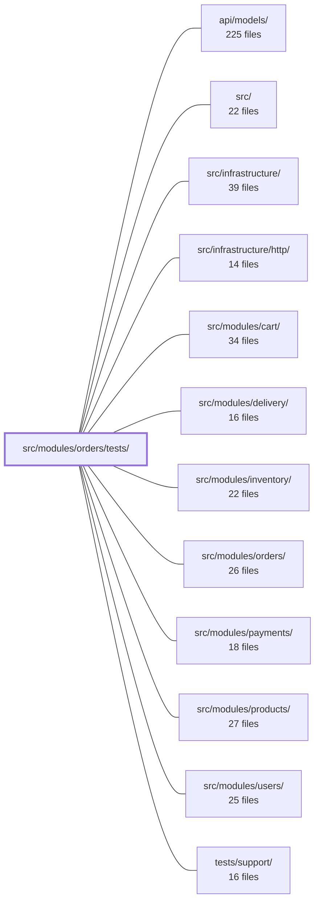

---
tags:
  - 2repo
  - 2repo/module
  - project/boilerplate-node-backend
type: module
module: src/modules/orders/tests/
files: 16
updated: 2026-08-25T11:21:46.115427+00:00
---

# src/modules/orders/tests/

## Purpose

Test suite for the orders module. It covers unit tests (domain rules, service logic, serialization, state machine), property-based tests for monetary arithmetic, OpenAPI contract tests for the HTTP wire format, and a fixture factory that bridges the orders builder to real Mongoose documents in integration contexts.

## Key parts

- **Contract tests** — `contract/api.contract.test.ts` validates every `/orders` HTTP response (list, detail, cancel) against the OpenAPI spec, including both the admin-scoped and user-scoped shape branches of `GET /orders/{id}`.
- **Test fixtures** — `factory.ts` adapts persisted `UserDocument` / `ProductDocument` instances into the plain-payload shape the pure builder expects and exposes a single `createOrder` helper for integration tests.
- **Domain & state-machine units** — `unit/domain-rules.test.ts` (order-line validation), `unit/lifecycle.test.ts` (state-table structural invariants), `unit/money.property.test.ts` and `unit/totals.property.test.ts` (property-based guarantees on monetary arithmetic).
- **Service-layer units** — `unit/cancel.test.ts` (authorization, status guard, refund event), `unit/service-crud.test.ts` (write-path + snapshot immutability), `unit/service-scope.test.ts` (caller-scope boundary), `unit/service-search.test.ts` (filters, totals, pagination).
- **Data & serialization units** — `unit/model.test.ts` (no Mongoose leakage, embedded-product normalization), `unit/schema-contract.test.ts` (Mongoose declaration invariants), `unit/serialization-guards.test.ts` (defensive branches in `applyOrderTransform`), `unit/repository.test.ts` (create / aggregate / findByIdScoped).
- **Cross-cutting units** — `unit/audit.test.ts` (pins audit-action strings used by external log queries), `unit/invoice-locale.test.ts` (locale resolution in PDF rendering and multer uploads).

## How it connects

- **`src/modules/orders/`** — the module under test; every unit spec imports services, domain rules, the repository, and the pure factory from here.
- **`api/models/`** — contract tests assert that HTTP responses match the OpenAPI spec; `schema-contract.test.ts` and `model.test.ts` exercise Mongoose schema declarations and `toJSON` output.
- **`src/infrastructure/http/`** — contract tests target the real HTTP surface (status codes, response bodies) produced by the infrastructure layer.
- **`src/modules/users/`** — `factory.ts` consumes `UserDocument` instances; `service-scope.test.ts` verifies the admin / owner / unauthenticated authorization boundary.
- **`src/modules/products/`** — `factory.ts` consumes `ProductDocument` instances; several tests pin the embedded product-snapshot shape on order lines.
- **`src/modules/payments/`** — `cancel.test.ts` asserts the `ORDER_CANCELLED` domain event carries correct refund semantics consumed by the payments module.
- **`tests/support/`** — shared test utilities (database setup, request helpers) used across the suite.

## Where to start

1. **`factory.ts`** — shows how to create a valid order document for any test in the suite; once you understand this helper, the setup in every unit spec becomes straightforward.
2. **`contract/api.contract.test.ts`** — reads like a specification of the order API's wire shape (fields, totals, role-based variants). Understanding what the spec *requires* makes the unit tests around serialization and totals much easier to follow.

## Connected modules

[[boilerplate-node-backend_api_models|api/models/]] · [[boilerplate-node-backend_src|src/]] · [[boilerplate-node-backend_src_infrastructure|src/infrastructure/]] · [[boilerplate-node-backend_src_infrastructure_http|src/infrastructure/http/]] · [[boilerplate-node-backend_src_modules_cart|src/modules/cart/]] · [[boilerplate-node-backend_src_modules_delivery|src/modules/delivery/]] · [[boilerplate-node-backend_src_modules_inventory|src/modules/inventory/]] · [[boilerplate-node-backend_src_modules_orders|src/modules/orders/]] · [[boilerplate-node-backend_src_modules_payments|src/modules/payments/]] · [[boilerplate-node-backend_src_modules_products|src/modules/products/]] · [[boilerplate-node-backend_src_modules_users|src/modules/users/]] · [[boilerplate-node-backend_tests_support|tests/support/]]

## Files
- `src/modules/orders/tests/contract/api.contract.test.ts` — Contract tests that validate every `/orders` HTTP response (list, detail, cancel) against the OpenAPI spec, ensuring the wire shape matches `openapi.yaml`. The suite was created because the list endpoint returned `totalItems`/`totalQuantity`/`totalPrice` where the spec expected a single `total`, and `GET /orders/{id}` silently returned different shapes depending on the caller's role (scoped aggregate vs. plain `findById`). Both role branches are asserted here to prevent that divergence from recurring.
- `src/modules/orders/tests/factory.ts` — Test-fixture layer for orders that bridges the pure builder in `src/modules/orders/factory.ts` to integration tests that work with real Mongoose documents. It adapts persisted `UserDocument` / `ProductDocument` instances into the plain-payload shape the builder expects, and exposes a single `createOrder` helper that writes to the test database.
- `src/modules/orders/tests/unit/audit.test.ts` — Unit test that pins the exact string values of the orders module's audit actions. Because those strings are a **wire contract** consumed by external log queries, dashboards, and alert rules, a rename or accidental addition/removal must fail here. The cross-cutting shape test (`tests/cross-cutting/audit-actions.test.ts`) cannot assert values without coupling to every domain, so the owner module owns its value assertions in this file.
- `src/modules/orders/tests/unit/cancel.test.ts` — Unit tests for `orderService.cancelById` and `orderService.withActions`. They verify the authorization gate (owner / stranger / admin / operator), the status-transition guard (pending → cancelled only), the 404-vs-409 distinction, refund semantics on the `ORDER_CANCELLED` domain event, and that `withActions` exposes only legitimate transitions on the serialized wire shape.
- `src/modules/orders/tests/unit/domain-rules.test.ts` — Unit tests for the `checkOrderLines` domain rule. They verify that the rule correctly rejects invalid order-line sets (empty, missing products) and accepts valid ones, without any mocks, database, or fake timers — the rule is a pure function of its arguments.
- `src/modules/orders/tests/unit/invoice-locale.test.ts` — Unit tests that prove the PDF worker renders the locale **already baked into** the invoice copy (resolved up-front by `invoiceDocument`) and never re-consults an ambient locale. A second block verifies that every multer upload method restores the request's negotiated locale after the stream is consumed. The file lives in `orders/tests` so that deleting the orders module removes the template, its copy, and this spec together.
- `src/modules/orders/tests/unit/lifecycle.test.ts` — Pure unit tests for the order state-machine table and its query helpers. Rather than restating individual rows, the suite asserts structural sentences about the table (totality, direction, terminality, actor permissions) so that a copy-pasted table or a single missing edge is caught without needing a test per cell.
- `src/modules/orders/tests/unit/model.test.ts` — Guarantees that no order response path leaks Mongoose internals (`_id`, `__v`) and that the embedded product snapshot is normalized identically whether it arrives via `toJSON` (hydrated document) or via `.aggregate()` (plain JS). Also asserts a schema-level invariant: `productSchema`'s indexes must not be copied onto `orderItemSchema`'s embedded `product` path.
- `src/modules/orders/tests/unit/money.property.test.ts` — Property-based tests (via `fast-check`) that verify the `Money` domain module satisfies its core invariant: **no monetary arithmetic can produce `NaN`, `Infinity`, or a fraction of a cent**, for *every* possible input. Inputs are deliberately hostile (junk types, overflow values) rather than realistic, because the guarantee is universal.
- `src/modules/orders/tests/unit/repository.test.ts` — Unit tests for `orderRepository`, covering the `create`, `aggregate`, and `findByIdScoped` methods. Verifies data-integrity invariants (product snapshots, quantities), MongoDB aggregate pipeline behavior, and the polymorphic `id`/`_id` contract that `findByIdScoped` guarantees across its scoped and unscoped branches.
- `src/modules/orders/tests/unit/schema-contract.test.ts` — Tests the Mongoose schema *declarations* of the order model—defaults, `required` flags, `select: false`, and serialization shape—rather than the repository's behavioral logic. These properties are part of the public API but are exercised nowhere else in the test suite. It runs against a real Mongo instance because the properties under test (default resolution, required enforcement, `toJSON` output) are Mongoose's own semantics, not application logic.
- `src/modules/orders/tests/unit/serialization-guards.test.ts` — Unit tests for the defensive guard branches in `applyOrderTransform`. These guards protect the single serialization point every order response passes through; a throw here turns a successful read into a 500 for the entire collection. The tests exist because the "defensive" branches are actually reachable in production (e.g., Mongoose `.select()` projections that omit `items`).
- `src/modules/orders/tests/unit/service-crud.test.ts` — Unit tests for the **write half** of the orders service (`create`, `getById`, `update`, `updateById`, `remove`, `removeById`). The companion file `orders.test.ts` covers the read/aggregation half (`search`). This file exists to close a mutation-coverage gap and to pin two behaviours the team considers load-bearing: product-snapshot immutability on order lines, and the `scope`-based authorization boundary on `getById`.
- `src/modules/orders/tests/unit/service-scope.test.ts` — Unit tests for `orderService.callerScope`, the authorization boundary that determines which orders a caller can read. Verifies the three documented contracts: admin → unscoped, non-admin → own `userId` + soft-delete exclusion, and unauthenticated → throws. Also pins two subtle correctness details (BSON `ObjectId` type, `$exists: false` for soft-deletes) that a loose assertion would let regress.
- `src/modules/orders/tests/unit/service-search.test.ts` — Unit tests for `orderService.search`, verifying that derived totals (`totalItems`, `totalQuantity`, `totalPrice`) are computed correctly, that all supported filters work, and that pagination behaves as expected. It exists to guard against regressions in the repository's `normalize` step and the search aggregation pipeline.
- `src/modules/orders/tests/unit/totals.property.test.ts` — Property-based tests (via `fast-check`) for the order-total arithmetic in `src/modules/orders/domain/totals.ts`. The file asserts that `sumLineItems` is *total* (never NaN, never throws) under arbitrary junk input, and that its arithmetic satisfies exact invariants in cents (additivity, scaling, order-independence). It also pins the `orderTotal` composition rule so the serializer, payment intent, and confirmation email all agree on the final number.

---
[[boilerplate-node-backend_INDEX|← boilerplate-node-backend index]]
