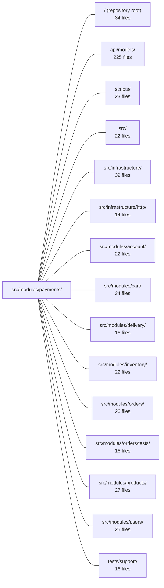

---
tags:
  - 2repo
  - 2repo/module
  - project/boilerplate-node-backend
type: module
module: src/modules/payments/
files: 18
updated: 2026-08-25T11:22:00.845381+00:00
---

# src/modules/payments/

## Purpose

The payments module owns the provider-facing money lifecycle for an order: creating a payment intent, confirming a card charge, handling declines, and processing refunds. It maintains exactly one payment record per order and ensures that "what happened to the money" is always a single, unambiguous status (`requires_confirmation → succeeded | declined → refunded`), even across retries and race conditions.

## Key parts

- **Domain core** — `service.ts` (business rules: intent creation, confirm with order-status gating and auto-refund on race, refund), `model.ts` (Mongoose schema, unique `orderId` index, status enum), `repository.ts` (CRUD + idempotent upsert + guarded status transition).
- **HTTP surface** — `routes.ts` (Express router + auth middleware), `controllers/` (thin handlers for intent, confirm, refund, and payment-by-order), `openapi.yaml` (OpenAPI 3.0.3 contract, single source of truth for the four endpoints and `Payment` schema).
- **Provider port & implementations** — `providers/index.ts` (the `PaymentProvider` interface, registry, and env-driven resolver), `providers/card.ts` (shared `CardDetails` type and `cardLastFour` utility), `providers/fake.ts` (no-IO fake that mimics PSP test-mode: one card declines, the rest succeed).
- **Observability** — `metrics.ts` (Prometheus counters), `analytics.ts` (funnel event names registered on the shared `AnalyticsEventMap`), `audit.ts` (typed audit action strings registered on the global `AuditActionMap`).
- **Module wiring** — `module.ts` (manifest: identity, HTTP surface, dependency edges, event subscriptions; no logic).
- **Tests** — `tests/unit/service.test.ts` (order-total freeze at intent time, conditional state transitions, using the fake provider's magic cards), `tests/contract/api.contract.test.ts` (status codes, `PaymentEnvelope` shape, error branches over real HTTP).

## How it connects

- **orders** — Payments are 1-to-1 with orders. The service gates `pending → paid` on successful charge and triggers auto-refund on race; the `get-payment-by-order` controller lets the order page re-hydrate mid-flow. The refund endpoint is deliberately decoupled so an operator can refund money and cancel the order as independent actions.
- **inventory** — `service.ts` delegates stock release to the inventory module as part of the confirm/decline flow.
- **delivery** — The order-total freeze at intent time includes the shipping amount sourced from the delivery module.
- **infrastructure/http** — Routes apply shared Express authentication middleware and response-envelope conventions provided by the HTTP infrastructure layer.
- **api/models** — The shared `PaymentEnvelope` response shape (referenced in contract tests) lives in the top-level API model definitions.
- **users** — The auth middleware on every payment route authenticates against the users module.
- **tests/support** — Unit tests use the shared `setupTestDb` helper and other cross-module test utilities.

## Where to start

Read **`service.ts`** first — it contains every money-movement rule (intent, confirm, refund, status gating) in one place and makes the module's invariants concrete. Then read **`providers/index.ts`** to see the `PaymentProvider` port and how a concrete PSP is selected at runtime; together those two files explain the module's core abstraction and the single seam a real provider plugs into.

## Connected modules

[[boilerplate-node-backend_ROOT|/ (repository root)]] · [[boilerplate-node-backend_api_models|api/models/]] · [[boilerplate-node-backend_scripts|scripts/]] · [[boilerplate-node-backend_src|src/]] · [[boilerplate-node-backend_src_infrastructure|src/infrastructure/]] · [[boilerplate-node-backend_src_infrastructure_http|src/infrastructure/http/]] · [[boilerplate-node-backend_src_modules_account|src/modules/account/]] · [[boilerplate-node-backend_src_modules_cart|src/modules/cart/]] · [[boilerplate-node-backend_src_modules_delivery|src/modules/delivery/]] · [[boilerplate-node-backend_src_modules_inventory|src/modules/inventory/]] · [[boilerplate-node-backend_src_modules_orders|src/modules/orders/]] · [[boilerplate-node-backend_src_modules_orders_tests|src/modules/orders/tests/]] · [[boilerplate-node-backend_src_modules_products|src/modules/products/]] · [[boilerplate-node-backend_src_modules_users|src/modules/users/]] · [[boilerplate-node-backend_tests_support|tests/support/]]

## Files
- `src/modules/payments/analytics.ts` — Declares the two analytics event names the payments module emits (`payment_succeeded`, `payment_declined`) and registers them on the shared `AnalyticsEventMap` via a module augmentation. These events form the funnel's final gate — the ratio of succeeded to (succeeded + declined) is the conversion metric a payment-provider change would move.
- `src/modules/payments/audit.ts` — Declares the three audit action strings that the payments module can emit (`succeeded`, `declined`, `refunded`) and registers them into the global `AuditActionMap` so the observability layer recognizes them. The file exists so every "money moves" event has a stable, typed name without requiring a shared enum across modules.
- `src/modules/payments/controllers/get-payment-by-order.ts` — Express route handler for `GET /payments/order/:orderId`. It retrieves the payment (intent + status) associated with an order so the order page's payment panel can re-hydrate on reload mid-flow rather than forcing the user to start over.
- `src/modules/payments/controllers/post-payment-confirm.ts` — Express controller handler for `POST /payments/:id/confirm`. It validates the incoming card-confirmation body, delegates to `paymentService.confirmPayment`, and — for both success and decline outcomes — records a Prometheus metric, an audit event, and an analytics event before writing the HTTP response.
- `src/modules/payments/controllers/post-payment-intent.ts` — Express controller handler for `POST /payments/intent`. Validates the request body against a Zod schema, delegates the actual intent creation to the payment service, and writes the HTTP response. Deliberately thin: ownership checks, the `pending`-state gate, and amount logic all live in the service layer.
- `src/modules/payments/controllers/post-payment-refund.ts` — HTTP handler for `POST /payments/order/:orderId/refund`. It triggers a standalone refund for an order without changing the order's status. It exists so an operator can refund money and cancel an order as two independent actions rather than a single coupled operation.
- `src/modules/payments/metrics.ts` — Defines the domain-owned Prometheus counters for the payments module. Metrics live here (rather than in infrastructure) so the module owns its observability surface; the overview endpoint reads them via the shared registry without importing this file.
- `src/modules/payments/model.ts` — Defines the Mongoose schema, document interface, and model for **Payment** — one document per order (enforced by a unique index on `orderId`). It records the provider-facing money lifecycle (`requires_confirmation → succeeded | declined → refunded`) so that "what happened to the money on this order" is always exactly one row with one status, even across retries.
- `src/modules/payments/module.ts` — The module manifest for the **payments** domain. It declares the module's identity, HTTP surface, inter-module dependency edges, and event subscriptions so the kernel can register and boot it. All domain logic lives elsewhere (`service.ts`, `routes.ts`); this file is purely wiring.
- `src/modules/payments/openapi.yaml` — OpenAPI 3.0.3 contract for the payments module. It defines the four endpoints that manage the provider-facing money lifecycle (intent → confirm → refund) tied to an order, and the schemas that describe a `Payment` record. The file is the single source of truth for what clients may call and what they receive back, independent of the order module's own contract.
- `src/modules/payments/providers/card.ts` — Shared type and utility for card data at the provider boundary. It exists in its own file so the provider port and every concrete provider can reference `CardDetails` and `cardLastFour` without importing each other directly.
- `src/modules/payments/providers/fake.ts` — A no-IO fake implementation of the `PaymentProvider` interface, used in demos, e2e flows, and tests. It mimics a real PSP's test-mode behavior (one specific card number declines, all others succeed) so that both the happy and decline paths can be exercised without any external network call.
- `src/modules/payments/providers/index.ts` — Defines the `PaymentProvider` port (interface) that the payment service programs against, plus the registry and env-driven resolver that selects a concrete implementation at runtime. This is the single seam a real PSP plugs into; the service, contract, and frontend are agnostic to which provider answers.
- `src/modules/payments/repository.ts` — Data-access layer for the payments collection. Builds on the shared `createBaseRepository` factory for standard CRUD, then adds the four domain-specific operations payments actually need: scoped lookups by id/order, an idempotent intent upsert, and a guarded status transition.
- `src/modules/payments/routes.ts` — Defines the Express router for all payment-related HTTP endpoints. It wires routes to their controller handlers and applies shared authentication middleware so that every payment operation is behind an auth boundary.
- `src/modules/payments/service.ts` — Owns the money-movement rules for an order: creating a payment intent, confirming a charge (with conditional order-status gating and automatic refund on race), and exposing a payment's state and available actions to the order page. Everything else—PSP calls, persistence, stock release—is delegated.
- `src/modules/payments/tests/contract/api.contract.test.ts` — Contract tests that pin the HTTP-level API contract for every `/payments` route: correct status codes, the shared `PaymentEnvelope` response shape, and the distinguishable error branches (401, 404, 409, 422). Business-logic rules (amounts, idempotency, state transitions) are covered in the unit suite; this file only verifies the responses are reachable and well-formed over real HTTP.
- `src/modules/payments/tests/unit/service.test.ts` — Unit tests for the payments service (`service.ts`) that pin the two invariants most likely to regress silently: the order-total freeze at intent time (shipping included) and the conditional state transitions (`pending → paid`, `succeeded → refunded`). Uses a real MongoDB via `setupTestDb` because the guarantees under test *are* the conditional writes, and uses the fake provider's magic cards as the acceptance/rejection contract.

---
[[boilerplate-node-backend_INDEX|← boilerplate-node-backend index]]
