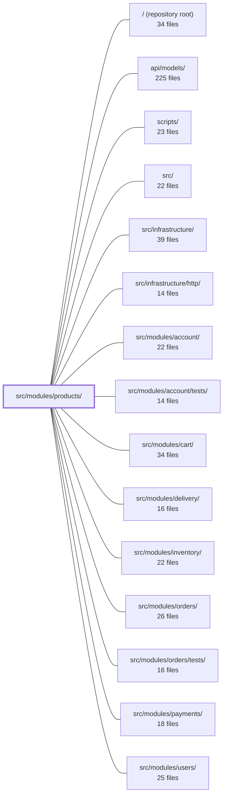

---
tags:
  - 2repo
  - 2repo/module
  - project/boilerplate-node-backend
type: module
module: src/modules/products/
files: 27
updated: 2026-08-25T11:22:16.489638+00:00
---

# src/modules/products/

## Purpose

The products module owns the product catalogue: what a shop sells. It handles product CRUD, search, category/tag facets, role-scoped visibility, stock counters (`onHand` / `reserved`), and the full HTTP surface for the storefront and admin. It is a deliberate leaf in the dependency graph — cart, delivery, payments, orders, inventory, and wishlist all consume it, but it never imports them back.

## Key parts

- **Domain core** — `model.ts` (Mongoose schema, Zod validation, serialization transform), `service.ts` (business logic, orchestration, response envelopes), `repository.ts` (CRUD, facet aggregation, stock counters), and `factory.ts` (minimal fixture builder used by demo data and tests).
- **HTTP layer** — `routes.ts` wires auth, cache, and upload middleware to five controllers under `controllers/`: listing/search (`get-products.ts`), single-product read (`get-product-item.ts`), catalogue facets (`get-catalogue-facets.ts`), create/update (`write-products.ts`), and delete (`delete-products.ts`).
- **Module wiring & contracts** — `module.ts` assembles routes, seed data, event listeners, and locale files into the kernel's `AppModule`. `index.ts` is the sole public barrel; `eslint-plugin-boundaries` enforces that siblings import only from here. `openapi.yaml` is the single source of truth for the public API contract; `probes.ts` adds manual test scenarios the contract can't express.
- **Observability & events** — `analytics.ts`, `audit.ts`, and `events.ts` each register their module's typed constants into shared kernel maps via TypeScript module augmentation, keeping domain vocabulary out of the infrastructure layer.
- **Demo data** — `demo.ts` defines six seed rows chosen to exercise every visibility/stock/default branch; `factory.ts` supplies the builder.
- **Tests** — `tests/contract/` validates wire shapes against `openapi.yaml`; `tests/unit/` covers service rules, repository queries, schema semantics, model serialization, audit-string stability, facets, and validation copy; `tests/factory.ts` persists fixtures for the test database.

## How it connects

- **`src/infrastructure/` and `src/infrastructure/http/`** — the module augments the shared `AnalyticsEventMap`, `AuditActionMap`, and `DomainEventMap` types; uses the shared delete-controller factory, `createBaseRepository`, auth middleware, and cache tags.
- **`src/modules/users/`** — role-based visibility (admin vs. public) and authorization checks reference the users module's identity/role model.
- **`api/models/`** — shared API-level types consumed by the OpenAPI spec and response envelopes.
- **`src/modules/cart/`, `src/modules/delivery/`, `src/modules/payments/`, `src/modules/orders/`, `src/modules/inventory/`, `src/modules/wishlist/`** — downstream consumers that import only from `src/modules/products/index.ts`. They never appear in this module's own imports.
- **`scripts/`** — tooling that exports `db/demo/demo-data.json` from the demo fixtures so paired frontends receive identical seed data without sharing source.
- **`tests/support/` and `tests/unit/infrastructure/`** — shared test harness and infrastructure unit tests that the products test suite builds upon.

## Where to start

1. **`model.ts`** — defines every field a product stores, how input is validated (Zod), and how a document is serialized to the wire. Understanding this makes every other file in the module readable.
2. **`service.ts`** — the business-logic layer that orchestrates validation, visibility scoping, stock transitions, event emission, and image cleanup. Reading it alongside the model gives a complete picture of what the module does before you touch routes or controllers.

## Connected modules

[[boilerplate-node-backend_ROOT|/ (repository root)]] · [[boilerplate-node-backend_api_models|api/models/]] · [[boilerplate-node-backend_scripts|scripts/]] · [[boilerplate-node-backend_src|src/]] · [[boilerplate-node-backend_src_infrastructure|src/infrastructure/]] · [[boilerplate-node-backend_src_infrastructure_http|src/infrastructure/http/]] · [[boilerplate-node-backend_src_modules_account|src/modules/account/]] · [[boilerplate-node-backend_src_modules_account_tests|src/modules/account/tests/]] · [[boilerplate-node-backend_src_modules_cart|src/modules/cart/]] · [[boilerplate-node-backend_src_modules_delivery|src/modules/delivery/]] · [[boilerplate-node-backend_src_modules_inventory|src/modules/inventory/]] · [[boilerplate-node-backend_src_modules_orders|src/modules/orders/]] · [[boilerplate-node-backend_src_modules_orders_tests|src/modules/orders/tests/]] · [[boilerplate-node-backend_src_modules_payments|src/modules/payments/]] · [[boilerplate-node-backend_src_modules_users|src/modules/users/]] · … and 4 more

## Files
- `src/modules/products/analytics.ts` — Declares the analytics event names for the products module (search and product-view) and registers them into the shared `AnalyticsEventMap` type via a module augmentation. It exists so that product-related controllers can reference typed event constants without the infrastructure layer needing to know any domain vocabulary.
- `src/modules/products/audit.ts` — Declares the set of audit actions emitted by the products module (admin create, update, delete) and registers them into the global `AuditActionMap` via TypeScript module augmentation, so the observability layer can type-check product-specific audit events.
- `src/modules/products/controllers/delete-products.ts` — Wires up the admin `DELETE /products/:id` endpoint by delegating to the shared delete-controller factory. It exposes both a default soft-delete and an optional hard-delete (via `?hardDelete=true`) without duplicating controller boilerplate.
- `src/modules/products/controllers/get-catalogue-facets.ts` — Express controller that handles `GET /products/categories`. It returns every category and tag present in the public catalogue, each with a count — the data behind the storefront's filter chips. The response is public and cached under the products cache tag, so it is invalidated whenever the catalogue changes.
- `src/modules/products/controllers/get-product-item.ts` — Express controller handler for `GET /products/:id`. It retrieves a single product by path parameter, enforces role-based visibility (non-admin callers only see active products), and emits an analytics event on successful retrieval.
- `src/modules/products/controllers/get-products.ts` — Controller handler for the product listing/search endpoints (`GET /products`, `POST /products/search`). It validates and coerces query-string or body parameters into a typed `SearchProductsRequest`, delegates to `productService.search`, emits an analytics event, and returns the paginated result. The admin caller scope sees all products; public callers see only active ones (handled inside the service).
- `src/modules/products/controllers/write-products.ts` — HTTP controller that handles product **creation** (`POST /products`) and **update** (`PUT /products`, `PUT /products/:id`). It is the single write entry-point for the admin product surface: it parses and coerces input, validates it, delegates to `productService`, manages uploaded-image lifecycle, and emits audit events.
- `src/modules/products/demo.ts` — Defines the six-row demo catalogue that the product module owns. The records live here (rather than in a shared cross-repo fragment) so that removing `src/modules/products` removes its seed data with it, and so that paired frontend consumers receive the same data via an exported JSON file (`db/demo/demo-data.json`) instead of shared source. The fixtures are chosen to exercise the branches the storefront and repositories actually contain—soft-deleted, inactive, out-of-stock, and a barebones record that hits every model default.
- `src/modules/products/events.ts` — Declares the `product.deleted` domain event for the products module by augmenting the kernel's `DomainEventMap` interface, and exports a shared string constant for the event name. This file exists so that the event's shape is declared alongside its owning module rather than in a central registry, and so emitters and listeners reference one constant instead of independent literals.
- `src/modules/products/factory.ts` — Builds a minimal product fixture (a document ready for `productRepository.create`) for the demo dataset and any test that needs a catalogue row. It intentionally omits every field that has a Mongoose `default:` in the schema so the seeded rows record what the schema actually does, rather than reasserting those defaults.
- `src/modules/products/index.ts` — Public barrel (entry point) for the products module. It is the **only** import surface available to sibling modules — lint (`eslint-plugin-boundaries`) makes importing directly from `@modules/products/service` or any other internal path a hard error. Every re-export here is a stability contract: other modules may rely on its shape not changing.
- `src/modules/products/model.ts` — Defines the Product collection's Mongoose schema, TypeScript interfaces, Zod validation schema, and serialization transform. It is the single source of truth for which fields a product stores, how incoming data is validated, and how a stored document is shaped into the wire contract (including the derived `available` field).
- `src/modules/products/module.ts` — Declares the **products** application module — the product catalogue that defines what a shop sells. It wires together the module's routes, seed data, event listeners, and locale files into a single `AppModule` object registered with the kernel. It is intentionally a leaf: other modules (cart, delivery, payments) depend on it, but it never imports them back.
- `src/modules/products/openapi.yaml` — OpenAPI 3.0.3 specification defining the Products module's public API contract. It declares every product endpoint (list, create, read, update, delete, catalogue facets), their parameters, request/response schemas, security requirements, and error responses so that clients, tests, and documentation can be generated from a single source of truth.
- `src/modules/products/probes.ts` — Defines a fixed set of manual API test probes for the products module that cover scenarios a contract (valid calls + declared responses) cannot express: rejection/validation, i18n, optional-parameter combinations, and visibility-rule distinctions. These probes are appended to every generated client collection after the contract-derived requests.
- `src/modules/products/repository.ts` — The product repository for the catalogue. It wires `productModel` into the shared `createBaseRepository` factory for standard CRUD and search, then layers the catalogue's own query rules (public visibility scoping, facet counts) and the only counter transitions for stock (`onHand` / `reserved`) in the codebase.
- `src/modules/products/routes.ts` — Express router that maps all product catalogue HTTP endpoints to their controller handlers. It wires together auth checks, cache set/invalidate middleware, file-upload handling, and the appropriate controller for each route, separating public read access from admin-only write and delete operations.
- `src/modules/products/service.ts` — Business-logic layer for the Product entity. Owns validation, CRUD, search, facet aggregation, and deletion (soft/hard) for products. Delegates all database access to `productRepository`, orchestrates cross-cutting concerns (image-file cleanup, domain-event emission, authorization scoping), and returns HTTP-envelope-ready results (`ResponseSuccess` / `ResponseReject`) so controllers stay thin.
- `src/modules/products/tests/contract/api.contract.test.ts` — Contract tests that validate the **wire response shape** of every `/products` endpoint against `openapi.yaml` (via `toSatisfyApiSpec()`), including `additionalProperties: false` to catch leaked fields. Behavioural assertions (role visibility, filter interaction) are included only to ensure each contract branch is actually exercised with realistic data.
- `src/modules/products/tests/factory.ts` — Test-database factory for Product fixtures. It wraps the pure `makeProduct` builder (defined one level up in `src/modules/products/factory.ts`) with a `createProduct` function that persists the payload via `productRepository`, giving tests a one-liner to seed the test database with a product document.
- `src/modules/products/tests/unit/audit.test.ts` — Pins the exact string values of the products module's audit action constants to their wire-contract form. These strings are read by log queries, dashboards, and alert rules outside this repo, so a rename or deletion that keeps the TypeScript types intact would silently break external tooling. This test is the module-owner's guarantee that the values remain stable.
- `src/modules/products/tests/unit/facets.test.ts` — Unit tests for `productRepository.facets`, the query behind the storefront's filter chips. The suite pins down the public-visibility invariant (hidden and soft-deleted products must not inflate counts), the sort contract (count desc, then name asc), and the empty-catalogue behavior.
- `src/modules/products/tests/unit/model.test.ts` — Unit test that verifies products never leak `_id` or `__v` into serialized output. It covers the two serialization paths that exist in the service: hydrated Mongoose documents (normalized via `toJSON`) and `.lean()` list results (normalized by manual mapping inside the service).
- `src/modules/products/tests/unit/repository.test.ts` — Unit-test suite for `productRepository` (Mongoose-based). Exercises every public method — `create`, `findById`, `findOne`, `findAll`, `count`, `save`, `deleteOne`, plus the aggregate helpers `facets`, `sumReserved`, and `availabilityPage` — against a real test database. A second block pins the "empty catalogue" contract for the aggregates, ensuring callers see well-defined empty shapes rather than `undefined`.
- `src/modules/products/tests/unit/schema-contract.test.ts` — Validates the Mongoose schema declarations themselves—defaults, `required`, `select: false`, and serialization—rather than business-logic behavior covered by sibling specs. Runs against a real MongoDB instance because these are Mongoose's own semantics, not application code.
- `src/modules/products/tests/unit/service.test.ts` — Unit tests for the product service (`productService`), covering input validation (`validateData`), role-scoped search (`search`), and single-product retrieval (`getById`). The file exists to pin the service's business rules—visibility by caller role, filter/pagination semantics, validation boundaries, and i18n message integrity—against regressions.
- `src/modules/products/tests/unit/validation-messages.test.ts` — Guards that the products Zod schema emits its own locale-aware Italian validation copy verbatim, rather than silently falling back to Zod's built-in English defaults. It mirrors the same regression the `modules/users` suite defends, applied to the catalogue's separate schema and copy.

---
[[boilerplate-node-backend_INDEX|← boilerplate-node-backend index]]
