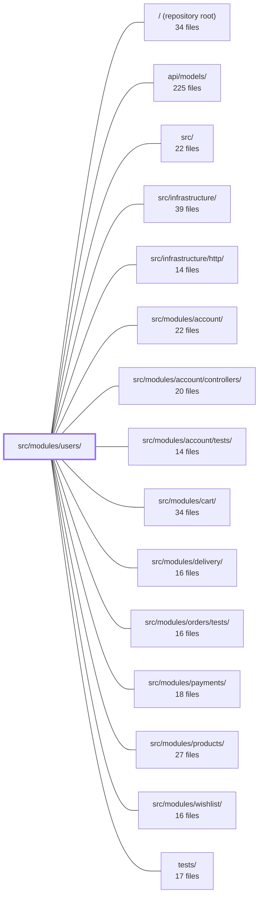

---
tags:
  - 2repo
  - 2repo/module
  - project/boilerplate-node-backend
type: module
module: src/modules/users/
files: 25
updated: 2026-08-25T11:22:32.951847+00:00
---

# src/modules/users/

## Purpose

The users module owns the admin-facing lifecycle of `User` records: creation, search, read, partial update, and soft/hard deletion. It is the "operator panel" half of user management; self-service authentication (signup, login, password reset, token rotation) is deliberately delegated to the sibling `account` module. Everything in this directory revolves around one Mongoose collection, exposed through a typed service, a shared repository, and a set of Express controllers.

## Key parts

- **Domain core** — `model.ts` (schema, types, token subdoc, Zod wire schema), `service.ts` (CRUD + search + token-lookup helpers), `repository.ts` (data access, credential-aware reads, atomic token mutations).
- **HTTP surface** — `routes.ts` (router, middleware wiring), `controllers/` (one file per HTTP verb: `get-users`, `get-user-item`, `write-users`, `delete-users`), `openapi.yaml` (standalone 3.0.3 contract).
- **Module wiring & contracts** — `module.ts` (registers routes, seed data, and event subscriptions with the kernel), `index.ts` (the sole public barrel; lint enforces that sibling modules import only through it), `audit.ts` (typed audit-action strings), `events.ts` (domain-event catalogue augmentation).
- **Seed & fixtures** — `demo.ts` (two demo accounts for local bootstrapping), `factory.ts` (pure user-fixture builder used by demo and tests).
- **Tests** — `tests/contract/` (OpenAPI contract + credential-leak assertions), `tests/unit/` (model, schema, repository, service, token-lookup, audit, i18n validation), `tests/factory.ts` (persists fixtures to an in-memory Mongo).

## How it connects

- **`src/modules/account/`** — The tightest coupling. `account` operates on the *same* `User` collection and imports the model, repository, and service through this module's barrel (`index.ts`). The users service exposes four token-lookup helpers (`findByEmail`, `findByPasswordResetToken`, `findByAccountDeleteToken`, `consumeToken`) that account's reset/verify/delete controllers call directly. The repository's `+password`/`+tokens` re-selection paths are shared infrastructure that both modules depend on.
- **`src/infrastructure/http/`** — `routes.ts` composes shared middleware (authentication, authorization, cache read/write, file-upload, flag-parsing) from the infrastructure layer before handing control to the user controllers.
- **`/` & `src/`** — `module.ts` is consumed by the root application bootstrapper to mount the `/users` router and register the module's demo seeds and event subscriptions into the kernel.
- **`tests/` / `tests/support/`** — The module's test files rely on shared test utilities (in-memory Mongo, app factory, request helpers) provided by the root `tests/support` directory.

## Where to start

1. **`model.ts`** — Read this first. It is the single source of truth for what a `User` record is: every field, its defaults, the `select: false` credential guard, the token subdocument shape, and the Zod wire schema. Nothing else in the module makes sense without this picture.
2. **`service.ts`** — Next, see what you can *do* with a user from the admin side: create, search, update, soft/hard delete, and the token-lookup methods that `account` leans on. The service is the boundary between HTTP handlers and data access, so it shows the module's full operational surface in one file.

## Connected modules

[[boilerplate-node-backend_ROOT|/ (repository root)]] · [[boilerplate-node-backend_api_models|api/models/]] · [[boilerplate-node-backend_src|src/]] · [[boilerplate-node-backend_src_infrastructure|src/infrastructure/]] · [[boilerplate-node-backend_src_infrastructure_http|src/infrastructure/http/]] · [[boilerplate-node-backend_src_modules_account|src/modules/account/]] · [[boilerplate-node-backend_src_modules_account_controllers|src/modules/account/controllers/]] · [[boilerplate-node-backend_src_modules_account_tests|src/modules/account/tests/]] · [[boilerplate-node-backend_src_modules_cart|src/modules/cart/]] · [[boilerplate-node-backend_src_modules_delivery|src/modules/delivery/]] · [[boilerplate-node-backend_src_modules_orders_tests|src/modules/orders/tests/]] · [[boilerplate-node-backend_src_modules_payments|src/modules/payments/]] · [[boilerplate-node-backend_src_modules_products|src/modules/products/]] · [[boilerplate-node-backend_src_modules_wishlist|src/modules/wishlist/]] · [[boilerplate-node-backend_tests|tests/]] · … and 1 more

## Files
- `src/modules/users/audit.ts` — Defines the audit-action vocabulary for admin-initiated writes to user records and registers those actions in the global `AuditActionMap` via TypeScript module augmentation. It exists so that controllers in the users module can reference typed, string-literal audit identifiers without a shared enum.
- `src/modules/users/controllers/delete-users.ts` — Defines the admin-facing DELETE endpoint(s) for users by wiring `userService.removeById` into the shared delete-controller factory. It exposes both `DELETE /users` (id in body) and `DELETE /users/:id` (id in path), with soft-delete as the default and hard-delete opt-in via query param.
- `src/modules/users/controllers/get-user-item.ts` — Express controller for the admin `GET /users/:id` route. It resolves a single user by Mongoose ObjectId via the user service and shapes the HTTP response (success, 404, or database error).
- `src/modules/users/controllers/get-users.ts` — HTTP handler for `GET /users`. Accepts search filters as query-string parameters, validates and coerces them via a Zod schema, then delegates to `userService.search()`. Exists to isolate request parsing, cache-key derivation, and response shaping for the user-search endpoint from both the service layer and the route registration.
- `src/modules/users/controllers/write-users.ts` — Admin write controller for users. Exposes a single handler (`writeUsers`) that handles both user creation (`POST /users`) and user update (`PUT /users`, `PUT /users/:id`), dispatching to the user service based on whether an `id` is present in the path or body.
- `src/modules/users/demo.ts` — Defines the two demo seed accounts for the users module (one admin, one regular user) and provides the seed and export entry points that the global demo bootstrapper calls. It exists so that `db/demo/index.ts` can populate and later export user rows without each consumer re-declaring credentials.
- `src/modules/users/events.ts` — Declares the domain events emitted by the users module. It augments the kernel's `DomainEventMap` interface so that the event catalogue grows per-module without a shared enumeration file, and it exports a single string constant so emitters and listeners share one spelling.
- `src/modules/users/factory.ts` — Factory that assembles user fixtures for the demo accounts in `./demo` and for any test that needs a user. It deliberately omits every field that has a schema default (`imageUrl`, `locale`, `admin`, `active`, `verified`, `tokens`) so those values flow through `./model` and `demo-data.json` reflects the schema's actual defaults rather than a hand-restated copy.
- `src/modules/users/index.ts` — Public barrel (single import surface) for the `users` module. It is the **only** path through which a sibling module may import users' internals; lint rules make any direct import of `@modules/users/service` (or similar) a compile error. The barrel is intentionally wide because `account` operates over the same `User` collection and needs the model and repository in addition to the service.
- `src/modules/users/model.ts` — Single source of truth for the user record: the Mongoose schema, the document/model TypeScript types, the token subdocument shape, and the Zod wire-validation schema all live here. The file is deliberately monolithic so that the `select: false` guard on `password` and `tokens` sits beside the token instance methods that manipulate them, preventing a reader from separating the storage rule from the code that depends on it.
- `src/modules/users/module.ts` — Registers the **users** module with the application kernel. It wires together the user record's HTTP routes, seed data, and event subscriptions under a single `AppModule` descriptor. The module covers admin-facing search, read, write, and soft-delete of user records. Authentication (signup, login, password reset, token lifecycle) deliberately lives elsewhere in the `account` module.
- `src/modules/users/openapi.yaml` — OpenAPI 3.0.3 contract (v2.0.0) for the **users** module. It declares the full set of user CRUD endpoints (`/users`, `/users/{id}`, `/users/{id}/hard`) with their parameters, request/response schemas, and error responses, so that clients, code generators, and API gateways can consume a single authoritative spec without reading implementation code.
- `src/modules/users/repository.ts` — Data-access layer for user documents. Extends the shared base repository with credential-specific reads (the only sanctioned way to load `select: false` fields) and atomic token/session mutations, so that the `+password`/`+tokens` re-selection and the MongoDB update semantics live in one place instead of being repeated across account services and controllers.
- `src/modules/users/routes.ts` — Defines the Express router that exposes all user-management HTTP endpoints. It wires authentication, authorization, cache read/write, file-upload, and flag-parsing middleware onto the user CRUD controllers, and is the single entry point the application mounts for `/users`.
- `src/modules/users/service.ts` — Admin-facing user CRUD and search service. It owns all operations an operator performs from the admin panel (create, read, update, soft/hard delete, search) and exposes token-lookup helpers that the `account` module's self-service controllers (reset, delete, verify) rely on. Authentication concerns (signup, login, password reset flow) belong to the `account` module and are explicitly excluded here.
- `src/modules/users/tests/contract/api.contract.test.ts` — Contract test suite for user-facing endpoints (`/users`, `/users/{id}`, `/account`, `/account/signup`). It validates that every response satisfies the OpenAPI schema (`additionalProperties: false` on the `User` model) and explicitly asserts that credential-bearing fields (`password`, `tokens`, bcrypt hashes) never appear in a payload. It exists because the OpenAPI guard catches *any* undeclared field generically, while the explicit assertions document intent and cover the specific regression that motivated them.
- `src/modules/users/tests/factory.ts` — Test-database persistence layer for User fixtures. It wraps the pure builder (`makeUser`) from `../factory` with actual Mongoose inserts so that any test needing a *persisted* user (for login flows, permission checks, foreign-key references, etc.) has a single, unambiguous entry point.
- `src/modules/users/tests/unit/audit.test.ts` — Unit test that pins the exact string values of the users module's audit action constants. Because those strings are a wire contract (consumed by external log queries, dashboards, and alert rules), a silent value change would pass all other tests and type-checks while breaking production monitoring. This file makes the decision to add, remove, or revalue an action an explicit, reviewable edit.
- `src/modules/users/tests/unit/model.test.ts` — Guarantees that user credentials (bcrypt password hash, live refresh tokens) can never appear in a serialised API response. It asserts **both** independent safety mechanisms — the schema's `select: false` and the `toJSON` allowlist transform — because each covers a path the other does not (e.g. `.lean()` bypasses `toJSON`; the `*WithCredentials` finders bypass `select: false`).
- `src/modules/users/tests/unit/repository.test.ts` — Unit test suite for the `userRepository` CRUD operations and model-level token utilities. It verifies correct persistence behavior, query filtering, pagination, lean-object return types, and the `tokenRemoveExpired` / `tokenRemoveAll` logic against an in-memory MongoDB instance.
- `src/modules/users/tests/unit/schema-contract.test.ts` — Pins the Mongoose **schema declarations** for the User model — defaults, `required` flags, `select: false`, serialization, and the unique email index — rather than the application-level transforms that sibling behavioural specs cover. It exists because nothing else in the test suite exercises *what the schema says*; a schema edit that silently drops a flag or a unique constraint fails here before it surfaces in a timing-dependent integration test.
- `src/modules/users/tests/unit/service-tokens.test.ts` — Unit tests for the four token-facing lookups in the users service — `findByEmail`, `findByPasswordResetToken`, `findByAccountDeleteToken`, and `consumeToken`. They exist to pin two invariants that the one-liner implementations are easy to break: (1) these methods must use `findOneWithCredentials` (not the ordinary finder) because `tokens` and `password` carry `select: false`, and (2) each token lookup must filter on both `tokens.token` *and* `tokens.type` so one token type cannot stand in for the other.
- `src/modules/users/tests/unit/service.test.ts` — Unit tests for the `userService` module, covering input validation, search/filter/pagination, retrieval by ID, creation (including password hashing), and partial updates. Runs against an in-memory Mongoose database so no external service is needed.
- `src/modules/users/tests/unit/validation-messages.test.ts` — Guards against a regression where `t()` called at module scope (before `i18next.init()`) returns `undefined`, causing Zod to silently fall back to its English default messages. By asserting the **exact** shipped strings for both `en` and `it`, any fallback to a Zod default fails the suite — unlike a weaker "not a dotted key" check.
- `src/modules/users/tests/unit/validation.test.ts` — Guarantees that every i18n message thunk on `zodUserSchema` both *executes* and resolves to the correct localized string. Statement coverage alone cannot prove a thunk was ever invoked; this suite drives each validation rule with a targeted bad payload and asserts the emitted message matches the copy in `en.json`, catching two regressions that green "rejects" tests would miss: eagerly-evaluated thunks (PROBLEM 01) and messages attached to the wrong rule.

---
[[boilerplate-node-backend_INDEX|← boilerplate-node-backend index]]
