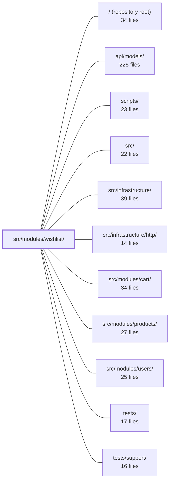

---
tags:
  - 2repo
  - 2repo/module
  - project/boilerplate-node-backend
type: module
module: src/modules/wishlist/
files: 16
updated: 2026-08-25T11:22:45.751098+00:00
---

# src/modules/wishlist/

## Purpose

The wishlist module implements a per-user "saved products" list. A wishlist is a standalone Mongoose document keyed by `userId` whose items are bare product IDs (no quantities), answering "do I want this?" rather than "how many?" It exposes four authenticated HTTP endpoints — save, list, remove, and move-to-cart — while keeping business rules, cross-module orchestration, and response shaping in a dedicated service layer.

## Key parts

- **Domain core** — `model.ts` (Mongoose schema/types), `repository.ts` (data access with `addLine`, `removeLine`, `removeProductFromAll`), and `service.ts` (validation, cross-module orchestration, `WishlistView` shaping).
- **HTTP layer** — `controllers/` (one thin handler per endpoint), `routes.ts` (route table + auth enforcement), and `module.ts` (AppModule registration: identity, routing, dependencies, event subscriptions, seed hooks).
- **Contract & analytics** — `openapi.yaml` (OpenAPI 3.0.3 spec), `probes.ts` (negative-path rejection probes), and `analytics.ts` (domain-owned event names registered via module augmentation).
- **Test data & tests** — `demo.ts` + `factory.ts` (seed/fixture builders), `tests/unit/service.test.ts` (behavioural invariants), `tests/contract/api.contract.test.ts` (end-to-end response-shape verification).

## How it connects

- **`src/modules/cart/`** — The move-to-cart action delegates the actual "add to cart + remove from wishlist" sequence to the cart module; the service enforces cart-write-before-drop ordering.
- **`src/modules/products/`** — The service gates saves and listings on catalogue visibility; a product-deletion domain event triggers `removeProductFromAll` so stale IDs never persist.
- **`src/modules/users/`** — A user-deletion domain event is subscribed to for subscription-driven cleanup of that user's wishlist document.
- **`src/infrastructure/http/`** — Controllers rely on shared controller/response utilities (success, validation-error, not-found helpers) defined here.
- **`src/infrastructure/`** — The module registry (kernel) consumes `module.ts` to wire the wishlist into the application; the analytics port reads the augmented `AnalyticsEventMap` contributed by `analytics.ts`.
- **`tests/` / `tests/support/`** — Contract tests and probes execute against the same HTTP infrastructure and shared test utilities used across all module test suites.

## Where to start

1. **`service.ts`** — Read this first: it encodes every business rule (idempotent saves, visibility gates, move-to-cart ordering, deletion cleanup) in one place, making the "why" behind each endpoint obvious.
2. **`model.ts`** — Short and self-contained; understanding the schema (single `userId` key, `items` as a flat ID array) gives you the data shape that every other file in the module assumes.

## Connected modules

[[boilerplate-node-backend_ROOT|/ (repository root)]] · [[boilerplate-node-backend_api_models|api/models/]] · [[boilerplate-node-backend_scripts|scripts/]] · [[boilerplate-node-backend_src|src/]] · [[boilerplate-node-backend_src_infrastructure|src/infrastructure/]] · [[boilerplate-node-backend_src_infrastructure_http|src/infrastructure/http/]] · [[boilerplate-node-backend_src_modules_cart|src/modules/cart/]] · [[boilerplate-node-backend_src_modules_products|src/modules/products/]] · [[boilerplate-node-backend_src_modules_users|src/modules/users/]] · [[boilerplate-node-backend_tests|tests/]] · [[boilerplate-node-backend_tests_support|tests/support/]]

## Files
- `src/modules/wishlist/analytics.ts` — Defines the analytics event names for the wishlist domain and registers them into the shared `AnalyticsEventMap` via a TypeScript module augmentation. This keeps the event-name catalogue owned by the domain module rather than a central file, so the analytics infrastructure port remains domain-agnostic.
- `src/modules/wishlist/controllers/delete-wishlist-item.ts` — Express handler for `DELETE /wishlist/:productId`. It validates the supplied product ID, delegates the removal to the wishlist service, emits a post-success analytics event, and shapes the HTTP response (success, validation error, or not-found) according to the shared controller/response utilities.
- `src/modules/wishlist/controllers/get-wishlist.ts` — Handler for `GET /wishlist`. Returns the authenticated user's saved product **ids only** (no full product objects), mirroring the cart convention so the client can join against its own product store.
- `src/modules/wishlist/controllers/post-move-to-cart.ts` — HTTP controller for `POST /wishlist/:productId/move-to-cart`. Validates the request, delegates the actual "move product to cart and remove from wishlist" work to the wishlist service, emits an analytics event on success, and sends the appropriate HTTP response.
- `src/modules/wishlist/controllers/post-wishlist.ts` — Express route handler for `POST /wishlist`. Validates the incoming body, confirms the `productId` is a well-formed ObjectId, delegates the add to the wishlist service, and emits an analytics event on success. Designed to be idempotent—re-saving an already-saved product returns the same `200` so a double-clicked heart icon is never surfaced as an error.
- `src/modules/wishlist/demo.ts` — Seeds two wishlist records (one per demo account) as part of the application's demo dataset. Every product reference is constrained to publicly visible products so the storefront's wishlist page renders without gaps.
- `src/modules/wishlist/factory.ts` — Builds a wishlist document fixture (ready for `wishlistRepository.create`) for test/demo data. It converts string ids into `ObjectId` instances and wraps bare product ids into the `items` array shape the schema stores, so callers never deal with Mongoose types or the `WishlistItem[]` wrapper directly.
- `src/modules/wishlist/model.ts` — Defines the Mongoose schema, types, and model for the Wishlist collection. The wishlist is a standalone document keyed by `userId` (mirroring the cart's isolation strategy) whose items are bare product IDs — no quantity — because a wishlist answers "do I want this", not "how many". All queries and business rules are intentionally kept out of this file.
- `src/modules/wishlist/module.ts` — Module registration file for the **wishlist** supporting subdomain. Declares the module's identity, HTTP routing, upstream dependencies, domain-event subscriptions, and seed-data hooks in a single `AppModule` object that the kernel registry consumes to wire the module into the application.
- `src/modules/wishlist/openapi.yaml` — OpenAPI 3.0.3 contract (v2.0.0) for the wishlist module. It defines four endpoints that let an authenticated user save, list, remove, and move-to-cart product lines. The wishlist stores **product IDs only** (no quantities); any quantity semantics belong to the cart.
- `src/modules/wishlist/probes.ts` — Declares negative-path (rejection) probes for the wishlist module — requests that prove the API *refuses* things, which a contract (that describes valid calls and their declared answers) cannot express. These probes are appended to every generated client collection after the contract-derived requests.
- `src/modules/wishlist/repository.ts` — Mongoose data-access layer for the wishlist domain. It provides the standard CRUD surface via a shared base factory and three wishlist-specific writes (`addLine`, `removeLine`, `removeProductFromAll`), all keyed by `userId` (the schema's unique index) so no caller needs to read-before-write.
- `src/modules/wishlist/routes.ts` — Defines the Express route table for the wishlist module. It wires each HTTP verb/path to its dedicated controller function and enforces authentication on every route, since a wishlist is inherently per-user.
- `src/modules/wishlist/service.ts` — Business logic layer for the wishlist module. Validates state, orchestrates cross-module writes (cart, products), and shapes the wire-format `WishlistView` that every endpoint returns. Exists so controllers stay thin and the OpenAPI contract (`WishlistResponse`) is built in exactly one place.
- `src/modules/wishlist/tests/contract/api.contract.test.ts` — Contract tests that exercise every declared response shape of the `/wishlist` API over real HTTP. Unlike the unit suite (which covers behavioural rules), these tests exist to guarantee that each contract branch—success, 401, 404, 422—is actually reachable and matches the published API spec.
- `src/modules/wishlist/tests/unit/service.test.ts` — Unit test suite for `wishlistService`, verifying the behavioural contracts that make a wishlist safe: idempotent saves, catalogue visibility gates, move-to-cart ordering guarantees (cart-write-before-drop), and subscription-driven cleanup on product/user deletion. Exists so regressions in any of these invariants are caught before integration.

---
[[boilerplate-node-backend_INDEX|← boilerplate-node-backend index]]
