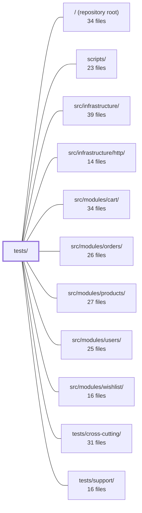

---
tags:
  - 2repo
  - 2repo/module
  - project/boilerplate-node-backend
type: module
module: tests/
files: 17
updated: 2026-08-25T11:23:02.482753+00:00
---

# tests/

## Purpose

`tests/` is the repository's automated verification layer. It validates the application across five complementary axes—multi-process cluster behavior, OpenAPI contract conformance, spec-driven fuzzing, single-process integration, and concurrency invariants—so that regressions in any of those dimensions are caught before they reach production.

## Key parts

- **`tests/cluster/`** — Boots a real multi-process cluster (via `tests/cluster/support/cluster.ts`) backed by a local Redis (`tests/cluster/support/redis.ts`). The rate-limit test here is the only suite that can detect a regression to an in-memory counter, since single-process tests cannot distinguish per-process from shared budgets.

- **`tests/contract/`** — Four complementary OpenAPI conformance suites: `request-contract.test.ts` (spec-valid payloads accepted, spec-invalid rejected), `request-sources.test.ts` (static source-file check that controllers don't declare more parameters than the spec allows, plus module-mounting validation), `system.test.ts` (health and error-envelope shapes), and the response-side mirror in sibling files. Together they catch both over-strict and under-strict validators.

- **`tests/fuzz/`** — `endpoints.fuzz.test.ts` auto-discovers every operation in `openapi.yaml`, generates hostile but spec-valid requests, and asserts no 5xx plus spec-conformant responses. Runs nightly / via `npm run test:fuzz`, outside the default gate.

- **`tests/integration/`** — The largest group. Sub-areas include:
  - *App-level*: `app-health.test.ts` (routes, 404, `/observability/*`), `auth-hardening.test.ts` (rate-limit budgets, 500-detail stripping), `locale.test.ts` / `locale-cache-invalidation.test.ts` (per-request language negotiation, cache-tag correctness).
  - *Concurrency*: `concurrency/auth-races.test.ts`, `concurrency/cart-races.test.ts`, `concurrency/wishlist-races.test.ts` — fire genuinely parallel requests and assert state invariants (exactly-one-user, no duplicate orders, no duplicate lines) rather than winner identity.
  - *I/O & security*: `product-multipart-write.test.ts` (string-typed form fields through multipart), `upload-security.test.ts` (oversized/malicious uploads rejected, path-traversal and directory-listing blocked on the static handler), `observability-auth.test.ts` (SSE and metrics auth/authorization failure modes).

## How it connects

- **`/` (repository root)** — npm scripts (`test`, `test:fuzz`, etc.) define the execution entry points; CI configuration selects which suites run in which job (e.g., the Redis service container for `tests/cluster/`).
- **`tests/support/`** — Provides the shared supertest harness and in-memory Mongo bootstrap that nearly every integration and contract test relies on.
- **`tests/cross-cutting/`** — Complementary suite that covers cross-module scenarios (e.g., feature-flag gating) not isolated to a single module's integration tests.
- **`src/infrastructure/http/`** — The Express app, middleware stack, and error serialisation that `app-health`, `locale`, `auth-hardening`, and `system` contract tests exercise end-to-end.
- **`src/infrastructure/`** — Bootstrap (`src/app.ts`), Redis client, and queue wiring that the cluster harness and observability tests depend on.
- **`src/modules/users/`** — Auth endpoints, signup multipart, rate-limiting, and the race invariants in `auth-races` / `upload-security`.
- **`src/modules/cart/`** and **`src/modules/orders/`** — The write paths whose concurrency guarantees `cart-races` and the double-checkout regression pin down.
- **`src/modules/wishlist/`** — The `$addToSet`/upsert write path validated under contention by `wishlist-races`.
- **`src/modules/products/`** — Multipart product-write decoding covered by `product-multipart-write`.
- **`scripts/`** — Test-orchestration and environment-provisioning scripts (Redis, container engine) that the cluster and fuzz suites invoke.

## Where to start

1. **`tests/integration/app-health.test.ts`** — The shortest, most self-contained integration file. It shows the shared harness pattern (boot real app via `src/app.ts`, drive with supertest), the expected response shapes, and the `/observability/*` surface. Reading it first gives you the vocabulary every other suite reuses.

2. **`tests/contract/request-contract.test.ts`** — Illustrates how the repo treats `openapi.yaml` as the single source of truth for request validation, and how the test derives its cases directly from the spec rather than hard-coding payloads. This mental model ("the spec is the contract, tests are the check") underpins the entire `tests/contract/` group and the fuzz suite.

## Connected modules

[[boilerplate-node-backend_ROOT|/ (repository root)]] · [[boilerplate-node-backend_scripts|scripts/]] · [[boilerplate-node-backend_src_infrastructure|src/infrastructure/]] · [[boilerplate-node-backend_src_infrastructure_http|src/infrastructure/http/]] · [[boilerplate-node-backend_src_modules_cart|src/modules/cart/]] · [[boilerplate-node-backend_src_modules_orders|src/modules/orders/]] · [[boilerplate-node-backend_src_modules_products|src/modules/products/]] · [[boilerplate-node-backend_src_modules_users|src/modules/users/]] · [[boilerplate-node-backend_src_modules_wishlist|src/modules/wishlist/]] · [[boilerplate-node-backend_tests_cross-cutting|tests/cross-cutting/]] · [[boilerplate-node-backend_tests_support|tests/support/]]

## Files
- `tests/cluster/rate-limit.test.ts` — Integration test that verifies the rate limiter enforces **one shared budget across all worker processes** when counters live in Redis, and demonstrates the opposite (budget multiplies by worker count) when they don't. It exists because every other test suite runs the app in a single process, where a per-process counter is indistinguishable from a shared one—so a regression to the in-memory store would otherwise pass the entire repository.
- `tests/cluster/support/cluster.ts` — Test-harness that boots a **real multi-process cluster** (spawns `src/cluster.ts` via `tsx`, with in-memory Mongo) so that tests can observe cross-worker state—bugs invisible to single-process `supertest` suites. It provides a `startCluster` entry point and a connection-disciplined `getOnFreshConnection` helper to ensure the OS load-balancer actually distributes requests across workers.
- `tests/cluster/support/redis.ts` — Test-support module that starts (or reuses) a Redis instance for the cluster integration suite. It deliberately avoids testcontainers: the repo is podman-first, and spawning a container via the already-named `CONTAINER_ENGINE` is ~30 lines with no added dependency. In CI, a pre-started service container is used via `NODE_TEST_REDIS_URL`, so no container is launched in-job.
- `tests/contract/request-contract.test.ts` — Contract-derived **request** tests for every write endpoint: asserts the API accepts every payload its own OpenAPI contract declares legal (2xx) and rejects exactly what it declares illegal (422 with a `ValidationErrorResponse`-shaped body). This is the request-side mirror of the other `tests/contract/*` files, which compare real **responses** against `openapi.yaml`. Together they catch two bug classes: validators tighter than the spec, and validators laxer than the spec.
- `tests/contract/request-sources.test.ts` — A static contract test that verifies every controller's declared request sources (`params`, `body`, `query`) are a **subset** of what `openapi.yaml` permits for the corresponding operation. It also validates module mounting (enabled modules, base paths, router prefixes) so that a wrong `basePath` or a missing entry in `src/modules.ts` — which would make real operations unreachable — is caught here rather than silently in production. No server is booted; the test compares two written claims by reading source files.
- `tests/contract/system.test.ts` — Contract tests that verify the API's system-level responses — the root health endpoint and the shared error envelope shapes (404, 422) — against the OpenAPI spec. It exists to catch drift between the spec's typed responses and what the server actually serializes.
- `tests/fuzz/endpoints.fuzz.test.ts` — Spec-driven fuzzing suite (L5). For every operation declared in `openapi.yaml`, it generates spec-valid but hostile requests against the real app and asserts two invariants: no 5xx is ever returned, and the response conforms to the spec (status code + shape). Operations are auto-discovered by walking the spec, so newly added routes are covered without maintaining a list. It runs nightly and via `npm run test:fuzz`, not in the default `npm run test` gate.
- `tests/integration/app-health.test.ts` — Integration tests that exercise the **real** Express application (bootstrapped via `src/app.ts`) through the shared supertest harness, covering the root route, unknown-route handling, and the `/observability/*` family (metrics, SSE events, and auth-protected endpoints). The file exists to verify that the production middleware stack behaves correctly end-to-end rather than testing a privately assembled app.
- `tests/integration/auth-hardening.test.ts` — Integration tests that verify two security-hardening properties of the auth layer: (1) credential endpoints are rate-limited by both identity and address with separate budgets, and (2) the global 500 handler strips internal error details while preserving deliberately chosen error messages. The tests exist to pin down behavior that is invisible in normal operation but critical under attack.
- `tests/integration/concurrency/auth-races.test.ts` — Integration tests that fire N genuinely concurrent requests against the account endpoints (signup, login, logout-all, reset-confirm) and assert **invariants** — "exactly one user exists", "all tokens are preserved" — rather than which request won. They guard two historically real race bugs (R1: duplicate signup via check-then-insert; R4: token loss via read-modify-write) and a one-time-token double-spend, while confirming the rate limiter is raised but not disabled.
- `tests/integration/concurrency/cart-races.test.ts` — Integration tests that exercise race conditions on the cart and checkout endpoints under concurrent load. It verifies two specific regressions: **R2** (double-checkout producing duplicate orders) and **R3** (concurrent cart upserts producing duplicate lines or duplicate carts). Each `describe` block maps to a distinct interleaving scenario that a single-threaded test cannot trigger.
- `tests/integration/concurrency/wishlist-races.test.ts` — Integration tests that pin down the concurrency guarantees of the wishlist endpoints under simultaneous writes. They exist to verify that the `wishlist/repository.ts` write path — which relies on `$addToSet` and an upsert guarded by a unique index on `userId` rather than an explicit retry budget — holds up under contention in exactly the same way the cart's retry-budgeted path does, and to fail loudly if either invariant is ever weakened.
- `tests/integration/locale-cache-invalidation.test.ts` — Integration test that drives the real app end-to-end to verify admin writes to locale routes actually remove the cached public dictionary response, rather than merely asserting the invalidation function was called. It guards against a tag-name mismatch between the read (store) and write (invalidate) sides, which would pass in development (30 s TTL clamp) but serve stale translations for an hour in production.
- `tests/integration/locale.test.ts` — Integration tests that verify per-request locale negotiation via the `Accept-Language` header, using `POST /account/signup` and `POST /feedback/contact` as subjects because both reject on validation before any repository call. This lets the tests exercise the full middleware stack (`attachLocale`, Zod thunks, `rejectResponse`) with no database, Redis, or queue. The two most critical cases guard against (1) concurrent requests in different languages cross-contaminating, and (2) Zod's built-in English defaults leaking onto the wire.
- `tests/integration/observability-auth.test.ts` — Integration tests that verify the authentication and authorization behavior of the two observability endpoints: `GET /observability/events` (SSE stream, cookie-authenticated, admin-only) and `GET /observability/metrics` (scrape endpoint, bearer-token-authenticated). They exist to lock in the exact failure modes—wrong role, forged credentials, revoked sessions, missing configuration—so that an attacker's reconnaissance surface stays locked down.
- `tests/integration/product-multipart-write.test.ts` — Integration test that verifies the server correctly decodes string-typed form fields (numeric `price`, boolean `active`) when a product is written via a multipart body with an image attachment. It exists because multipart form data arrives with every field as a string, and no other suite exercises this combination (JSON suites send native types; the signup multipart test has no numeric fields; frontend mocks coerce before dispatch).
- `tests/integration/upload-security.test.ts` — Integration tests for the unauthenticated upload on `POST /account/signup`. They verify two things end-to-end: (1) that malicious or oversized content is rejected **and not written to disk**, and (2) that the `express.static` serving of the upload directory cannot be used to execute stored payloads, read dotfiles, list directories, or escape via path traversal. The decisive assertions target the filesystem and response headers, not just status codes.

---
[[boilerplate-node-backend_INDEX|← boilerplate-node-backend index]]
