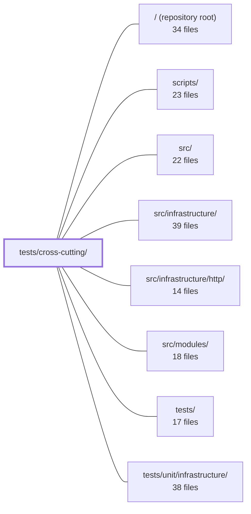

---
tags:
  - 2repo
  - 2repo/module
  - project/boilerplate-node-backend
type: module
module: tests/cross-cutting/
files: 31
updated: 2026-08-25T11:23:20.354658+00:00
---

# tests/cross-cutting/

## Purpose

`tests/cross-cutting/` is a collection of repository-level invariant tests that each enforce a structural or semantic rule spanning many modules simultaneously. Where a unit test inside a single module can only see its own boundary, these tests step outside that boundary to verify agreements *between* modules, between source and generated artifacts, or between the codebase and external tooling (CI workflows, frontend checkouts, OpenAPI contracts). They exist so that a drift that no single module test could detect—two modules claiming the same audit action, a locale key collision, a renamed metric counter—fails the suite the moment it is introduced.

## Key parts

- **Contract & schema guards** – `contract-bundles`, `contract-aliases`, `contract-error-declarations`, `contract-scalars`, `contract-search-parity`, `seed-conformance`, and `generated-type-shadowing` collectively keep the OpenAPI/AsyncAPI documents, generated Zod schemas, orval constants, and seed data mutually consistent.
- **Module structure & naming** – `module-shape`, `module-file-shapes`, `controller-naming`, `service-namespaces`, `subdomain-discipline`, `published-language`, `audit-actions`, `metric-names`, `outbox-names`, and `probes-are-wired` enforce the closed vocabularies (file shapes, naming conventions, barrel-export size, subdomain classification, action/metric/mail-name uniqueness) that let new modules be added without a manual checklist.
- **Security & correctness of public surfaces** – `authenticated-controllers`, `credential-fields`, `search-regex`, `search.property`, and `paginated-sort-is-total` protect the boundary where unauthenticated user input meets the database (auth misplacement, leaked secrets, regex injection, non-deterministic pagination).
- **Locale & i18n integrity** – `locale-namespaces` and `locale-parity` ensure the deep-merged translation dictionary has no key collisions and no missing keys across locales.
- **Tooling & CI hygiene** – `ci-covers-the-gate` and `coverage-thresholds` prevent silent gaps between the local pre-commit gate and the CI workflow, and guard against Jest's silent ignore of empty glob patterns.
- **Context & dependency graph** – `context-map` verifies that `dependsOn` declarations in module manifests stay in lockstep with actual `@modules/*` imports.
- **Process-memory & infrastructure contracts** – `process-snapshot` pins the small set of files allowed to read process memory and the exact schema published in OpenAPI/AsyncAPI.
- **Frontend pairing** – `frontend-pairing` documents and enforces the (intentionally asymmetric) module-name mapping between this backend and the sibling Vue frontend.

## How it connects

- **`src/modules/`** – Most tests in this directory scan, import, or statically read files under `src/modules/*/`. They validate invariants that are *across* modules (naming uniqueness, barrel-export size, locale key ownership, audit-action uniqueness) and therefore have no natural home inside any single module's own test directory.
- **`src/infrastructure/`** – Tests such as `contract-scalars`, `search-regex`, `search.property`, `serialize.property`, `paginated-sort-is-total`, and `process-snapshot` pin the behavior of shared infrastructure utilities (scalar bounds, regex escaping, serialization, sort totality, memory payload) that every module consumes.
- **`/` (repository root)** – `ci-covers-the-gate` reads `.github/workflows/` and `package.json`; `coverage-thresholds` mirrors `jest.config.js`; `frontend-pairing` reads the sibling `boilerplate-vue-frontend` checkout; `seed-conformance` reads `db/demo/demo-data.json`. These tests anchor the codebase to its tooling and external contracts.
- **`tests/unit/infrastructure/`** – The property-based suites here (`search.property`, `serialize.property`) are the repository-level complement to the per-function unit tests in `tests/unit/infrastructure/`: the unit tests check specific known inputs, while these check *all* inputs via `fast-check`.

## Where to start

1. **`module-shape.test.ts`** – It encodes the "outline" every module must satisfy (folder layout, manifest registration, route mounting, barrel hygiene, docs). Reading it first gives a newcomer the mental model of what a "valid module" looks like before diving into the more specialized invariants.
2. **`context-map.test.ts`** – It shows the `dependsOn` / import-edge contract that governs how modules may reference each other, which is the single most important architectural rule for understanding why the cross-cutting tests exist at all.

## Connected modules

[[boilerplate-node-backend_ROOT|/ (repository root)]] · [[boilerplate-node-backend_scripts|scripts/]] · [[boilerplate-node-backend_src|src/]] · [[boilerplate-node-backend_src_infrastructure|src/infrastructure/]] · [[boilerplate-node-backend_src_infrastructure_http|src/infrastructure/http/]] · [[boilerplate-node-backend_src_modules|src/modules/]] · [[boilerplate-node-backend_tests|tests/]] · [[boilerplate-node-backend_tests_unit_infrastructure|tests/unit/infrastructure/]]

## Files
- `tests/cross-cutting/audit-actions.test.ts` — Cross-cutting test that validates the audit-action vocabulary of every module simultaneously. Rather than pinning specific action strings (which would reintroduce the cross-module coupling the architecture removes), it asserts three structural invariants: every module that declares an `audit.ts` actually exports actions, no action string is claimed by two modules, and every action string follows the dotted lower-snake-case convention (`noun.noun.verb`) that log-backend prefix filtering depends on.
- `tests/cross-cutting/authenticated-controllers.test.ts` — Cross-cutting guard test that ensures every controller handler calling `authContextOf()` is only reachable on an authenticated route. Because `authContext` is optional until the `isAuth` middleware resolves it, a handler that reads it on a public route would fail at runtime with `undefined.id`; this test catches that misplacement at test time by correlating controller source with route registration order.
- `tests/cross-cutting/ci-covers-the-gate.test.ts` — Guards against drift between the local pre-commit gate (`npm run complete`) and the CI workflow definitions. Historically, five checks existed in the gate but had no CI job, meaning `--no-verify`, missing husky, or fork PRs could bypass them while CI stayed green. This test asserts that every leaf check in the `complete` chain has a corresponding job in `.github/workflows/`, treating the workflow files as the backstop for the known bypass paths.
- `tests/cross-cutting/context-map.test.ts` — Cross-cutting test that verifies the `dependsOn` graph declared in module manifests is in sync with the actual `@modules/*` imports in production source. It enforces three invariants: every declared edge has a corresponding import, every cross-module import has a declared edge, and `shared-kernel` relationships are confined to a hard allowlist.
- `tests/cross-cutting/contract-aliases.test.ts` — Validates the `x-alias-of` OpenAPI extension by asserting that every operation marked as an alias is truly functionally interchangeable with its canonical target: same success status code and same 2xx response schema. It exists to give the annotation teeth — the extension is inert to all generators, so without these assertions a drifted alias would silently mislead SDK authors.
- `tests/cross-cutting/contract-bundles.test.ts` — Jest suite that validates every contract bundle in the repo—both committed (compiled) and generated (client collections). It asserts structural invariants of the OpenAPI, AsyncAPI, and analytics-event bundles (fragment non-emptiness, path exclusivity, channel–message integrity, server binding, public/full split) and checks that the shared-file guard in `spec-identity` matches the bundle manifest. It intentionally does **not** re-run the byte-for-byte `check:contracts-bundle --check` assertion, which CI already enforces on every commit.
- `tests/cross-cutting/contract-error-declarations.test.ts` — Enforces that every OpenAPI contract fragment which accepts a templated id parameter (`{id}`, `{orderId}`, `{userId}`, …) declares a `422` response, because the shared `databaseErrorInterpreter` can answer `422 Invalid identifier` on any such route. The test reads the per-module fragment files directly (not the generated bundle) so that failures point at the file a developer actually edits, and it is scoped to 422 only—500 omissions are noted in the header comment but intentionally not asserted.
- `tests/cross-cutting/contract-scalars.test.ts` — Guarantees that the shared scalar bounds declared in `infrastructure` (`pageSizeSchema`, `hardDeleteSchema`) stay in lockstep with the per-operation constants orval generates from the OpenAPI contract. Because orval duplicates a single shared component into one constant per endpoint, `infrastructure` cannot import "the" constant without coupling itself to a specific domain; this test is the bridge that catches drift in either direction after regeneration.
- `tests/cross-cutting/contract-search-parity.test.ts` — Verifies that the two spellings of a search endpoint (`GET /resource?filter=x` and `POST /resource/search {filter}`) declare identical validation constraints. It exists to catch the structural drift that arises naturally when a constraint is added to one spelling's location in the OpenAPI document (query `parameters`) but not the other's (request-body schema), leaving the same filter documented as open on one route and closed on the other.
- `tests/cross-cutting/controller-naming.test.ts` — Cross-cutting naming-convention guard that asserts every controller file under `src/modules/*/controllers/` is named `<verb>-<thing>.ts`, where verb is one of `get`, `post`, `put`, `patch`, `delete`, or `write`. It enforces the convention by discovery (scanning the filesystem) rather than by a maintained list, so new modules are covered automatically. The file intentionally has no allowlist: any exception would require one, and the repo's policy is to eliminate exceptions structurally (e.g., by splitting a file) instead of papering over them.
- `tests/cross-cutting/coverage-thresholds.test.ts` — Guards against a silent failure mode in `jest.config.js`: a `coverageThreshold` key whose glob matches no files is silently ignored by Jest (the run stays green). This test re-runs the exact glob expansion Jest's `CoverageReporter` performs and fails the suite if any key resolves to zero files, so a directory rename turns a red run instead of leaving a floor unmeasured.
- `tests/cross-cutting/credential-fields.test.ts` — Cross-cutting guard that asserts no credential-shaped property name survives the Mongoose `toJSON()` serialization of any registered model. It exists because the only thing keeping a password hash or live token out of a response body is an `omit` entry in the schema transform, and adding a new field to a schema does not automatically add it to that list. The test drives the transform layer (not query-time `select: false`) so it catches a missing or renamed `omit` entry regardless of how the field would otherwise be requested.
- `tests/cross-cutting/frontend-pairing.test.ts` — Verifies that every backend module has a documented counterpart in the sibling `boilerplate-vue-frontend` checkout (and vice versa), and that any name mismatch carries a human-readable justification. It exists because the two repositories' module names do not align 1:1, and the reasoning behind the asymmetry is recorded nowhere else.
- `tests/cross-cutting/generated-type-shadowing.test.ts` — Cross-cutting guard that enforces the convention "a contract schema is declared once, in `openapi.yaml`—never restated in TypeScript." It scans the generated type bundle under `api/models` for exported names, then walks every `.ts` file under `src/` to assert no handwritten `interface` or `type` reuses one of those names (unless explicitly allowlisted). The test reads the generated source textually via regex rather than importing it, because `interface` declarations carry no runtime value and a star-import would see only the enums.
- `tests/cross-cutting/locale-namespaces.test.ts` — Guards the locale namespace contract across all modules: because `infrastructure` deep-merges every module's `en.json` onto the shared dictionary at boot (last-writer-wins), a silent key collision would corrupt user-facing copy with no runtime error. This file statically verifies that no module redefines a shared key, no two modules claim the same key, and every key lives under its owning module's namespace prefix.
- `tests/cross-cutting/locale-parity.test.ts` — Cross-cutting test that asserts every supported locale declares an identical set of keys across the **merged** dictionary (shared file + all module locale directories). It exists because a missing translation is otherwise silent: each JSON file is valid in isolation, and the user simply sees the raw key rendered in the wrong language. No single module test catches this, so one repository-level property test covers it for all modules simultaneously.
- `tests/cross-cutting/metric-names.test.ts` — A cross-cutting test that validates metric names by **reading source text** rather than importing modules. It cross-checks that every metric name the overview controller reads by string literal is actually declared in some module's `metrics.ts`, enforces Prometheus naming rules, and guards against the silent failure mode of a renamed counter (which compiles, passes unit tests, and only shows up as a flat line on a dashboard weeks later).
- `tests/cross-cutting/module-file-shapes.test.ts` — Enforces a closed vocabulary of allowed file shapes inside every `src/modules/<name>/` directory. Any file that matches no registered pattern fails the suite by name, and any pattern matched by no file also fails — making the catalogue both a whitelist and a liveness check. The file deliberately contains no prose descriptions of shapes; that lives in `docs/reference/src-modules.md`.
- `tests/cross-cutting/module-shape.test.ts` — Cross-cutting structural test that enforces the agreements between a module's folder on disk, its manifest in `enabledModules`, and its presence in `docs/modules/`. It verifies the module's *outline* — naming, registration, route-mounting coherence, test-directory existence, barrel-export hygiene, and documentation coverage — without inspecting the module's internal implementation.
- `tests/cross-cutting/outbox-names.test.ts` — Cross-backend contract test for outbox mail names. It enforces that every `template:` identifier published by this Node/EJS backend is extension-free, two-segment kebab-case, unique, resolvable to a real template file, and exactly the set the PHP/Blade twin also publishes — so the shared frontend e2e specs can match mails by name regardless of which backend they run against.
- `tests/cross-cutting/paginated-sort-is-total.test.ts` — A cross-cutting guard that statically asserts every `$sort` stage co-located with a `$skip` in the source tree is *total*—its final key is unique (`_id` or `id`)—so that the non-deterministic tie order MongoDB allows among equal keys cannot cause a document to appear on two pages or be skipped by both. It exists because `createdAt` (or any non-unique field) is not a safe sole sort key for paged reads, and the failure mode is silent.
- `tests/cross-cutting/probes-are-wired.test.ts` — Guard test that asserts a bidirectional agreement between the `PROBED_SECTIONS` map (hand-maintained in `generate-collections.ts`) and the actual `probes.ts` files on disk under `src/modules/`. It catches the silent case where a new module writes probes but never edits the map, producing contract collections that look complete but omit those probes.
- `tests/cross-cutting/process-snapshot.test.ts` — A cross-cutting architectural test that enforces two invariants for the process-memory/uptime payload: (1) only a fixed, documented set of files may call `process.memoryUsage()` or `process.uptime()` directly, and (2) the memory schema block declared in `openapi.yaml` and `asyncapi.yaml` must agree on field names, field order, and closedness. It also pins the `uptimeSeconds` type as a non-negative integer in all three published locations.
- `tests/cross-cutting/published-language.test.ts` — Enforces, across every module at once, the rule that a module's `index.ts` barrel publishes exactly the names its sibling modules import — no more, no less. It exists because ESLint can prevent reaching past the barrel but cannot judge whether the barrel is the right *size*; this test closes that gap structurally (a module with no barrel cannot be imported at all) rather than by convention.
- `tests/cross-cutting/search-pagination.test.ts` — Locks down the contract of `normalizePagination` — the single authority on pagination **defaults** — and explicitly guards what it must *not* do (e.g., capping caller-supplied page sizes). It exists so that the boundary between "normalize defaults" (this function) and "reject out-of-range" (the HTTP schema layer) stays intact.
- `tests/cross-cutting/search-regex.test.ts` — Cross-cutting integration tests for the regex-escaping and filter-building layer that sits between public, unauthenticated search endpoints (`POST /products/search`, `GET /products?text=`) and MongoDB's `$regex`. The file verifies two distinct security/correctness invariants: that metacharacters are escaped so user input is matched literally (preventing catastrophic backtracking DoS and regex syntax errors), and that control characters (NUL, ESC, DEL, etc.) are stripped before pattern construction (preventing a C-string 500 from the driver).
- `tests/cross-cutting/search.property.test.ts` — Property-based tests (via `fast-check`) for the security-relevant functions in `src/infrastructure/persistence/search.ts`. Unlike the sibling example-based suites (`search-regex.test.ts`, `search-pagination.test.ts`), this file asserts totality over *arbitrary* inputs: that `escapeRegex` is a literal-match guarantee for every possible string, and that `normalizePagination` never yields a value Mongo would reject. It owns the generated-combination and non-idempotence facts the example-based files cannot express.
- `tests/cross-cutting/seed-conformance.test.ts` — Validates that the exported demo dataset (`db/demo/demo-data.json`) still conforms to the OpenAPI contract as expressed by the generated Zod schemas. It exists to close the drift gap in the "contract renames a field, seed keeps the old name" direction, which neither the compile-time fixture typing nor the `check:spec-identity` byte-comparison would catch. It is a mirror of the paired frontend's `seedConformance.spec.ts`; both repos run it so a stale copy on either side is caught immediately.
- `tests/cross-cutting/serialize.property.test.ts` — Property-based tests (via `fast-check`) for `applySerialization`. Instead of asserting behavior on a handful of known model shapes, these tests generate arbitrary documents and verify the universal serialization contract—`_id` → `id` rename, `__v` deletion, `omit` key removal, in-place mutation, idempotency, and `after`-hook ordering—for *any* input shape. This matters because 95 of the OpenAPI schemas forbid extra properties, so a single leaked field is a contract violation.
- `tests/cross-cutting/service-namespaces.test.ts` — Enforces two structural invariants across all modules under `src/modules`: (1) each module exports exactly one object whose name ends in `Service`, and (2) that object is the *complete* surface of the service — every exported function must be a member of it. The file exists to catch the silent failure mode where a developer adds a loose function export and forgets to add it to the namespace object; nothing breaks at runtime, but the namespace quietly stops being the single entry point the rest of the codebase assumes.
- `tests/cross-cutting/subdomain-discipline.test.ts` — Enforces DDD subdomain discipline as a structural constraint: every enabled module must declare a subdomain classification (`core`, `supporting`, or `generic`), and `generic` modules must not contain a `domain/` folder. It exists to make the classification field *operative* rather than decorative — a generic subdomain carrying a hand-written rules layer signals effort spent on a part of the system that should be bought, not built.

---
[[boilerplate-node-backend_INDEX|← boilerplate-node-backend index]]
