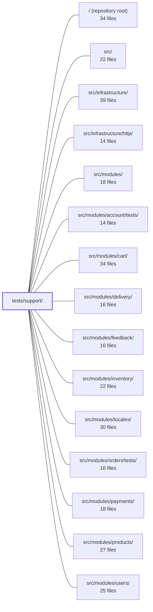

---
tags:
  - 2repo
  - 2repo/module
  - project/boilerplate-node-backend
type: module
module: tests/support/
files: 16
updated: 2026-08-25T11:23:35.886730+00:00
---

# tests/support/

## Purpose

`tests/support/` is the shared infrastructure layer for the entire test suite. It owns every cross-cutting concern that test files need—database lifecycle, HTTP request harness, OpenAPI contract validation, environment-variable scoping, concurrency primitives, and import-order bootstrapping—so that individual spec files can focus on assertions rather than plumbing.

## Key parts

- **Jest bootstrap & environment** — `setup.ts` (the `setupFiles` entry that sets env vars, i18n locales, and Zod messages before any module loads), `i18n-boot.ts` (reproduces `app.ts`'s import-ordering so module-scope `t()` calls are tested correctly), `environment.ts` (per-test-case env-var override with guaranteed restore).
- **Database lifecycle** — `global-setup.ts` / `global-teardown.ts` (start and stop a single in-memory MongoDB per Jest instance, managing `.tmp/mongo/<pid>` directories), `database.ts` (per-file `connect` / `disconnect` / `clearAll` helpers against that shared server), `setup-test-db.ts` (registers `beforeEach`/`afterAll` hooks for any Mongo-touching suite), `migrations.ts` (discovers and replays `db/migrations` in canonical order).
- **HTTP & contract testing** — `http.ts` (supertest harness that drives the mounted Express app through its full pipeline), `contract.ts` (registers the `jest-openapi` matcher for spec-level response validation), `spec-walk.ts` (enumerates every OpenAPI operation and resolves request-body schemas for the fuzzer), `contract-data.ts` (Zod-schema-driven payload generator producing valid and single-constraint-violating bodies), `express.ts` (minimal Response stub for unit-level middleware/error-handler tests), `race.ts` (fires N parallel requests and asserts "only one wins" semantics).
- **Type & assertion helpers** — `response.ts` (narrows `ResponseSuccess | ResponseReject` with an explicit branch assertion), `stub.ts` (the single sanctioned `asStub` cast helper).

## How it connects

- **`/` (repository root)** — The Jest config in the root `package.json` / `jest.config` points `globalSetup`, `globalTeardown`, and `setupFiles` at files in this directory.
- **`src/`** — `http.ts` imports `src/app.ts` to obtain the mounted Express app (the auto-start guard is skipped in test env). `i18n-boot.ts` deliberately mirrors `app.ts`'s import sequence.
- **`src/infrastructure/http/`** — The supertest harness in `http.ts` and the `express.ts` stub both exercise this layer's middleware, serialisers, and error responders.
- **`src/modules/`** (and sub-module test suites such as `src/modules/account/tests/`, `src/modules/orders/tests/`) — Contract/fuzz tests derive their endpoint and payload space from the OpenAPI spec of these modules via `spec-walk.ts` + `contract-data.ts`; `race.ts` targets module endpoints that enforce uniqueness (e.g. orders, carts).
- **`src/modules/locales/`** — `setup.ts` registers the locale directories and `i18n-boot.ts` ensures module-scope initialisation, both of which depend on the locale assets produced by this module.
- **`tests/`, `tests/unit/`, `tests/unit/infrastructure/`** — All spec files import helpers from this directory; unit tests lean on `express.ts`, `stub.ts`, `response.ts`, and `environment.ts`, while integration/contract tests rely on the HTTP, database, and OpenAPI groups.

## Where to start

1. **`setup.ts`** — Read this first to understand *when* and *why* env vars, i18n, and Zod messages are configured before any module under test is imported. It explains the constraint that shapes every other file in the directory.
2. **`http.ts`** — Next, read the contract-test harness to see how a real HTTP request is driven through the full Express pipeline and compared against `openapi.yaml`. Once you understand this loop, the roles of `spec-walk.ts`, `contract-data.ts`, and `contract.ts` become self-evident.

## Connected modules

[[boilerplate-node-backend_ROOT|/ (repository root)]] · [[boilerplate-node-backend_src|src/]] · [[boilerplate-node-backend_src_infrastructure|src/infrastructure/]] · [[boilerplate-node-backend_src_infrastructure_http|src/infrastructure/http/]] · [[boilerplate-node-backend_src_modules|src/modules/]] · [[boilerplate-node-backend_src_modules_account_tests|src/modules/account/tests/]] · [[boilerplate-node-backend_src_modules_cart|src/modules/cart/]] · [[boilerplate-node-backend_src_modules_delivery|src/modules/delivery/]] · [[boilerplate-node-backend_src_modules_feedback|src/modules/feedback/]] · [[boilerplate-node-backend_src_modules_inventory|src/modules/inventory/]] · [[boilerplate-node-backend_src_modules_locales|src/modules/locales/]] · [[boilerplate-node-backend_src_modules_orders_tests|src/modules/orders/tests/]] · [[boilerplate-node-backend_src_modules_payments|src/modules/payments/]] · [[boilerplate-node-backend_src_modules_products|src/modules/products/]] · [[boilerplate-node-backend_src_modules_users|src/modules/users/]] · … and 4 more

## Files
- `tests/support/contract-data.ts` — Zod-schema-driven fixture generator for request-body payloads. It walks a Zod v4 schema and produces (a) a payload that satisfies every constraint and (b) payloads that each violate exactly one constraint. It exists to answer "does the API honour its own contract for *any* legal input?" — a question the hand-written per-module factories (`tests/factory.ts`) cannot answer. It is additive; deterministic scenario tests continue to use those factories.
- `tests/support/contract.ts` — Side-effect module that registers the `jest-openapi` matcher so any test can validate a real HTTP response against `openapi.yaml`. It exists because the project's Zod schemas are non-strict (they strip unknown keys) and are only used for request payloads, so over-serialization issues (e.g. leaked `password`, extra `_id`) would be invisible without spec-level response validation.
- `tests/support/database.ts` — Provides the three database lifecycle helpers (`connect`, `disconnect`, `clearAll`) that Jest test files use to talk to a **shared** in-memory MongoDB. By connecting to one globally-started server (one per Jest instance) instead of spawning a `MongoMemoryServer` per file, it cuts the disk and process cost of test runs—especially under Stryker mutation testing—while preserving per-file data isolation through a unique database name.
- `tests/support/environment.ts` — Test helper that lets a single test case temporarily override an environment variable and guarantees the original state is restored afterward. It exists because all configuration in this codebase is read lazily at the point of use, so tests need a safe, per-case way to vary a value without leaking it into subsequent cases in the same file.
- `tests/support/express.ts` — Provides a minimal Express `Response` stub for unit tests that assert on what a function *attempts to send* (status code, JSON body). It exists so tests of middleware, error responders, or rejection paths can inspect outgoing data without spinning up a server or exercising the full HTTP stack.
- `tests/support/global-setup.ts` — Jest global-setup hook that starts a single in-memory MongoDB server for the entire test run and passes its connection URI to workers via `process.env`. It also manages per-instance data directories under `.tmp/mongo/<pid>` and sweeps directories left behind by SIGKILLed prior instances (a common occurrence under Stryker mutation testing).
- `tests/support/global-teardown.ts` — Jest global teardown hook that runs once per jest instance after the last worker exits. It stops the shared in-memory MongoDB server started by `globalSetup` and deletes the instance-specific temp data directory. It exists to make resource cleanup prompt rather than relying on process death, while guaranteeing that cleanup failures can never fail an already-completed test run.
- `tests/support/http.ts` — HTTP-level test harness for contract tests. It drives the mounted Express app through its full request pipeline (routing, middleware, auth, serialization, error handling) using `supertest`, which is the only layer where a response can be meaningfully compared against `openapi.yaml`. Importing `src/app.ts` in a test environment skips its auto-start guard, so no server, Mongo, Redis, or queue is spawned.
- `tests/support/i18n-boot.ts` — Reproduces the import ordering that `app.ts` enforces in production (module code executes before `i18next.init()` runs) so that tests can detect the bug where a module-scope `t()` call returns `undefined`, causing Zod to silently fall back to English defaults. Without this helper, Jest's `setupFiles` mechanism initialises i18next before any spec imports a module, masking the issue.
- `tests/support/migrations.ts` — Shared test-support module that discovers and loads the real migration files from `db/migrations` in the same order `migrate-mongo` would apply them. It exists so that two test suites that both need a migrated database define "the migrations" in one place, preventing silent drift in file discovery, ordering, or filtering from going unnoticed.
- `tests/support/race.ts` — A small concurrency-harness module that fires N identical HTTP requests simultaneously and provides assertion helpers for the outcomes. It exists so the three race test suites can verify that "only one participant wins" semantics hold under genuine parallelism—something mutation testing and serial suites structurally cannot verify.
- `tests/support/response.ts` — Test-only helpers that narrow a service's `ResponseSuccess<T> | ResponseReject` union to a single arm while asserting the correct branch via `expect()`. This replaces repeated inline `as` casts in test files, so a response that took the wrong branch fails on a clear assertion line rather than surfacing later as an `undefined` read.
- `tests/support/setup-test-db.ts` — Registers MongoDB lifecycle hooks for any test suite that touches Mongo. Called once at the top level of a test file, it guarantees a connected in-memory database for the suite and an empty one at the start of every `it()`, so each test can assert on absolute document counts regardless of execution order.
- `tests/support/setup.ts` — Jest `setupFiles` bootstrap that runs once per worker **before any test module is imported**. It sets environment variables (rate limits, Redis toggle, metrics token, mongod binary), registers i18n locale directories, initialises i18next, and wires Zod validation messages. The file exists because these values are read at **import time** by the modules under test; setting them later (e.g. in `beforeAll`) would be too late.
- `tests/support/spec-walk.ts` — Enumerates every operation declared in `openapi.yaml` and resolves their request-body schemas so the fuzz-test suite can derive its endpoint and payload space directly from the spec. The endpoint list is never hand-written; adding a route to the spec automatically extends fuzzer coverage. It is deliberately scoped: it resolves `$ref`, flattens `allOf`, and reads path parameters, but stops before the territory where a real OpenAPI tool would be the right answer.
- `tests/support/stub.ts` — Provides a single, named cast helper (`asStub`) that is the **only** sanctioned location in the codebase for converting a hand-built test stub object to an arbitrary interface type. It exists to centralize the unavoidable `as unknown as T` double-cast so it is no longer scattered across dozens of test suites, and to give reviewers one searchable symbol to find.

---
[[boilerplate-node-backend_INDEX|← boilerplate-node-backend index]]
