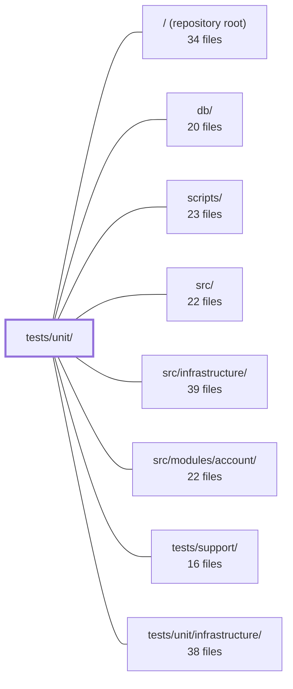

---
tags:
  - 2repo
  - 2repo/module
  - project/boilerplate-node-backend
type: module
module: tests/unit/
files: 15
updated: 2026-08-25T11:23:54.451246+00:00
---

# tests/unit/

## Purpose

Unit tests that pin the behavioral contract of individual functions, handlers, and kernel abstractions in isolation. Each file uses stubs, synthetic AST snippets, or in-memory databases to verify a narrow guarantee—exit codes, index compatibility, event ordering, rule flagging—without requiring a live server, a sibling repo, or a full migration pass.

## Key parts

- **`app/`** — Locks the `uncaughtException` / `unhandledRejection` contract so a future refactor cannot silently swallow fatal errors in dev and CI.
- **`db/`** — Five files covering the database tooling surface: the `npm run host` wrapper and URI resolution, the committed demo-data snapshot's byte-identity under multiple migration orderings, migration-vs-Mongoose index compatibility, the `runScript` wrapper's exit/cleanup/error-logging guarantees, and URL-path validity of every seed-fixture image reference.
- **`eslint/`** — `RuleTester`-driven tests for two custom rules (`controller-chain-must-catch`, `no-hardcoded-user-text`), each with valid *and* invalid cases to prevent both under- and over-reporting.
- **`i18n/`** — Locks the producer/worker boundary for outbound email: `enqueueEmail` must publish resolved copy; `handleEmailJob` must be locale-agnostic at render time.
- **`kernel/`** — Tests for the shared kernel layer: the two authorization scoping combinators, the three auth middlewares (with their deliberately distinct failure modes), the domain event bus (resolution-after-all-handlers + handler-failure isolation), and the module registry's boot-time validation (duplicate, cycle, missing-dependency detection).
- **`scripts/`** — Tests for the mutation-score ratchet (asymmetry: up is free, down is blocked) and the cross-repo spec-identity check (OpenAPI, AsyncAPI, analytics seed byte-identity).

## How it connects

- **`src/`** — The primary system under test. Kernel tests import `src/kernel/authorization.ts`, `src/kernel/middlewares/authorizations.ts`, the event bus, and the registry; `db/run-script.test.ts` exercises `src/db/run-script.ts`.
- **`db/`** — Migration and seed tests execute real migration and seeder code from this directory against a temporary database; the demo-data test compares output to `db/demo/demo-data.json`.
- **`scripts/`** — `mutation-baseline.test.ts` and `spec-identity.test.ts` drive the corresponding script modules with synthetic inputs.
- **`src/infrastructure/`** — Kernel and i18n tests stub or exercise infrastructure boundaries (audit sinks, job queues, email producers) to keep assertions at the unit level.
- **`src/modules/account/`** — Authorization and middleware tests use account-scoped stubs to verify read-scoping and token-resolution behavior.
- **`tests/support/`** — Provides shared helpers (stub builders, in-memory Mongo setup, fixture generators) consumed across several files here.
- **`tests/unit/infrastructure/`** — Sibling unit-test module for lower-level infrastructure; this module tests the kernel and application-layer abstractions that sit above it.
- **`/` (repository root)** — `spec-identity.test.ts` reads shared contract files (OpenAPI, AsyncAPI, analytics seed) from the repo root to verify byte-identity against a sibling checkout.

## Where to start

1. **`kernel/registry.test.ts`** — shortest path to understanding how the application's modules declare dependencies, how the boot order is validated, and what "fail loudly" means in practice. Every other kernel test assumes this wiring.
2. **`app/process-error-handlers.test.ts`** — a small, self-contained file that shows the testing philosophy in action: pin a safety-critical contract (log *then* exit) so a single misplaced `return` can never produce a green suite around a dead process.

## Connected modules

[[boilerplate-node-backend_ROOT|/ (repository root)]] · [[boilerplate-node-backend_db|db/]] · [[boilerplate-node-backend_scripts|scripts/]] · [[boilerplate-node-backend_src|src/]] · [[boilerplate-node-backend_src_infrastructure|src/infrastructure/]] · [[boilerplate-node-backend_src_modules_account|src/modules/account/]] · [[boilerplate-node-backend_tests_support|tests/support/]] · [[boilerplate-node-backend_tests_unit_infrastructure|tests/unit/infrastructure/]]

## Files
- `tests/unit/app/process-error-handlers.test.ts` — Unit tests for the process-level `uncaughtException` and `unhandledRejection` handlers installed by `installErrorHandling`. They guard against a critical regression: a branch that returns before logging would cause the process to silently swallow fatal exceptions in dev and CI, passing a green suite while the server stops functioning. The tests pin the contract that non-test environments always log and exit, while the test runner environment installs nothing for `uncaughtException`.
- `tests/unit/db/host-scripts.test.ts` — Guards the `npm run host -- <script>` wrapper and the two URI-resolver code paths it depends on. It verifies that the wrapper blanks the full-URI env vars and redirects only the hostname to loopback, that `getDatabaseUri()` correctly falls through to per-fragment env vars when the URI is empty (rather than hardcoding a database name), and that `migrate-mongo-config.js`—which must duplicate the resolution logic in CommonJS—stays in lockstep with the application resolver.
- `tests/unit/db/migration-demo-data.test.ts` — Guarantees that the committed demo-data artefact (`db/demo/demo-data.json`) is byte-identical to what a live database would contain after migrations and seeders run. It exercises three orderings — migrate-then-seed, seed-then-migrate, and a double migration pass — to catch any migration that rewrites rows in a way that diverges from the published snapshot. No other test places migrations and seeders in the same database.
- `tests/unit/db/migration-model-indexes.test.ts` — Verifies that migration-created indexes and Mongoose schema-declared indexes are mutually compatible. No other test suite exercises a database that has been both migrated and booted; this is the one state where a name or option mismatch (e.g. same key, different name → `IndexKeySpecsConflict`) would surface in production but stay invisible in CI. The test also guards against the discovery mechanism itself going silently empty.
- `tests/unit/db/run-script.test.ts` — Unit tests for the `runScript` wrapper in `db/run-script.ts`. The wrapper exists to guarantee three things a bare promise chain does not: a non-zero exit code on failure, cleanup execution even when the body throws (without which `db:seed` leaves Mongo/Redis sockets open and the process hangs), and a logged error reason. These tests pin all three behaviours plus edge cases.
- `tests/unit/db/seed-fixtures.test.ts` — Validates that every `imageUrl` field in the seed/demo fixtures is a well-formed, repository-shipped URL path under the `express.static` mount. It exists to catch the silent "images are broken" class of bug — Windows separators leaking into URL strings, references to files that were never committed, or fixture images placed outside the `seed/` directory that `.gitignore` would silently drop.
- `tests/unit/eslint/controller-chain-must-catch.test.ts` — Unit test for the `controller-chain-must-catch` ESLint rule. It feeds parsed-AST code snippets through ESLint's `RuleTester` to verify that the rule correctly flags promise chains in exported handlers that lack a `.catch`, while leaving the rule's documented carve-outs (chains inside handlers, private helpers, non-chain code) unflagged.
- `tests/unit/eslint/no-hardcoded-user-text.test.ts` — Unit tests for the `no-hardcoded-user-text` ESLint rule. The suite verifies that the rule flags bare string literals (and no-expression template literals) in the `errors` argument of `rejectResponse` / `generateReject`, while explicitly not flagging dictionary `t(…)` calls, `code:` identifiers, templates with expressions, or unrelated function calls. The valid cases exist specifically to prevent over-reporting, which is the failure mode that trains developers to silence a rule.
- `tests/unit/i18n/email-locale.test.ts` — Verifies the two-halves i18n contract for outbound email: the **producer** (`enqueueEmail`) must publish fully-resolved copy (no locale keys, no lookup pending), and the **worker** (`handleEmailJob`) must render whatever finished strings it receives regardless of what locale (if any) surrounds it at runtime. These tests exist to lock that boundary so a future refactor cannot accidentally reintroduce a locale dependency on the worker side.
- `tests/unit/kernel/authorization.test.ts` — Unit tests for the two read-scoping combinators exported by `src/kernel/authorization.ts`. They assert the kernel's contract in isolation—using stub builders—so a failure pinpoints the shared rule (admin bypass, non-admin narrowing, fail-closed on empty id) rather than a specific module's collection logic.
- `tests/unit/kernel/authorizations.test.ts` — Unit tests for the authorization middlewares exported from `src/kernel/middlewares/authorizations.ts`. Verifies the three deliberately distinct failure modes (`getAuth` fails open, `isAuth` 401, `isAdmin` 401-or-403), the `getTokenBearer` parser, and the cookie-based `isAdminViaCookie`. The response object is real (not mocked) so the asserted status codes and body envelopes are what a client actually receives; only the audit sink and the JWT/user-resolution boundary are stubbed.
- `tests/unit/kernel/events.test.ts` — Unit tests for the domain event bus (`@kernel/events`). The suite exists to lock in two guarantees the product-delete → cart-empty path depends on: (1) `emitDomainEvent` resolves only after every handler has finished, and (2) a throwing or rejecting handler is caught and logged without aborting the remaining handlers or the emitter.
- `tests/unit/kernel/registry.test.ts` — Unit tests for the kernel's module registry validation and registration. The file enforces that misconfigurations (duplicates, missing deps, cycles, self-references) fail loudly at boot time with the offending names named, rather than producing silent 500s after startup. It also pins down the subscription-order guarantee: a broken registry attaches no handlers.
- `tests/unit/scripts/mutation-baseline.test.ts` — Unit tests for the per-file mutation-score ratchet (`scripts/mutation-baseline.ts`). The core design invariant pinned here is the ratchet's asymmetry: improvements move the recorded baseline up, regressions never move it down. Tests are driven against synthetic Stryker-shaped reports so the logic is verifiable without a full mutation run.
- `tests/unit/scripts/spec-identity.test.ts` — Unit tests for the cross-repo contract check in `scripts/spec-identity.ts`. It verifies that shared contract files (OpenAPI spec, AsyncAPI spec, analytics-events seed) remain byte-identical between the backend and frontend checkouts, covering both synthetic fixture roots (runnable anywhere, including CI without a sibling checkout) and — conditionally — the real neighbouring repo when present.

---
[[boilerplate-node-backend_INDEX|← boilerplate-node-backend index]]
