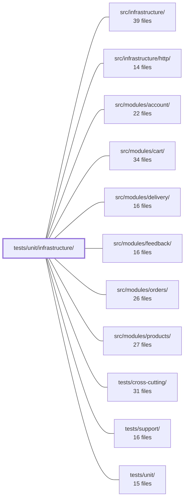

---
tags:
  - 2repo
  - 2repo/module
  - project/boilerplate-node-backend
type: module
module: tests/unit/infrastructure/
files: 38
updated: 2026-08-25T11:24:11.750322+00:00
---

# tests/unit/infrastructure/

## Purpose

This module contains the unit-test suites for every sub-layer of `src/infrastructure/` — adapters, HTTP middleware/helpers, i18n, observability, persistence, and runtime primitives. Each test file pins behavioural contracts (fail-open guarantees, tri-state response protocols, wire-format invariants, security boundaries) at the single-function level so that regressions are caught without a live broker, database, browser, or HTTP server.

## Key parts

- **`adapters/`** — The largest group. Covers external-system integrations (Redis cache, RabbitMQ queue, SMTP mailer + templates + transport, Puppeteer PDF, filesystem moves, image-signature sniffing, image store, logger redaction, demo outbox, storage/multer surface, `storeUploadedImages` middleware, and the two queue-worker entry points). The common thread: verifying fail-open or tri-state contracts, exact payload/wire shapes, and that no partial side-effect escapes on error.

- **`http/`** — Tests for the HTTP-layer helpers and middleware that sit above the adapters: the response envelope, `readInput` / ID extraction, shared Zod schema scalars, upload-helper normalisation, `ExtendedError` / database-error mapping, and the individual Express middlewares (cache, locale, rate-limit store, request-logger, route-flag, security constants).

- **`i18n/`** — Four focused files covering locale negotiation, catalog discovery/loading, the `AsyncLocalStorage`-scoped `t()` context (including concurrency isolation), and the runtime override overlay with its refresh timer.

- **`observability/`** — Tests for analytics emit payloads, audit-log sink dispatch, dependency-health word mapping, Prometheus HTTP metrics, the SSE metrics stream (wire format + teardown), and OpenTelemetry span helpers.

- **`runtime/` + `persistence/`** — `environment.test.ts` (fail-fast boot validation and coercion rules) and `managed-connection.test.ts` (the shared optional-dependency lifecycle primitive), plus `seed.test.ts` for the upsert-skip branch.

## How it connects

- **`src/infrastructure/`** — Every file in this module imports from (and asserts against) a specific export in `src/infrastructure/`. The tests are the executable specification for that module's public API.
- **`src/infrastructure/http/`** — The `http/` subdirectory of this module mirrors the middleware and helper files in `src/infrastructure/http/` one-to-one.
- **`src/modules/account/`, `src/modules/cart/`, `src/modules/delivery/`, `src/modules/feedback/`, `src/modules/orders/`, `src/modules/products/`** — Several adapter and HTTP tests (e.g. `store-uploaded-images`, `mailer-dispatch`, `queue`, `workers`, `response`, `schemas`) lock in contracts that every one of these modules relies on at runtime; a change in the infrastructure layer that breaks those contracts will first surface here before any module integration test fires.
- **`tests/support/`** — Shared fakes, fixtures, and helper utilities referenced across the adapter and HTTP test files.
- **`tests/unit/`** — This module is a sibling group under the broader `tests/unit/` tree; it shares the same runner configuration and glob patterns.
- **`tests/cross-cutting/`** — Cross-cutting suites (e.g. the `tests/cluster/rate-limit.test.ts` referenced by `rate-limit-store.test.ts`) verify the same invariants at a higher integration level; this module covers the fast, dependency-free slice that runs on every `npm test`.

## Where to start

1. **`tests/unit/infrastructure/adapters/queue.test.ts`** — It demonstrates the module's recurring pattern most clearly: a tri-state contract (ack / dead-letter / requeue) verified with fakes, no live broker. Understanding how these tests isolate a single behavioural promise from the surrounding runtime sets the template for reading every other adapter file.

2. **`tests/unit/infrastructure/http/response.test.ts`** — A short, self-contained suite that shows how the module pins a client-facing contract (envelope shape, status→code mapping) in pure assertions with zero infrastructure. It is the fastest way to see the "guard a promise, not an implementation line" philosophy that runs through the whole directory.

## Connected modules

[[boilerplate-node-backend_src_infrastructure|src/infrastructure/]] · [[boilerplate-node-backend_src_infrastructure_http|src/infrastructure/http/]] · [[boilerplate-node-backend_src_modules_account|src/modules/account/]] · [[boilerplate-node-backend_src_modules_cart|src/modules/cart/]] · [[boilerplate-node-backend_src_modules_delivery|src/modules/delivery/]] · [[boilerplate-node-backend_src_modules_feedback|src/modules/feedback/]] · [[boilerplate-node-backend_src_modules_orders|src/modules/orders/]] · [[boilerplate-node-backend_src_modules_products|src/modules/products/]] · [[boilerplate-node-backend_tests_cross-cutting|tests/cross-cutting/]] · [[boilerplate-node-backend_tests_support|tests/support/]] · [[boilerplate-node-backend_tests_unit|tests/unit/]]

## Files
- `tests/unit/infrastructure/adapters/cache.test.ts` — Unit tests for the Redis cache adapter, verifying its three public operations (`clearCache`, `getCacheValue`, `setCacheValue`) and their fail-open contract: every code path must resolve (never reject) when Redis is unavailable, and every key must be namespaced to prevent cross-deployment leakage. The file also pins the one exception to fail-open — `clearCache` must distinguish "nothing to clear" from "could not clear" so the `db:cache:clear` CLI can exit non-zero on genuine failure.
- `tests/unit/infrastructure/adapters/demo-outbox.test.ts` — Unit tests for the demo outbox adapter — the in-memory email sink that records emails in demo mode instead of sending them. The suite locks in recording order, token extraction, recipient serialization, and the clear/read cycle so that the paired frontend's password-reset and verification specs (in a separate repo) receive well-formed records rather than an empty inbox.
- `tests/unit/infrastructure/adapters/filesystem.test.ts` — Unit tests for the `moveFile` function in `@infrastructure/adapters/filesystem`. The file focuses on the one filesystem operation an upload flow cannot tolerate failing silently: moving a staged temp file into the public directory. It verifies both the same-device fast path (`rename`) and the cross-device fallback (copy-then-unlink), ensuring the public outcome is identical regardless of which branch executes.
- `tests/unit/infrastructure/adapters/image-signatures.test.ts` — Unit tests for the content-based image identification functions in `@infrastructure/adapters/image-signatures`. The suite verifies that `identifyImage` and `identifyImageFile` recognise valid PNG/JPEG/WebP magic bytes, reject everything else (including disguised payloads), ignore file extensions, handle edge cases (short buffers, corrupted headers, polyglot appends), and—critically—read only the header from disk rather than loading entire files.
- `tests/unit/infrastructure/adapters/image-store.test.ts` — Unit tests for `filesystemImageStore` (`put` and `remove`) that exercise real files in a real temp directory rather than mocking `fs`. The rationale: the critical property is *which* path string is derived from a given `imageUrl`, and only a real filesystem round-trip can verify that.
- `tests/unit/infrastructure/adapters/logger.test.ts` — Unit and property-based tests for the log-redaction and error-serialization layer in `src/infrastructure/adapters/logger.ts`. The file exists to pin down security invariants (credentials never reach log output, input objects are never mutated) and operational guards (stack traces omitted in production) that mutation testing revealed were previously unverified.
- `tests/unit/infrastructure/adapters/mailer-dispatch.test.ts` — Unit tests for the `enqueueEmail` dispatch function in `src/infrastructure/adapters/mailer.ts`. They pin the three-branch contract (no broker → send inline; broker OK → enqueue only; broker fails → fall back to inline) and verify that exactly one delivery path fires per call, preventing silent email loss or duplicate delivery.
- `tests/unit/infrastructure/adapters/mailer-templates.test.ts` — Guards the email-templating pipeline end-to-end: asserts the template directory resolves to real files, and renders every `.ejs` template in every supported locale through its owning builder. Because i18next silently returns the key itself on a missing translation (no throw, no log), this is the only check that catches unresolved copy before it reaches a customer's inbox.
- `tests/unit/infrastructure/adapters/mailer-transport.test.ts` — Unit tests for the SMTP transport options that `src/infrastructure/adapters/mailer.ts` passes to `nodemailer.createTransport`. The production branch of that module was previously unreachable from the test suite because `NODE_ENV === 'test'` always selects the `jsonTransport` branch. This file forces the production path by temporarily overriding environment variables and capturing the options object via a mock, verifying that TLS mode, credentials, and identity fields are wired correctly.
- `tests/unit/infrastructure/adapters/pdf.test.ts` — Unit test suite for the `renderHtmlToPdf` adapter. It verifies the four externally observable decisions the adapter makes (call-time env resolution, sandbox flags, `networkidle0` wait, guaranteed browser close) without launching a real browser — `puppeteer-core` is fully mocked.
- `tests/unit/infrastructure/adapters/queue.test.ts` — Unit tests for the RabbitMQ adapter (`@infrastructure/adapters/queue`). Verifies connection-enablement logic, publish/consume wiring, dead-letter queue topology, channel supervision, and the full acknowledgement policy (ack / discard / requeue) without requiring a live broker.
- `tests/unit/infrastructure/adapters/storage.test.ts` — Unit tests for the upload-security surface of the storage adapter: the multer callbacks (`fileFilter`, `resolveUploadDestination`, `resolveUploadFilename`, `maxUploadBytes`) and the `validateUploadedImages` middleware. These functions were previously unreachable from tests because multer kept its callbacks internal; they had to be exported for this file to exist. Tests are written against behavioral guarantees a reviewer would want pinned, not against implementation lines.
- `tests/unit/infrastructure/adapters/store-uploaded-images.test.ts` — Unit tests for the `storeUploadedImages` Express middleware. They verify that staged Multer uploads are committed to object storage, that the resulting URLs are recorded on the request, and that every failure path (total rejection, partial rejection) cleans up both the local staged files and any already-committed objects so no orphans or temp-file leaks survive.
- `tests/unit/infrastructure/adapters/workers.test.ts` — Unit tests for the two queue-consumer entry points (`handleEmailJob`, `handlePdfJob`). The file exists to pin the **tri-state response contract** that the broker depends on: resolve `true` → ack, resolve `false` → dead-letter, reject → requeue. It verifies which malformed payloads are refused before any side effect runs, and which failures are allowed to escape as rejections so the broker can retry.
- `tests/unit/infrastructure/http/errors.test.ts` — Unit tests for `src/infrastructure/http/errors.ts`. Verifies that `ExtendedError` carries the correct HTTP status, operational flag, and user-facing messages; that non-operational errors trigger logging while operational ones stay silent; and that `databaseErrorInterpreter` / `isDuplicateKey` map driver-level failures (CastError, duplicate key, BSONError, ValidationError, generic) onto the correct `[httpCode, message]` tuple — specifically the branches that exist because production incidents produced wrong status codes or leaked internal detail into client-facing responses.
- `tests/unit/infrastructure/http/middlewares/cache.test.ts` — Unit tests for the `setCache` HTTP middleware (and, by extension, `invalidateCache`, `noStore`, `resolveCacheTtl`). The file exercises key construction, HIT/MISS flow, response-header policy, TTL clamping, and the byte-size gate against the real middleware logic, stubbing only the Redis adapter and the logger so that those two concerns don't leak into assertions.
- `tests/unit/infrastructure/http/middlewares/locale.test.ts` — Unit tests for the `attachLocale` Express middleware. Verifies that locale negotiation, context propagation, response headers, and graceful fallback all behave correctly, with particular emphasis on the requirement that `next()` executes *inside* the AsyncLocalStorage locale context (the mechanism that makes ambient `t()` calls work downstream).
- `tests/unit/infrastructure/http/middlewares/rate-limit-store.test.ts` — Fast, infrastructure-free regression guard for the rate limiter's connection-reuse bug: two `init()`-era Lua script loads fired before the Redis handshake completes must result in exactly one `connect()` call and must not destroy the shared client. It exists because the cluster suite that proves the same property (`tests/cluster/rate-limit.test.ts`) requires a container and ~25 s, so it lives outside `npm test`; this file closes that gap in the contributor gate.
- `tests/unit/infrastructure/http/middlewares/request-logger.test.ts` — Unit tests for the `requestLogger` Express middleware. Verifies that the middleware calls `next()` immediately, defers logging until the response `finish` event, selects the correct log level by status code (info/warn/error), emits only a slim set of metadata fields (no headers, IP, user-agent, or user ID), and fires at most once even if `finish` is emitted twice.
- `tests/unit/infrastructure/http/middlewares/route-flag.test.ts` — Unit tests for the `routeFlag` middleware. They pin the middleware's own contract — that it writes a named flag onto `request.params` as a string — while the products/users integration suites cover the end-to-end Express routing mechanism. This file exists so regressions in the middleware's write-behaviour are caught without needing a full HTTP stack.
- `tests/unit/infrastructure/http/middlewares/security.test.ts` — Unit tests for the two rate-limit budget constants and the `isMetricsScraper` Prometheus-scrape guard exported from the security middleware. The `isMetricsScraper` tests exist because that endpoint is the one credential check in the codebase that bypasses JWT, and each security property (deny-by-default, scheme enforcement, length-safe comparison) fails silently on its own.
- `tests/unit/infrastructure/http/request.test.ts` — Unit tests for the `readInput` helper (and its companions `extractAndValidateId`, `isValidObjectId`) in `@infrastructure/http/request`. Because every controller calls `readInput` and the integration/contract suites never exercise its edge cases in isolation, this file pins down the precedence chain, the ID-extraction rules, and the multipart transport-decoding rules that a 500 would otherwise mask.
- `tests/unit/infrastructure/http/response.test.ts` — Unit tests for the HTTP response envelope module (`src/infrastructure/http/response.ts`). It locks down the public API contract: the shape of success/failure bodies, the status→code mapping, the status→message wording, and the "status written twice" invariant. Every assertion here guards a client-facing guarantee rather than an internal implementation detail.
- `tests/unit/infrastructure/http/schemas.test.ts` — Unit tests for the shared contract scalars (`hardDeleteSchema`, `pageSchema`, `pageSizeSchema`, `paginationSchema`) that multiple HTTP endpoints rely on. The tests pin down the single authoritative interpretation of each query parameter so that no endpoint can silently diverge (e.g., reading `?hardDelete=false` as "present → true" or applying per-controller page-size bounds that contradict `openapi.yaml`).
- `tests/unit/infrastructure/http/uploads.test.ts` — Unit tests for the upload-helper utilities exported from `@infrastructure/http/uploads`. The file exists to lock down the contract that all three multer request shapes (`single`, `array`, `fields`) collapse into one uniform return type, and to assert that `resolveImageUrl` only ever returns a store-committed URL (never a filesystem path). Several tests are deliberately paired or adjacent to catch regressions that would pass if only one multer variant were exercised.
- `tests/unit/infrastructure/i18n/catalog.test.ts` — Unit tests for the i18n catalog discovery and loading logic. Verifies that locale enumeration, per-module dictionary merging, the shape handed to `i18next.init()`, and the critical caching contract all behave correctly under varying environments (env-var changes, working-directory changes).
- `tests/unit/infrastructure/i18n/context.test.ts` — Unit tests for the request-scoped translation helper (`t`) and the `AsyncLocalStorage`-backed locale context. Verifies that locale isolation holds inside a scope, that code outside any scope transparently falls back to the global instance, and — the primary reason the file exists — that concurrent, interleaved scopes never bleed each other's language into the other's response.
- `tests/unit/infrastructure/i18n/negotiate.test.ts` — Unit tests for the pure `negotiateLocale` function. Because the function is header-string-in / locale-out, it is exercised directly here rather than only through the HTTP integration suite — malformed headers, q-weight edge cases, and fallback paths are the interesting cases and are cheap to trigger in isolation.
- `tests/unit/infrastructure/i18n/overrides.test.ts` — Unit tests for the i18n locale-override overlay: verifying that stored overrides correctly layer on top of deployed translation files, that deleted or failed overrides degrade safely, and that the periodic refresh timer works as a single, idempotent interval across worker processes.
- `tests/unit/infrastructure/observability/analytics.test.ts` — Unit tests for the analytics provider port (`src/infrastructure/observability/analytics/`) and its Umami and PostHog implementations. Because the emit contract is fire-and-forget (twenty-one controllers emit and cannot observe the result), the tests assert on the outgoing wire payload rather than a return value. The file also pins a set of Umami 2.14 behaviours that are invisible from the API and not guessable from the code (e.g. silent event discard without `User-Agent`).
- `tests/unit/infrastructure/observability/audit.test.ts` — Unit tests for the core audit-logging subsystem (`emitAuditEvent`, `registerAuditSink`, `extractRequestContext`, `coreAuditActions`). Verifies log-level selection, sink dispatch, context extraction from an HTTP request, and the error-isolation contract that keeps a broken audit sink from breaking request handling.
- `tests/unit/infrastructure/observability/dependency-health.test.ts` — Unit tests that pin the exact mapping from each dependency's raw state to a health word (`ready`, `connecting`, `unavailable`, `disabled`) and verify the `overallStatus` fold. The file exists because the mapping depends on the runtime `.env` of whoever runs a contract suite, so the word-level contract is fixed here. Two cases are called out as easy to invert: `disabled` must not degrade a service, and `connecting` must not be reported as broken.
- `tests/unit/infrastructure/observability/metrics-http.test.ts` — Unit tests for the HTTP observability metrics module. Verifies that route labels are derived from Express's matched template (not the raw URL) to bound Prometheus cardinality, that request counters and gauges are incremented correctly, that the Prometheus text-exposition output includes the expected metric families, and that the histogram-bucket percentile helper selects the right upper bound.
- `tests/unit/infrastructure/observability/stream.test.ts` — Unit tests for the SSE (Server-Sent Events) observability metrics stream. The file pins down three failure modes that are invisible from the module's own API: the whitespace-significant wire format (frame terminator, single-line `data` field), timer/`Set` teardown on client disconnect, and silent error absorption inside interval callbacks. It exists so that regressions in any of those three areas produce a test failure rather than a silent production incident.
- `tests/unit/infrastructure/observability/tracer.test.ts` — Unit tests for the OpenTelemetry tracing helpers in the observability layer. Verifies that the public API (`getTracer`, `withSpan`, `getActiveSpanContext`, `recordErrorOnActiveSpan`) behaves correctly on both success and error paths, using an in-memory exporter for span assertions.
- `tests/unit/infrastructure/persistence/seed.test.ts` — Unit test for `upsertById`, the shared upsert policy used by every module seeder. It exists to exercise the `skipped` branch in isolation — a path that integration (db) suites never hit because they always seed into a freshly dropped database. Without this file the skip arm was invisible to coverage.
- `tests/unit/infrastructure/runtime/environment.test.ts` — Exhaustive unit tests for the three environment helpers in `@infrastructure/runtime/environment` — `validateRequiredEnvironment`, `environmentNumber`, and `environmentFlag`. The suite exists to guarantee the fail-fast boot check catches every missing or malformed secret before the process accepts traffic, and to pin down the coercion rules (base-10 parsing, whitespace tolerance, minimum enforcement, unified boolean vocabulary) that previously diverged across call sites. The file header notes it was added after a coverage-glob gap appeared when the source moved from `src/infrastructure/` into `runtime/`.
- `tests/unit/infrastructure/runtime/managed-connection.test.ts` — Unit tests for the `manageConnection` runtime primitive. They verify the four load-bearing invariants that every optional dependency (Redis, RabbitMQ) now shares through a single implementation: never rejecting on failure, never opening a second connection mid-flight, warning exactly once per outage, and closing cleanly on shutdown even when a connect is in flight. The tests run against a minimal fake handle with no real Redis or broker.

---
[[boilerplate-node-backend_INDEX|← boilerplate-node-backend index]]
