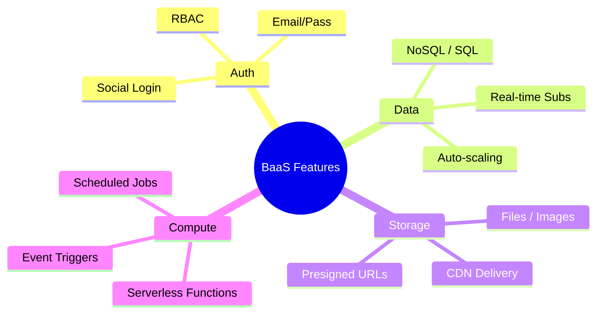
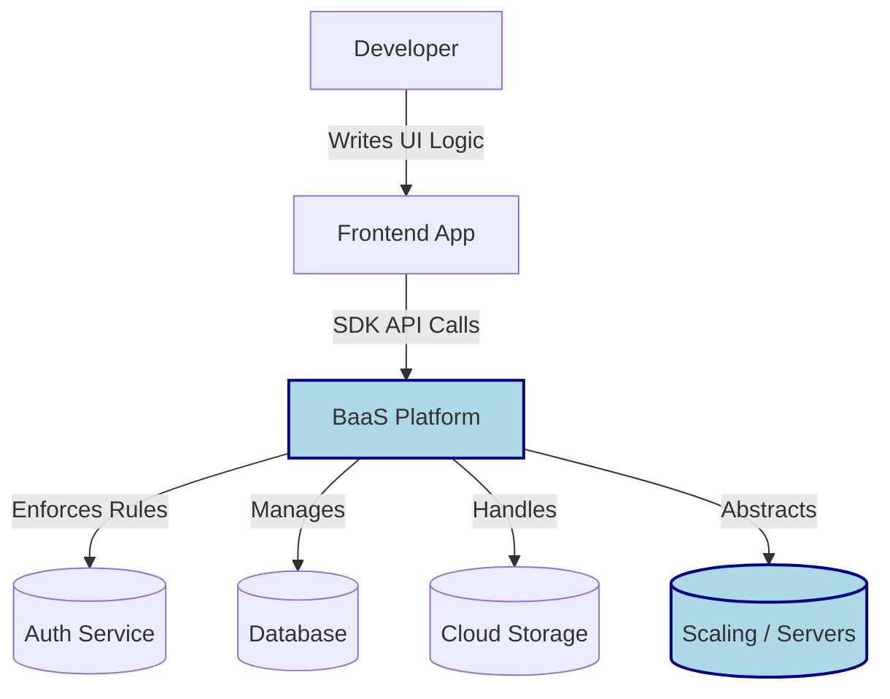
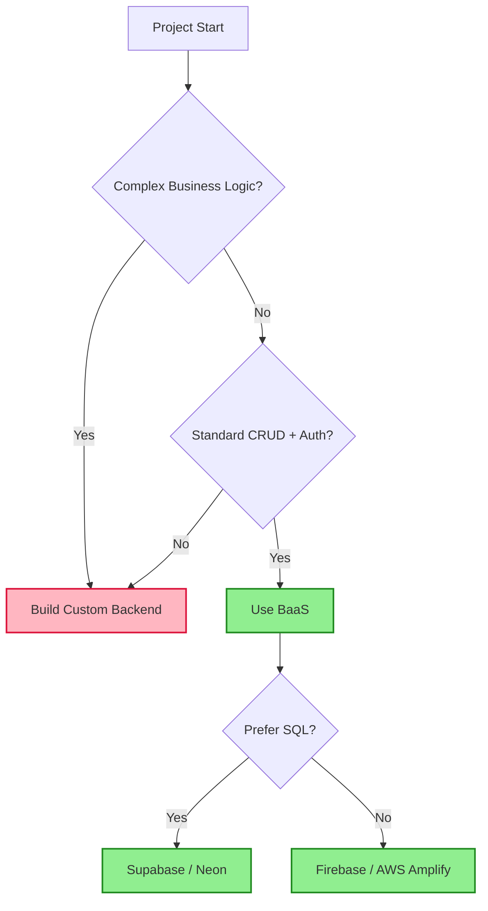

## Summary
BaaS provides pre-built server-side tools like authentication, databases, and file storage via APIs, so you can build apps faster without managing servers. It lets frontend developers handle backend logic using client SDKs, reducing boilerplate and infrastructure headaches.

## Core Features
*   **Authentication:** Social logins, email/password, MFA, and session management.
*   **Database:** Managed NoSQL or SQL databases with real-time subscriptions.
*   **Cloud Storage:** Upload, store, and serve files/images with CDN integration.
*   **Serverless Functions:** Run custom backend code triggered by events or HTTP calls.
*   **Real-time Features:** Live updates, chat sync, and collaboration tools out of the box.

## Architecture Flow

## Provider Comparison

| Provider | Database | Key Differentiator | Best For |
| :--- | :--- | :--- | :--- |
| **Firebase** | NoSQL (Firestore) | Google ecosystem, massive scale | Mobile apps, rapid prototyping |
| **Supabase** | PostgreSQL | Open-source, SQL-first, Auth + Realtime | Relational data needs, open-source preference |
| **Appwrite** | SQL/NoSQL | Self-hostable, container-based | Privacy control, on-prem deployment |
| **AWS Amplify** | Flexible | AWS native, deep integration | Existing AWS infrastructure users |

## Pros & Cons

> [!IMPORTANT] Key Takeaways
> *   **Speed:** Cut development time by weeks or months.
> *   **Cost:** Pay-per-use scales well for MVPs; watch costs at high traffic.
> *   **Focus:** Keep attention on product logic, not server ops.

> [!WARNING] Gotchas
> *   **Vendor Lock-in:** Migrating data and logic away from a BaaS can be painful.
> *   **Cold Starts:** Serverless functions may have latency on first invocation.
> *   **Debugging Limits:** Black-box infrastructure makes low-level debugging harder.

> [!DANGER] Critical Issues
> *   **Security Misconfiguration:** Incorrect security rules can expose your entire database to the public.
> *   **Egress Fees:** Data transfer out of the provider's network can spike bills unexpectedly.

## When to Use BaaS

## Security & Best Practices

> [!TIP] Best Practices
> *   **Principle of Least Privilege:** Grant minimum necessary permissions in security rules.
> *   **Never Expose Admin Keys:** Client SDKs should use restricted keys; save admin keys for server functions only.
> *   **Validate on Server:** Always validate data in cloud functions, not just in the frontend.

> [!NOTE] Excalidraw: Sketch a trust boundary showing the Client App talking to the BaaS SDK, with a thick wall between "Client Trust" and "Server Trust" where BaaS Rules enforce security regardless of client code.

*   **Client-Side Trust:** Remember the client is untrusted; BaaS rules are the source of truth.
*   **Rate Limiting:** Implement rate limits on functions to prevent abuse and cost spikes.
*   **Audit Logs:** Enable logging to track access patterns and detect anomalies.