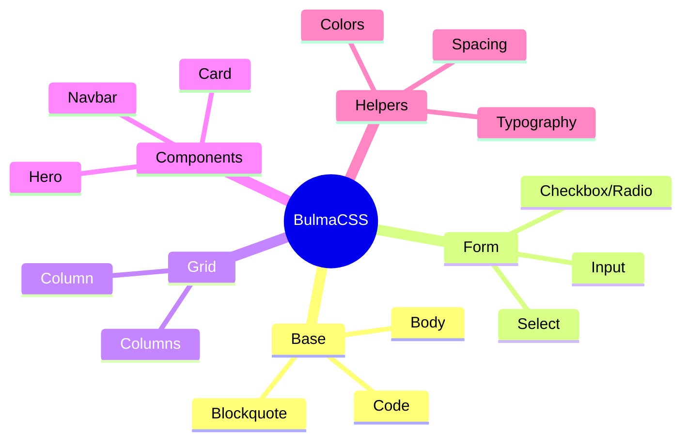
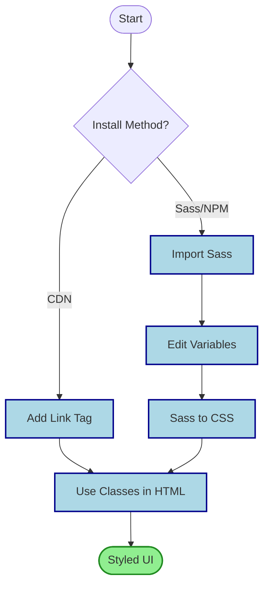

## Summary
- Bulma is a free, open-source CSS framework built on Flexbox for rapid, responsive web development.
- It uses a class-based approach, allowing you to style components directly in HTML without writing JavaScript.

## Core Concepts
- **No JavaScript**: Pure CSS framework; interaction logic must be added manually.
- **Flexbox Foundation**: Built entirely on CSS Flexbox for flexible layouts.
- **Class-based**: Utility-first and component classes applied directly to HTML elements.
- **Sass Variables**: Highly customizable via Sass variables for colors, spacing, and breakpoints.

## Architecture

## Workflow

> [!TIP] Modifier Pattern
> Use `is-` and `has-` prefixes. Examples: `is-centered`, `is-fullwidth`, `has-text-dark`. Keeps markup semantic.

> [!WARNING] JavaScript Gap
> Bulma has no JS. Dropdowns, modals, and tabs require manual code or external libraries.

> [!NOTE] Excalidraw: Sketch grid layout with `is-one-third`, `is-half`, and mobile collapse behavior.

## Comparison
| Feature | Bulma | Bootstrap | Tailwind CSS |
| :--- | :--- | :--- | :--- |
| **JS Dependency** | None | Required | None |
| **Customization** | Sass Variables | Sass/SCSS | Config + Utilities |
| **Learning Curve** | Low | Medium | Steep |
| **Style** | Component-based | Component + Utility | Utility-first |

## Responsive Breakpoints
| Breakpoint | Class Prefix | Width |
| :--- | :--- | :--- |
| Mobile | Default | < 769px |
| Tablet | `is-` | ≥ 769px |
| Desktop | `is-desktop` | ≥ 1024px |
| Widescreen | `is-widescreen` | ≥ 1216px |
| FullHD | `is-fullhd` | ≥ 1408px |