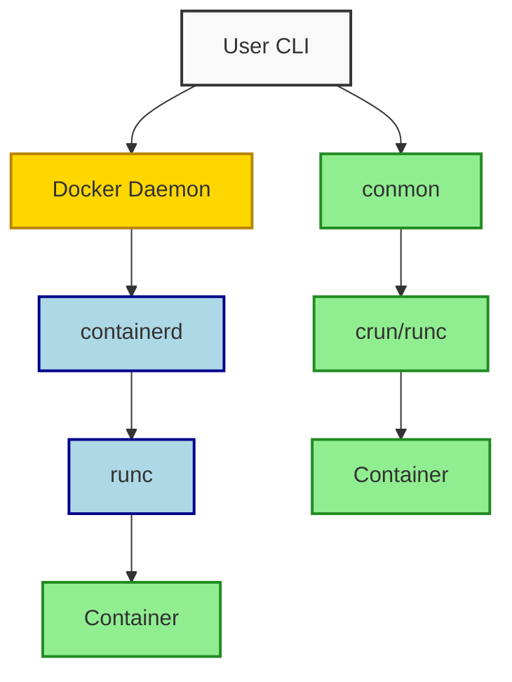

## Summary
Docker and Podman are container runtimes that package applications with dependencies for consistent deployment. Docker relies on a central daemon for management, while Podman runs containers directly without a background service. Both use standard OCI images but differ in security defaults, networking, and ecosystem tools.

## Core Concepts
- **Containers**: Isolated processes sharing the host kernel, lightweight alternative to VMs
- **Images**: Read-only blueprints built from `Dockerfile` or `Containerfile`
- **Storage Drivers**: Overlay2 (Docker) vs vfs/storage overlay (Podman rootless)
- **Networking**: Bridge networks, host mode, port mapping, DNS resolution
- **Orchestration**: Docker Compose vs Podman Pods / Kompose / Kubernetes integration
- **OCI Compliance**: Both produce/run standard Open Container Initiative images

## Docker vs Podman
| Feature | Docker | Podman |
|---|---|---|
| Architecture | Client → Daemon → Runtime | Daemonless → Conmon → Runtime |
| Default Execution | Root required | Rootless by default |
| Network Setup | Docker bridge/CNI | CNI plugins (host/networkmanager) |
| Compose Tool | Docker Compose (official) | Podman Compose (community) |
| Systemd Integration | Requires third-party generators | Native `generate systemd` support |
| Ecosystem | Mature, broad plugin support | Linux-native, Kubernetes-friendly |
| CLI Compatibility | `docker` commands | `podman` aliases (`docker` → `podman`) |

## Architecture Flow

## Command Cheat Sheet
- `docker/podman run -d -p 8080:80 --name web nginx` → Run detached container with port mapping
- `docker/podman build -t myapp:latest .` → Build image from current directory
- `docker/podman compose up -d` → Start multi-container stack
- `podman system migrate` → Fix storage issues after rootless setup
- `alias docker=podman` → Drop-in CLI compatibility layer

> [!TIP] best practices
> - Always pin image tags to specific versions or digests
> - Use `--read-only` and `--tmpfs` for writable layers
> - Prefer named volumes over bind mounts for database state
> - Run containers as non-root with `--userns=keep-id` (Podman)

> [!WARNING] gotchas
> - Docker daemon blocks port 2375/2376; conflicts with other services
> - Podman rootless requires `fuse-overlayfs` or `userxattr` kernel options
> - Docker Compose v3+ drops support for `network_mode: host` on some platforms
> - Volume permissions break when UID/GID differs between host and container

> [!DANGER] critical issues
> - Never expose Docker socket (`-v /var/run/docker.sock`) to untrusted containers
> - Rootless Podman fails silently if subuid/subgid ranges are misconfigured in `/etc/subuid`
> - Running privileged containers bypasses all isolation; audit before use

## Quick Debugging Flow
- `docker/podman logs <container>` → View stdout/stderr
- `docker/podman exec -it <container> /bin/sh` → Drop into running process
- `docker/podman inspect <container>` → JSON metadata & mount/network details
- `podman info` → Runtime config, storage driver, CNI networks
- `journalctl -u docker.service` / `systemctl status docker` → Daemon health

> [!NOTE] Excalidraw: Sketch host kernel → storage driver → network bridge → container process lifecycle with arrow flow

> [!IMPORTANT] key takeaways
> Podman wins on security and systemd integration; Docker wins on ecosystem maturity and Windows/Mac desktop support. Choose based on target environment, not features.