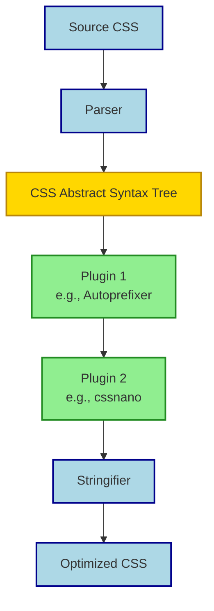

## Summary
PostCSS is a JavaScript tool that transforms CSS using a modular ecosystem of plugins. Unlike preprocessors like Sass, it processes standard CSS during the build to add vendor prefixes, minify files, or enable future syntax without changing your writing style.

## Core Concepts
*   **Runner, not language:** PostCSS doesn't add new syntax by default; plugins provide the functionality.
*   **AST-based:** Parses CSS into an Abstract Syntax Tree, allows plugins to mutate the tree, then stringifies back to CSS.
*   **Plugin-first architecture:** The core is tiny; power comes from the community plugin ecosystem.
*   **Async support:** Modern PostCSS supports async plugins for performance with large codebases.

> [!IMPORTANT] PostCSS works best in the build step, transforming CSS before it ships to the browser, or as part of a bundler pipeline.

## Processing Pipeline


## Plugin Order Matters
*   Plugins execute in the order listed in configuration.
*   **Common pattern:** Transformation -> Optimization.
*   Run feature additions (Autoprefixer) *before* minifiers (cssnano).
*   Minifying first can break subsequent transformations.

> [!WARNING] Incorrect plugin order can cause silent failures or broken styles. Always test changes to your plugin sequence.

## Comparison: PostCSS vs Preprocessors
| Feature | PostCSS | Sass / Less |
| :--- | :--- | :--- |
| **Type** | Post-processor / Transform tool | Preprocessor |
| **Syntax** | Standard CSS (mostly) | Extended syntax (SCSS/Less) |
| **Flexibility** | Infinite via JS plugins | Limited to language features |
| **Learning Curve** | Config-heavy, JS knowledge helps | New syntax to learn |
| **Use Case** | Pipeline optimization, future CSS | Variables, mixins, architecture |
| **Overlap** | Can do nesting via `postcss-nested` | Native nesting support |

## Configuration Basics
*   **File:** `postcss.config.js` or `postcss.config.json`.
*   **Structure:** Exports an object with a `plugins` array.
```javascript
module.exports = {
  plugins: [
    require('tailwindcss'),
    require('autoprefixer'),
    require('cssnano')
  ]
};
```
*   **Integration:** Works with Webpack, Vite, Rollup, Gulp, or CLI.

> [!TIP] Many frameworks (Tailwind, UnoCSS) rely on PostCSS under the hood. Check your framework docs to see if you need a separate PostCSS config.

## Key Plugins
*   **Autoprefixer:** Adds vendor prefixes based on browser share data.
*   **cssnano:** Minification suite (shorthand, colors, removing comments).
*   **PostCSS Nested:** Enables CSS nesting syntax.
*   **Stylelint:** Linting for CSS errors and style enforcement.
*   **PostCSS Loader:** Bridge for bundlers like Webpack.

> [!DANGER] Avoid stacking heavy optimization plugins. Running `cssnano` alongside aggressive bundler minimization can double build time with negligible size gains.

> [!NOTE] Excalidraw: [Sketch of PostCSS AST showing Root -> Rule -> Declaration nodes with values]