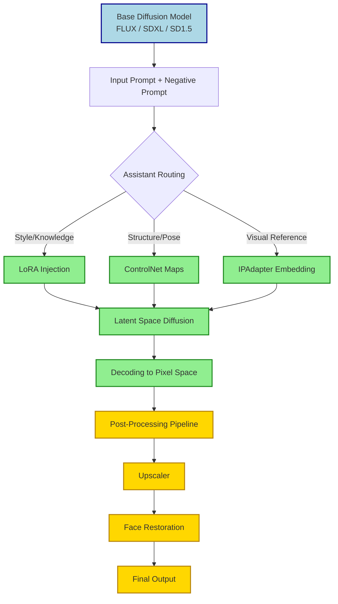

## Summary
Diffusion model assistants are specialized add-ons, adapters, and pipeline tools that extend base image generators like Stable Diffusion or Flux. They enable precise composition control, style consistency, and quality enhancement without requiring full model retraining.

## Core Adapters & Skill Packs
- **LoRA ([[Low Rank Adaptation]])**
  - Injects specific knowledge (characters, art styles, clothing, poses) into a base model
  - Extremely lightweight (100 MB–1 GB) vs. full checkpoint (5–10+ GB)
  - Modifies a small subset of weight matrices, leaving the core architecture intact
  - Best for: Style consistency, character replication, niche aesthetics
- **Checkpoint Variants**
  - Permanent modifications baked into model weights
  - Used for foundational shifts (e.g., photorealism, SFW filters, architectural realism)
  - Requires more VRAM and longer load times; acts as the baseline for assistants

## Structural & Reference Guides
- **ControlNet**
  - Provides explicit spatial/structural guidance during the diffusion sampling process
  - Accepts input maps: depth, Canny edges, OpenPose skeletons, normal maps, segmentation
  - Decouples *what* to generate from *how* it should be arranged
  - Best for: Pose matching, scene composition, technical accuracy, layout locking
- **IPAdapter / Reference-Only**
  - Feeds visual embeddings from a source image directly into the cross-attention layers
  - Preserves faces, color palettes, lighting, or overall mood without prompt dependency
  - Works cross-model when compatible CLIP/VAE encoders are used
  - Best for: Character consistency across shots, mood matching, style transfer

## Post-Processing & Quality Boosters
- **Upscalers**
  - AI-driven resolution boosters (Real-ESRGAN, 4x-UltraSharp, SwinIR, 4x-Anime)
  - Run *after* base generation to increase detail without hallucinating new structure
  - Typically add 2x–4x resolution while sharpening textures and reducing latent blur
- **Face Restoration**
  - Targets facial artifacts common in low-res or highly stylized generations
  - GFPGAN: Gentle restoration, preserves original expression and style
  - CodeFormer: Stronger correction, better for heavily distorted faces but may overwrite artistic intent
  - Applied in the final pipeline step before output

## Workflow Orchestration

> [!NOTE] Excalidraw: Sketch a node-based ComfyUI graph showing how prompt, LoRA, ControlNet, and upscaler nodes connect sequentially before the final image output.

## Comparison Matrix
| Assistant Type | Primary Function | VRAM Impact | Best Use Case | Loading Method |
|---|---|---|---|---|
| **LoRA** | Style/character knowledge injection | Low (+100 MB–1 GB) | Consistent aesthetics, specific subjects | Prompt tag or weight loader node |
| **ControlNet** | Spatial/structural guidance | Medium–High | Pose matching, composition, technical accuracy | Separate input with preprocessed map |
| **IPAdapter** | Visual reference embedding | Medium | Face consistency, mood/style transfer | Reference image fed to encoder node |
| **Upscaler** | Resolution/detail enhancement | Low–Medium | Crisp output, print-ready resolution | Pipeline stage after decoding |
| **Face Restore** | Artifact correction | Low | Clean eyes/skin, professional portraits | Final step toggle or node |

## Key Considerations & Best Practices
- **VRAM Management**: Running LoRA + ControlNet + IPAdapter simultaneously can push 8 GB GPUs to system RAM. Prioritize based on use case; offload ControlNet models when not actively guiding.
- **Weight Stacking**: LoRA weights rarely exceed `0.8–1.0`. Overloading causes prompt bleeding, washed-out colors, or structural collapse.
- **Model Compatibility**: Flux, SDXL, and SD 1.5 use different latent spaces and encoders. Cross-compatibility requires specific adapters or re-encoding.
- **Pipeline Order Matters**: Apply structural guides (ControlNet) during sampling, then switch to upscaling/restoration post-decoding. Mixing them mid-step creates artifacts.
- **Node-Based Flexibility**: Tools like ComfyUI or Diffusers let you branch, loop, and conditionally route assistants. Ideal for batch generation or A/B testing parameters.

> [!TIP] Start with a clean base model, add one assistant at a time, and save intermediate outputs. This isolates which helper causes quality drops or prompt conflicts.
> [!WARNING] ControlNet preprocessed images must match the generation resolution or be scaled appropriately. Mismatched aspect ratios cause warped compositions.
