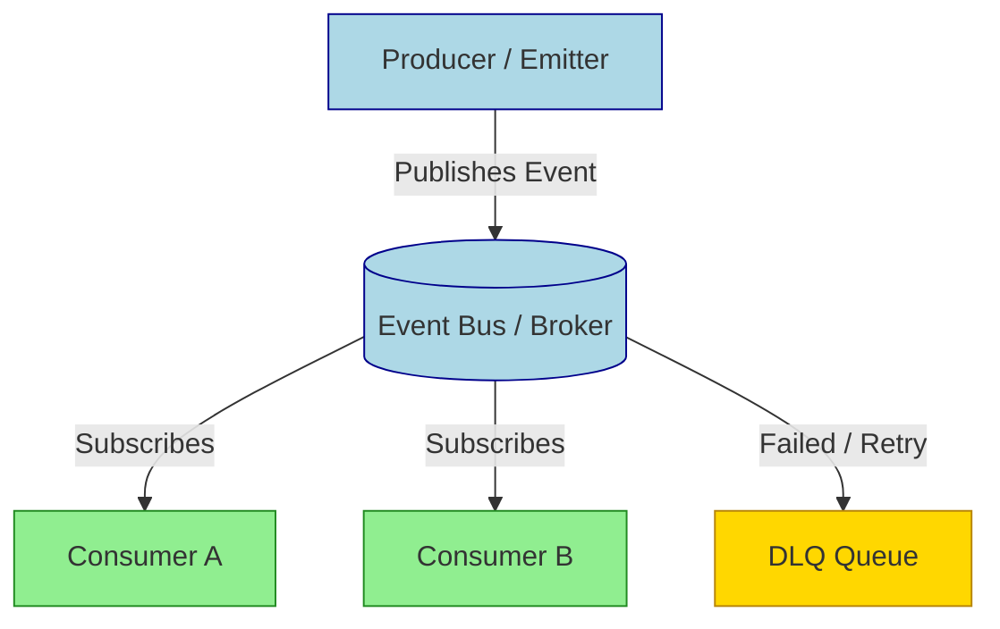

## Summary
Event-driven web development builds systems where components react to signals like user actions or data changes instead of following a fixed step-by-step flow. This enables real-time interactions, scalable microservices, and loosely coupled architecture that is easier to maintain and extend.

## Core Concepts
*   **Event:** An object representing a state change or occurrence (e.g., `UserClicked`, `OrderPlaced`).
*   **Producer:** Emits/publishes events without knowing who will handle them.
*   **Consumer:** Subscribes/listens to specific events and executes logic.
*   **Event Bus/Broker:** The middleware routing messages between producers and consumers.
*   **Asynchronous:** Producers don't wait for consumers; flow continues immediately.



## Communication Patterns
*   **Pub/Sub:** Decoupled; multiple consumers can react to one event.
*   **Request/Reply:** Synchronous; client waits for specific response.
*   **Event Sourcing:** Store sequence of events instead of current state.
*   **CQRS:** Separate read and write models for scalability.

> [!IMPORTANT] Key Takeaway
*   **Decoupling is the superpower:** Producers and consumers evolve independently.
*   **Trade-off:** Debugging becomes harder due to asynchronous flow; implement distributed tracing.

## Technology Comparison
| Pattern | Direction | Best For | Latency | Complexity |
| :--- | :--- | :--- | :--- | :--- |
| **WebSockets** | Bidirectional | Chat, Live Gaming, Real-time Dashboards | Low | High |
| **SSE** | Unidirectional (S→C) | News feeds, Notifications, Stock Tickers | Low | Medium |
| **Webhooks** | HTTP POST | Third-party integrations, CI/CD triggers | Eventual | Low |
| **Message Queue** | Internal Async | Background jobs, Microservice comms | Eventual | High |

## Frontend Implementation
*   **DOM Events:** `click`, `submit`, `keydown` via `addEventListener`.
*   **Custom Events:** Bridge communication between components without shared state.
    ```javascript
    const event = new CustomEvent('dataUpdated', { detail: { payload } });
    document.dispatchEvent(event);
    ```
*   **State Management:** Redux/Zustand actions act as events driving state changes.
*   **Optimistic UI:** Update UI immediately on event emit, revert on error.

> [!WARNING] Gotcha
*   **Event Order:** Events may arrive out of order in distributed systems; implement sequence IDs or timestamps.
*   **Memory Leaks:** Always remove event listeners in cleanup functions to prevent leaks.

## Backend & Architecture
*   **Brokers:** Kafka (high throughput), RabbitMQ (flexible routing), Redis (lightweight pub/sub).
*   **Idempotency:** Consumers must handle duplicate events safely without side effects.
*   **Backpressure:** Handle producer speed exceeding consumer capacity; use buffering or flow control.
*   **Dead Letter Queue (DLQ):** Capture failed events for inspection and manual retry.

> [!DANGER] Critical Issue
*   **Event Loops:** Never block the main event loop with synchronous operations; use async/await or worker threads.
*   **Data Loss:** Acknowledge messages only after successful processing; configure persistence in broker.

> [!NOTE] Excalidraw: Sketch of "Event Storming" session showing sticky notes for Events (orange), Commands (blue), and Aggregates (green) on a timeline.

## Best Practices
*   **Name Events:** Use past tense for facts (`OrderPlaced`), present/imperative for commands (`UpdateInventory`).
*   **Versioning:** Include schema version in events to handle breaking changes.
*   **Observability:** Log correlation IDs across the entire event chain.
*   **Testing:** Mock the event bus; test consumers in isolation.