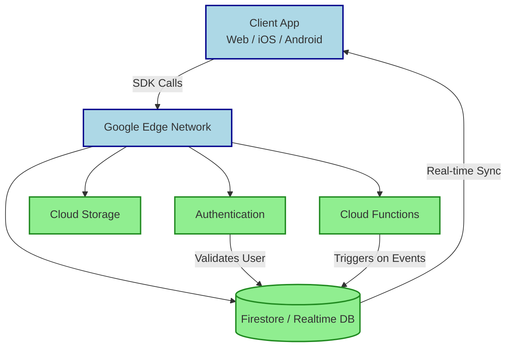

## Summary
Firebase is a Google-managed backend-as-a-service platform that lets developers build full applications without provisioning or maintaining servers. It bundles ready-made tools like authentication, real-time databases, cloud storage, and serverless functions into a single console.

## What It Is
- Backend-as-a-Service (BaaS) running on Google Cloud infrastructure
- SDK-driven architecture: client apps connect directly to cloud endpoints
- Fully managed: auto-scaling, built-in monitoring, zero server provisioning
- Cross-platform SDKs for Web, iOS, Android, Flutter, Unity, and JavaScript/TypeScript

## How It Works
- Client app imports the Firebase SDK
- SDK routes requests over secure WebSocket/HTTP connections to Google’s edge network
- Services validate identity, sync data, or trigger serverless code on events
- State changes broadcast instantly to all subscribed clients

> [!IMPORTANT] Key Architecture Note
> Firebase uses a **client-first** model. Most logic lives in the frontend SDK, with Cloud Functions acting as secure triggers for backend-only operations. This reduces server costs but requires strict security rules to prevent unauthorized data access.

## Common Use Cases
- Rapid MVP development for startups & indie hackers
- Real-time collaboration tools (chat, live dashboards, multiplayer games)
- Mobile-first applications needing offline sync & push notifications
- Serverless backends for SaaS products with predictable, pay-as-you-go scaling
- IoT device data ingestion & lightweight state management

> [!TIP] Best Practice
> Use Firestore security rules like a firewall. Never trust the client—always validate data ownership and permissions server-side via Cloud Functions or strict rule expressions.

## Firebase vs Supabase
| Feature | Firebase | Supabase |
|---|---|---|
| **Core Database** | NoSQL (Firestore, Realtime DB) | Relational (PostgreSQL) |
| **Query Model** | Document-based, nested arrays, limited joins | SQL, full joins, indexes, views, triggers |
| **Authentication** | Google-managed, OAuth, phone, email | GoTrue-based, OAuth, email, phone, MFA |
| **Real-time Sync** | Automatic via SDK subscriptions | PostgreSQL triggers + WebSockets |
| **Pricing Model** | Usage-based, scales predictably at high volume | Tiered subscriptions, generous free tier |
| **Open Source** | Proprietary, Google-locked | Open source, self-hostable |
| **Best For** | Document-heavy apps, rapid prototyping, mobile | Relational data, complex queries, data portability |

> [!WARNING] Gotcha
> Firebase’s NoSQL structure makes schema migrations painful. Avoid deeply nested arrays or documents exceeding 1MB. Supabase’s relational model handles complex relationships and bulk updates more gracefully.

> [!NOTE] Excalidraw: Sketch a side-by-side architecture comparison showing Firebase’s client-direct SDK flow vs Supabase’s client-to-API-to-PostgreSQL pipeline