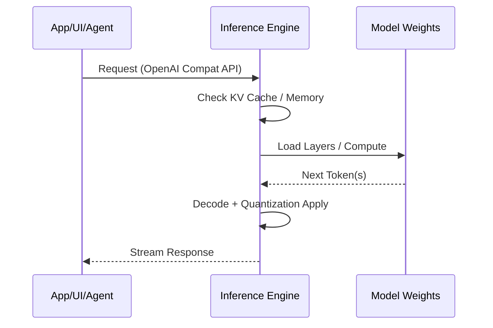
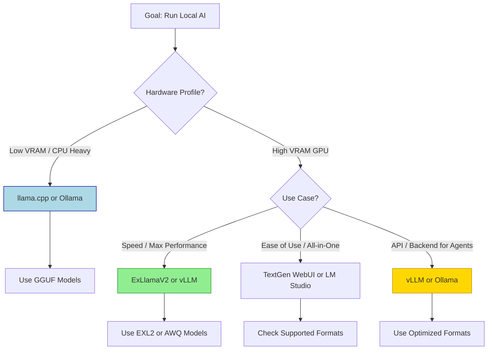

## Summary

Local inference engines are the software layer that loads, optimizes, and executes AI models on your hardware, transforming static model files into active, responsive systems. They manage memory allocation, handle [[Model Quantization]] formats, and expose APIs so other applications can interact with the model.

## Core Concept: The Engine Layer

- **Model vs. Engine**
    - **Model File:** Contains weights and architecture only (the "brain"). Cannot run alone.
    - **Inference Engine:** Software that loads the model, allocates memory, performs calculations, and exposes an interface.
    - **Equation:** `Model File + Inference Engine = Working AI`
- **Analogy**
    - Model = Blueprint of a car.
    - Engine = The actual engine block, fuel system, and drivetrain that makes it move.
- **Key Responsibilities**
    - **Memory Management:** Handles VRAM/RAM allocation, KV cache, and context windows.
    - **Quantization Handling:** Decodes compressed formats (GGUF, EXL2, etc.) on the fly.
    - **Optimization:** Applies tensor cores, layer offloading, and batch processing.
    - **API Exposure:** Standardizes communication for UIs and agents.

## Popular Engines Landscape

| Engine | Best For | Key Strengths | Primary Formats |
| :--- | :--- | :--- | :--- |
| **[[Ollama]]** | Ease of use, quick setup | Auto-downloads models, OpenAI API, low friction | GGUF |
| **llama.cpp** | CPU/GPU hybrid, flexibility | C++ backend, supports almost any CPU/GPU combo, GGUF native | GGUF |
| **vLLM** | High throughput, serving | PagedAttention, massive context, GPU-optimized, production-ready | GGUF, AWQ, GPTQ |
| **Text Generation WebUI** | All-in-one GUI | Community plugins, [[Low Rank Adaptation]] management, browser-based interface | GGUF, EXL2, GPTQ |
| **ExLlamaV2** | Speed on high-VRAM GPUs | Extremely fast inference, EXL2 native | EXL2 |
| **LM Studio** | Desktop GUI users | Drag-and-drop, built-in chat, format auto-detection | GGUF, GPTQ |

> [!TIP] API Standardization
> Most modern engines expose an **OpenAI-compatible API**. You can switch engines without changing your frontend; just point your UI/Agent to the local endpoint (e.g., `http://localhost:11434/v1`).

## Quantization & Format Mapping

Engines dictate which quantization formats you can run. Mismatching engine and format causes load errors.

- **GGUF**
    - **Support:** llama.cpp, Ollama, LM Studio, TextGen WebUI.
    - **Traits:** Universal, supports CPU/GPU splitting, flexible memory usage.
    - **Best for:** Consumer hardware, mixed CPU/GPU setups.
- **EXL2**
    - **Support:** ExLlamaV2, TextGen WebUI (via ExLlama backend).
    - **Traits:** GPU-native, faster generation, requires full model in VRAM usually.
    - **Best for:** High-end GPUs (24GB+ VRAM), speed focus.
- **GPTQ / AWQ**
    - **Support:** vLLM, TensorRT-LLM, TextGen WebUI.
    - **Traits:** High performance on specific GPU architectures.
    - **Best for:** Server environments, RTX 4090/5090, production workloads.

> [!WARNING] Format Mismatch
> Never attempt to load a GGUF model into an EXL2-only backend, or vice versa. Check your engine's documentation before downloading a model to avoid wasted storage and startup crashes.

## Integration Flow

Inference engines act as the bridge between the model and your tools.

- **Streaming:** Engines support token-by-token streaming for low latency feel.
- **Context Management:** Engines handle the KV cache to allow long conversations without reprocessing history.
- **Tool Calling:** Engines parse and return structured JSON when agents request tool usage.

## Hardware Optimization Strategies

The engine determines how efficiently your hardware is used.

- **Layer Offloading**
    - Move layers between CPU RAM and GPU VRAM.
    - **Trade-off:** Offloading fewer layers saves VRAM but slows inference speed.
- **[[VRAM with models in the ollama list]] Limits**
    - Engine must fit: `Model Weights + KV Cache + Overhead`.
    - **Context Window:** Larger context = larger KV cache = more VRAM needed per token.
- **Batch Size**
    - **vLLM:** Handles dynamic batching for multiple concurrent users.
    - **Ollama:** Single-user focused, though multi-request support is improving.

## Decision Framework

- **Start Here:**
    - **Ollama** if you want to chat in 60 seconds.
    - **lmstudio** if you want a GUI but don't want to touch config files.
    - **TextGen WebUI** if you want LoRAs, [[Retrieval Augmented Generation]], and community features in one place.
    - **vLLM** if you are building an [[AI Agent Workflows]] stack or hosting a local API for tools.
