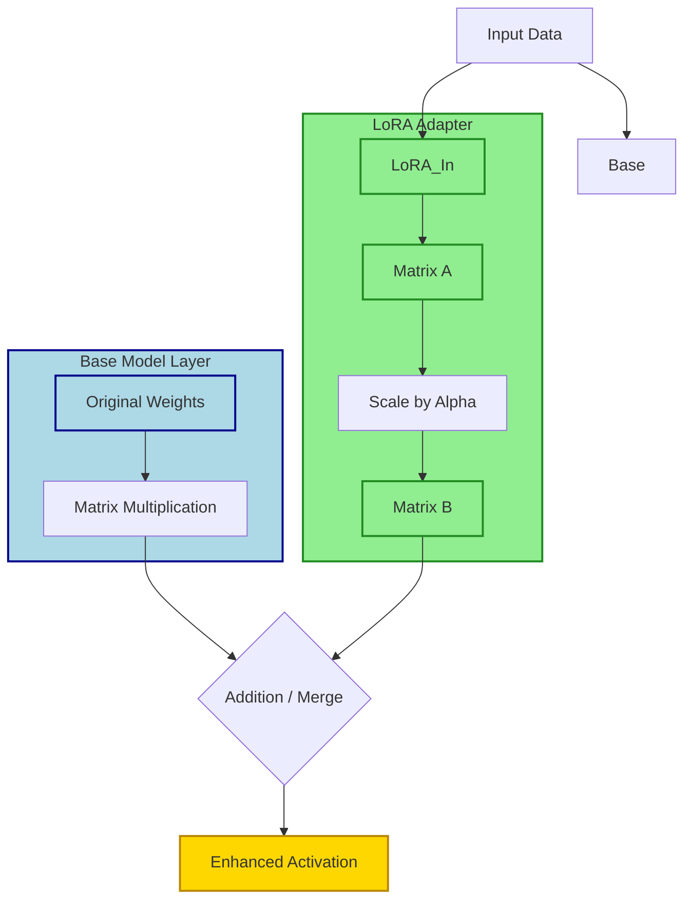

## Summary

LoRA (Low-Rank Adaptation) injects lightweight "skill packs" into a frozen base model by training only small adapter matrices instead of the full network. This enables rapid specialization for coding, art styles, or roleplay with tiny file sizes, allowing users to swap capabilities instantly without retraining or duplicating massive model weights.

## What is LoRA?

- **Definition:** A Parameter-Efficient Fine-Tuning (PEFT) method that freezes the base model and trains small "adapter" layers.
- **Core Idea:** Instead of updating billions of parameters, LoRA learns the *differences* needed for a new skill and adds them mathematically during inference.
- **Analogy:**
    - **Base Model:** A polyglot who knows standard English.
    - **LoRA:** A dictionary that teaches them to speak like Shakespeare or understand medical jargon without rewriting their entire brain.
- **Result:** `Base Model + LoRA = Specialized Behavior`.

## How It Works

- **Freezing Weights:** The original model weights ($W$) remain unchanged.
- **Low-Rank Matrices:** LoRA decomposes the weight update ($\Delta W$) into two smaller matrices ($A$ and $B$).
    - $\Delta W \approx A \times B$
    - This drastically reduces the number of trainable parameters.
- **Inference:**
    - The LoRA matrices are merged (or dynamically added) to the base weights when loading.
    - Output quality is identical to a full fine-tune for the specific task, despite the size difference.

## Key Advantages

- **Tiny Footprint:**
    - LLM LoRAs: Often `10 MB` to `500 MB`.
    - Image LoRAs: Typically `100 MB` to `1 GB`.
    - Contrast: Full 70B model fine-tune could require terabytes of storage.
- **Fast Training:** Trains in minutes or hours on consumer hardware, not days or weeks.
- **Modularity:**
    - Load/unload skills on the fly.
    - Keep one base model and swap LoRAs for different tasks.
- **No Catastrophic Forgetting:** Since the base model is frozen, the LoRA doesn't degrade general capabilities.

## LLM Applications [[llm wiki]]

- **Skill Injection:**
    - 🛠️ Better coding or specific language support.
    - 🎭 Roleplay persona consistency.
    - 📝 Writing style adaptation (e.g., formal, creative, concise).
    - 🏥 Domain knowledge (medical, legal jargon).
- **Examples:**
    - `Llama-3-8B` + `Coding-LoRA` → Specialized coder.
    - `Qwen` + `Character-LoRA` → Roleplay bot.
- **Stacking:**
    - Multiple LoRAs can be combined.
    - *Example:* Base + Coding LoRA + JSON-Format LoRA = Structured code generator.

## Image Generation Applications [[Diffusion Model Assistants]]

- **Style & Subject Control:**
    - 🎨 Art styles (Anime, Oil painting, Cyberpunk).
    - 👤 Specific characters or faces.
    - 👗 Clothing, poses, or object concepts.
- **Workflow:**
    - `Flux / SDXL` + `Anime LoRA` → Anime specialist.
    - `Base Model` + `Character LoRA` + `ControlNet` → High-fidelity character consistency.
- **Efficiency:**
    - Enables massive libraries of styles without duplicating the gigabyte-sized base checkpoint.

## LoRA vs. Alternatives

| Feature | LoRA | Full Fine-Tune | RAG [[Retrieval Augmented Generation]] |
| :--- | :--- | :--- | :--- |
| **File Size** | Tiny (MBs) | Huge (GBs/TBs) | Depends on docs |
| **Training Cost** | Low | High | None (Retrieval) |
| **Knowledge Type** | Skills/Styles/Patterns | Integrated Knowledge | External Facts/Memory |
| **Flexibility** | Swappable/Stackable | Static Model | Dynamic Content |
| **Analogy** | Skill Pack / Attachment | Modified Brain | Notebook / Reference |

## Technical Parameters

- **Rank (`r`):**
    - Determines the capacity of the LoRA.
    - Higher rank = more detail/complexity but larger file size.
    - Common ranges: `4` to `128`.
- **Alpha (`α`):**
    - Scaling factor applied to the LoRA output.
    - Controls how strongly the LoRA influences the base model.
    - *Tip:* If a LoRA feels too strong or too weak, adjusting alpha can fix it without retraining.
- **Target Modules:**
    - LoRA is applied to specific layers (e.g., attention weights).
    - Must match the architecture of the base model.

> [!IMPORTANT] Base Model Compatibility
> A LoRA **must** be trained on the exact same base model architecture and weights. Loading a LoRA trained on `Llama-2` into `Llama-3` will fail or produce garbage output.

> [!WARNING] Overfitting Risks
> If training data is too small or repetitive, the LoRA may memorize examples rather than learn the pattern. This leads to poor generalization outside the training set.

> [!TIP] GGUF Integration
> In tools like `llama.cpp` [[Local Inference Engines]] or `Ollama` [[Ollama]], LoRAs can be baked into a GGUF [[Model Quantization]] file for a single file distribution, or loaded dynamically if the software supports multiple LoRA paths. Dynamic loading saves RAM [[VRAM with models in the ollama list]] by keeping only the base model resident.

## Practical Tips

- **Curate Data:** Quality matters more than quantity. Clean, diverse datasets prevent overfitting.
- **Start Small:** Test with lower ranks before committing to large training runs.
- **Blend LoRAs:** In image gen, use weighting syntax (e.g., `lora:style:0.7, lora:char:0.5`) to balance influences.
- **Verify Source:** Download LoRAs from trusted repositories [[Huggingface, Civitai and ModelScope, brief overview, how they work, tips and tricks]] to avoid poisoned adapters or malicious code injections.
- **Monitor Metrics:** Watch training loss curves; a sharp drop followed by noise often indicates overfitting.
