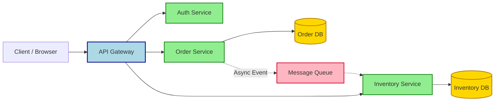

## Summary
Microservices split a large application into small, independent services that communicate over a network. This approach allows teams to scale, update, and deploy parts of the system independently, though it introduces significant complexity in networking, data consistency, and debugging.

## Core Principles
*   **Single Responsibility:** Each service owns a specific business capability.
*   **Decentralized Data:** Services manage their own private databases; no shared schemas.
*   **Infrastructure Automation:** CI/CD pipelines are mandatory due to service volume.
*   **Resilience:** Failures are isolated; one service crash shouldn't take down the whole system.
*   **Tech Diversity:** Teams can choose the best language/tooling per service.

## Communication Patterns

*   **Synchronous:** REST, gRPC. Good for immediate responses, user-facing actions.
*   **Asynchronous:** Kafka, RabbitMQ. Good for decoupling, background processing, high throughput.

| Type | Protocol | Use Case | Coupling |
| :--- | :--- | :--- | :--- |
| **Sync** | HTTP/REST, gRPC | Read data, User requests | Tighter (caller waits) |
| **Async** | MQ, Event Bus | Order processing, Notifications | Loose (fire & forget) |

## Data Management

> [!WARNING] Anti-Pattern: Shared Database
> Never share a single database across multiple services. It creates tight coupling and forces coordinated deployments.

*   **Database per Service:** Each service exposes data via its own API only.
*   **CQRS:** Separate read and write models for performance.
*   **Saga Pattern:** Manages distributed transactions across services using compensating actions.

> [!NOTE] Excalidraw: Sketch "Database per Service" boundaries showing Service A writing to DB A and Service B writing to DB B, with an arrow indicating Service A calls Service B's API to get data, not reading DB B directly.

## Pros vs Cons

| Pros | Cons |
| :--- | :--- |
| **Scalability:** Scale hot services independently. | **Distributed Complexity:** Network latency, failures. |
| **Deployment:** Release features without redeploying everything. | **Debugging:** Distributed tracing required; harder to debug. |
| **Failure Isolation:** Blast radius contained to one service. | **Data Consistency:** No ACID across services; eventual consistency. |
| **Team Autonomy:** Small teams own full lifecycle. | **DevOps Overhead:** Requires robust container orchestration. |

## Best Practices & Gotchas

> [!DANGER] Critical: Network Calls Fail
> Assume the network is unreliable. Always implement retries, circuit breakers, and timeouts for inter-service calls.

*   **Design for Failure:** Build fallbacks and graceful degradation.
*   **Observability First:** Implement distributed tracing (OpenTelemetry), structured logging, and metrics from day one.
*   **API Versioning:** Plan for backward compatibility to avoid breaking clients.
*   **Start Simple:** Consider a **Modular Monolith** first if the problem doesn't justify microservices complexity.

> [!IMPORTANT] Key Takeaway
> Microservices trade *coding complexity* for *organizational scalability*. Only adopt them if your team size or scaling needs demand it.

> [!TIP] Testing Strategy
> Use contract testing (Pact) to verify service interactions without running the full infrastructure.