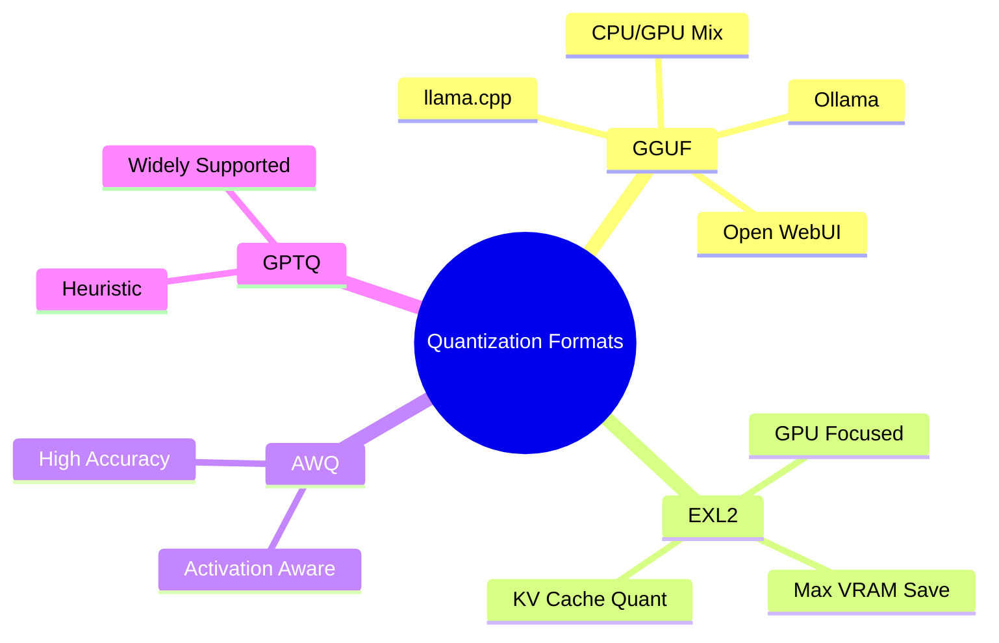

## Summary

Model quantization reduces the size of AI models by lowering numerical precision, allowing massive models to fit on consumer GPUs and run faster with less memory. You trade a tiny amount of calculation accuracy for massive gains in speed and accessibility, making 70B+ models runnable on a home workstation.

## Core Concept

*   **What it is:** Compression of model weights from high-precision numbers to lower-precision representations.
*   **Analogy:** Like converting a lossless WAV audio file to MP3; you lose negligible quality but drastically reduce file size.
*   **Why it matters:**
    *   **VRAM Constraints:** Unquantized models require huge [[VRAM with models in the ollama list]]. Quantization brings them within reach of 24GB consumer cards.
    *   **Memory Bandwidth:** Smaller models move data faster, reducing inference latency.
    *   **Source Examples:**
        *   8B Model: ~16 GB → 4–6 GB.
        *   70B Model: ~140 GB → 40–50 GB.

> [!NOTE] Excalidraw: Sketch a "Brain Compression" analogy. Draw a detailed high-res brain labeled "FP16" shrinking into a slightly pixelated but functionally identical brain labeled "INT4", with arrows showing reduced memory footprint and increased speed.

## Quantization Levels & Precision

*   **Bit Depth:** Refers to bits per weight. Lower bits = smaller size, potential quality loss.
    *   **FP16 / BF16:** Full precision baseline. Best quality, heaviest.
    *   **Q8 (INT8):** 8-bit. ~50% size reduction. Negligible quality loss.
    *   **Q6 / Q5:** 5–6-bit. ~60–75% reduction. Excellent balance for most use cases.
    *   **Q4:** 4-bit. ~75% reduction. The sweet spot for home setups.
        *   *Q4_K_M:* Specific variant that preserves quality in critical layers while compressing others. Recommended default.
    *   **Q2 / Q3:** 2–3-bit. Extreme compression. Noticeable degradation in reasoning/nuance. Use only for severe constraints.

> [!TIP] Rule of Thumb
> Start with **Q4_K_M** for most models. If the model feels "dumb" or lacks nuance, step up to **Q5_K_M** or **Q6_K**. Only drop to Q3/Q2 if you absolutely cannot fit Q4.

## Common Formats & Backends

Different quantization methods optimize for specific hardware or [[Local Inference Engines]].

| Format | Best For | Characteristics |
| :--- | :--- | :--- |
| **GGUF** | CPU / GPU Hybrid | • Standard for `llama.cpp` ecosystem. • Supports offloading parts to GPU and parts to RAM. • Used by [[Ollama]], Open WebUI. • **Most versatile for home PCs.** |
| **EXL2** | GPU Heavy | • Quantizes weights **and** KV cache. • Maximizes VRAM efficiency. • Requires dedicated GPU focus. • Higher performance on compatible backends. |
| **AWQ** | Accuracy | • Activation-Aware Weight Quantization. • Protects important weights based on activation patterns. • Often retains better quality at same bit depth vs GPTQ. |
| **GPTQ** | Compatibility | • Heuristic quantization method. • Mature, widely supported. • Slightly less accurate than AWQ in some cases. |

## Practical Implementation

*   **Home PC Workflow:**
    *   **Software:** Use `llama.cpp` based tools (Ollama, Text Generation WebUI) which handle GGUF natively.
    *   **Hardware Check:** Ensure VRAM > Model Size + Context Buffer.
        *   *Example:* 70B Q4 (~40GB model) won't fit on a 24GB card without heavy CPU offloading or EXL2/KV quant tricks.
    *   **Format Choice:** Stick to GGUF unless you have a specialized GPU setup and know how to deploy EXL2/AWQ via specialized loaders.
*   **Quality vs. Size Trade-off:**
    *   Quantization is not free; extreme quantization can degrade code generation, math, and long-context retention.
    *   *Strategy:* It is often better to run a larger model at Q4 than a smaller model at FP16, as capacity (parameters) usually dominates precision for general capability.

> [!WARNING] Gotcha
> **KV Cache Pressure:** Even if the model fits in VRAM, the context window (KV cache) takes memory. If context grows, you may OOM. Quantizing the KV cache (supported by EXL2 and some GGUF implementations) is critical for long conversations on limited VRAM.

> [!IMPORTANT] Key Takeaway
> Quantization democratizes AI. By understanding formats and levels, you can run frontier-class models on consumer hardware with near-full fidelity. GGUF Q4_K_M is the safest starting point for any local setup.
