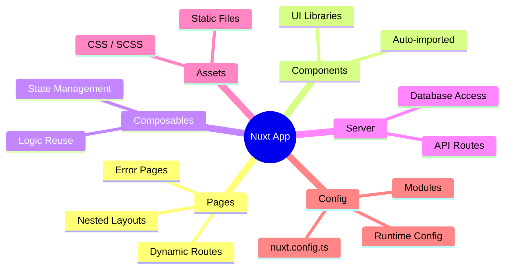
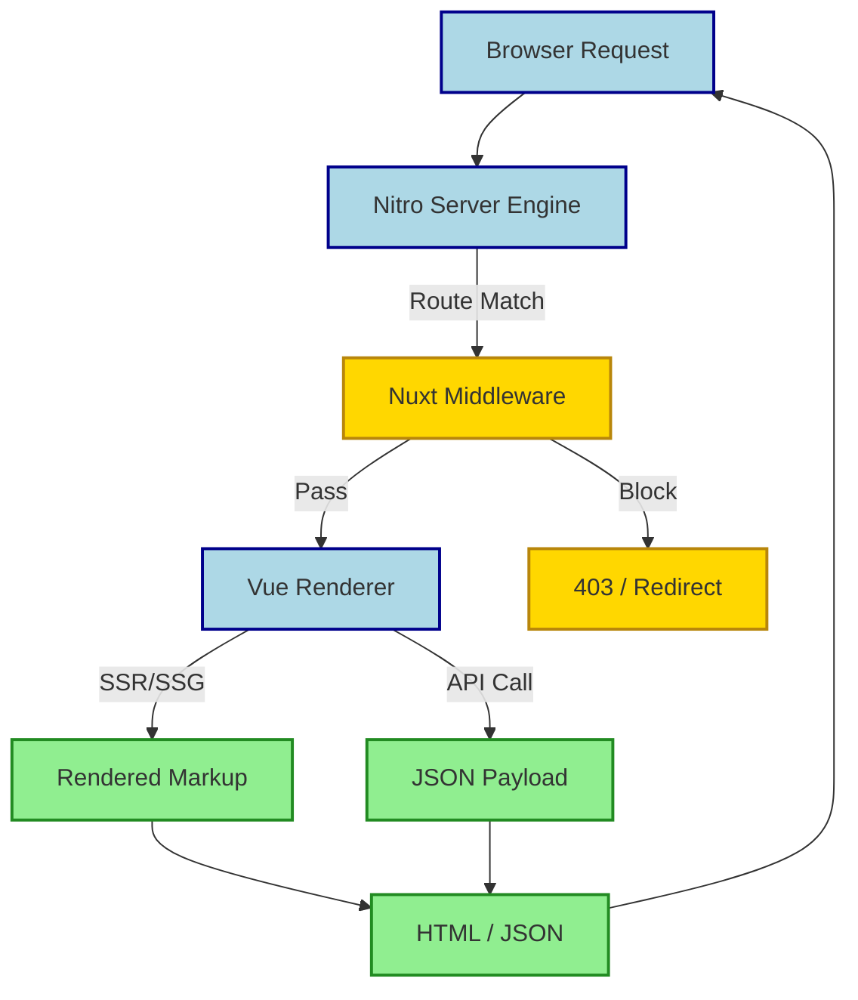

## Summary
Nuxt is a meta-framework for Vue.js that adds structure, file-based routing, and server-side rendering to simplify building production-ready web apps. It supports full-stack development with automatic imports, modular architecture, and flexible rendering modes for optimal performance and SEO.

## Core Concepts
- Built on Vue 3 + Composition API
- File-based routing and layout system
- Automatic imports for components, composables, and utilities
- Nitro engine for server-side capabilities
- Modular ecosystem via Nuxt modules
- Flexible rendering: SSR, SSG, CSR, or Hybrid

## Rendering Modes
> [!IMPORTANT] Choose mode per-page in Nuxt 3 using `definePageMeta({ ssr: false })` or global defaults.

| Mode | Best For | SEO | Hydration |
|---|---|---|---|
| **SSR** | Dynamic content, User data | ✅ Excellent | Client hydrates HTML |
| **SSG** | Blogs, Marketing pages | ✅ Excellent | Static HTML, no hydration |
| **CSR** | Dashboards, Auth-only apps | ❌ Poor | Full client render |
| **Hybrid** | Mixed static/dynamic needs | ✅ Configurable | Flexible per route |

## File Conventions
| Directory | Purpose | Auto-import? |
|---|---|---|
| `pages/` | Route definitions | ✅ Yes |
| `components/` | Reusable Vue components | ✅ Yes |
| `composables/` | Shared logic (`use*`) | ✅ Yes |
| `plugins/` | App setup code | ✅ Yes |
| `middleware/` | Route guards | ✅ Yes |
| `server/` | API routes & utils | ❌ Server only |
| `app.vue` | Root component | ❌ Manual |
| `nuxt.config.ts` | Configuration | ❌ Manual |

## Request Pipeline
> [!TIP] Use `<NuxtLink>` instead of `<a>` for client-side navigation to avoid full page reloads.

## Key Features & Patterns
- **`useFetch` vs `useAsyncData`**
  - `useFetch`: Shortcut for server data fetching with automatic loading/error states.
  - `useAsyncData`: Wrapper for any async operation; gives control over the async logic.
- **Runtime Config**
  - `useRuntimeConfig()` for secure server-only values and public client values.
  - Never expose secrets in client code.
- **Layouts**
  - Default layout or named layouts (`layouts/auth.vue`).
  - Change layouts per page via `definePageMeta({ layout: 'auth' })`.

> [!WARNING] **Hydration Mismatch**
> Server HTML must match client initial render. Dynamic values in `setup()` can cause flicker or errors. Use `ssr: false` or conditional rendering (`v-if="isClient"`) for browser-only logic.

> [!DANGER] **Secret Exposure**
> `runtimeConfig.public` is sent to the client. Never store API keys, DB passwords, or tokens there. Use `runtimeConfig` (without `.public`) for server-only secrets.

> [!NOTE] Excalidraw: Sketch the lifecycle of a Nuxt page showing Server Render -> Send HTML -> Client Hydration -> Interactive App, highlighting where data flows in each phase.

## Performance Tips
- Auto code-splitting by route
- `<NuxtImage>` for optimized images
- Prefetching with `<NuxtLink prefetch>`
- Tree-shaking composables
- Use `lazy` prefix (`LazyMyComponent`) to defer mounting

## Quick Debugging
- `nuxt dev --log-level verbose` for detailed logs
- Check browser network tab for hydration scripts
- Inspect `__NUXT_JSON__` in page source for server state
- Use `debug` module for internal Nuxt tracing