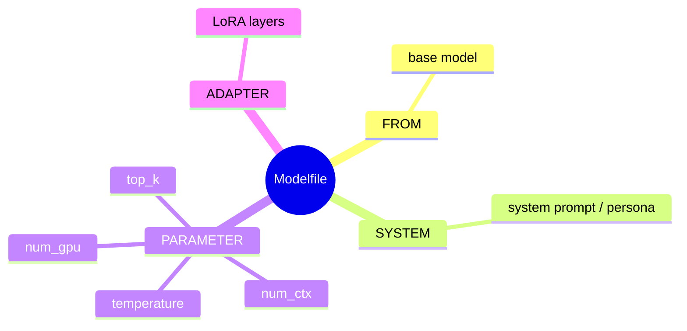

## Summary
Ollama is a lightweight, open-source tool that allows you to run large language models (LLMs) locally on your computer without complex setup. It simplifies downloading, managing, and interacting with models like Llama 3, Mistral, and others via a command-line interface or API.

## Key Features
- Runs LLMs locally on CPU/GPU with automatic resource management and acceleration.
- Supports GGUF model format for efficient inference and memory usage.
- One-command model download and execution workflow.
- Built-in library of popular models including Llama 3, Mistral, Phi, and Gemma.
- Cross-platform support for macOS, Linux, and Windows.

## Common Commands
- `ollama run <model>`: Start an interactive chat session with a model.
- `ollama pull <model>`: Download a model from the library to your local machine.
- `ollama list`: Display all downloaded models and their sizes.
- `ollama rm <model>`: Remove a model from your system.
- `ollama ps`: Show currently running instances.
- `ollama serve`: Run Ollama as a background service (default behavior on install).

## Modelfile System

- Text file used to define custom models, similar to a Dockerfile.
- `FROM`: Specifies the base model to use.
- `SYSTEM`: Sets the system prompt or context instructions.
- `PARAMETER`: Adjusts inference settings like `temperature`, `num_ctx`, and `top_k`.
- `ADAPTER`: Apply LoRA or other adapter layers for fine-tuning.
- Create custom configurations via `ollama create <name> -f Modelfile`.

## API & Integration

> [!NOTE] Ollama exposes an **OpenAI-compatible endpoint** — drop-in replacement for apps already using the OpenAI SDK, no code changes needed.

- Exposes a REST API at `localhost:11434` for programmatic access.
- OpenAI-compatible endpoint allows drop-in replacement in existing applications.
- Supports streaming responses for real-time output.
- Easy integration with Python, JavaScript, and other languages via HTTP requests or client libraries.
- Useful for building local chatbots, RAG pipelines, and AI agents.

## Best Practices

> [!TIP] Use `Q4_K_M` quantization by default — best balance of quality, speed, and VRAM for consumer GPUs.

> [!TIP] Set `OLLAMA_MODELS` to a drive with more space before pulling large models (they can be 20–40 GB).

- Use quantized models (e.g., `Q4_K_M`) to balance quality and memory usage on consumer hardware.
- Leverage GPU acceleration where available; Ollama falls back to CPU automatically.
- Configure `OLLAMA_MODELS` environment variable to store models on a drive with more space.
- Run as a background service to maintain persistent API access for applications.
- Check hardware requirements before pulling large models to avoid out-of-memory errors.
