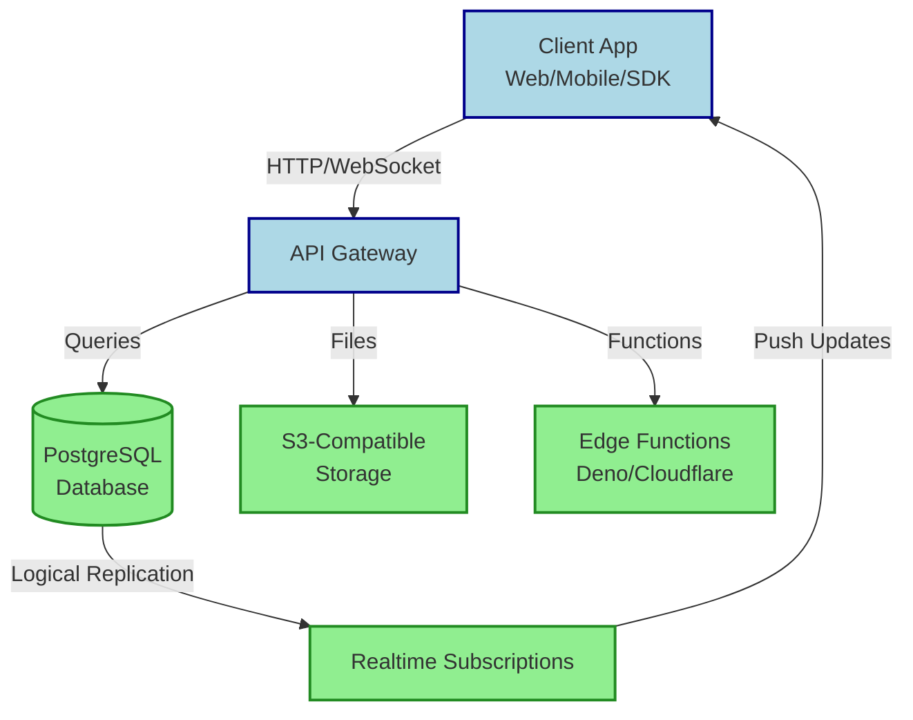

## Summary
Supabase is an open-source backend-as-a-service platform built around PostgreSQL. It supplies pre-configured tools for authentication, real-time data sync, file storage, and serverless functions so developers can ship full-stack apps without managing servers.

## What It Is
- Open-source alternative to Firebase
- Backend-as-a-Service (BaaS) stack
- Centers on a managed PostgreSQL database
- Provides official SDKs for web, mobile, and desktop
- Fully self-hostable or available as a managed cloud service
- Emphasizes standard SQL over proprietary query languages

## How It Works
- **Database:** PostgreSQL with Row Level Security (RLS) handling permissions directly at the table level
- **Realtime:** Uses PostgreSQL logical replication to stream row changes to connected clients via WebSockets
- **Auth:** Issues JWT tokens after verifying email, password, OAuth, or magic link flows
- **Storage:** S3-compatible bucket system with policy-driven access controls
- **Edge Functions:** Serverless code running on Deno, distributed globally via Cloudflare Workers
- **API Layer:** Auto-generates REST and GraphQL endpoints from your database schema using PostgREST

> [!NOTE] Excalidraw: Sketch a simple client-to-Supabase flow showing the SDK routing calls to DB, Auth, Storage, and Edge, with a dashed arrow looping back for Realtime subscriptions.

## Common Use Cases
- Rapid prototyping & MVP development
- Real-time dashboards, chat, and collaborative tools
- SaaS platforms requiring relational data & complex joins
- Mobile apps needing secure auth & offline-ready sync
- Analytics-heavy apps leveraging SQL indexing, views, and aggregation

> [!TIP] Best Practice: Define RLS policies before writing client code. Database-level security is faster and harder to bypass than app-layer checks.

> [!WARNING] Gotcha: PostgreSQL expects normalized relational schemas. Over-nesting JSON or ignoring foreign keys will hurt query performance and break realtime subscriptions.

## Differences With Firebase
| Feature | Supabase | Firebase |
|---|---|---|
| **Database Type** | PostgreSQL (Relational SQL) | Firestore/Realtime DB (NoSQL) |
| **Query Language** | Standard SQL, joins, aggregations | Document-based, limited querying |
| **Authentication** | JWT, email, password, OAuth, magic link | Similar, tightly bound to Google Identity |
| **Realtime** | PostgreSQL logical replication | Native NoSQL listeners |
| **Storage** | S3-compatible, policy-controlled | Firebase Storage (GCS-backed) |
| **Serverless Functions** | Deno/Cloudflare Workers | Node.js/Google Cloud Functions |
| **Pricing** | Predictable tiered + pay-as-you-go | Usage-based, can spike at high scale |
| **Vendor Lock-in** | Low (open-source, self-hostable) | High (Google proprietary ecosystem) |

> [!IMPORTANT] Key Takeaway: Pick Supabase for relational data, complex queries, and escape from vendor lock-in. Choose Firebase for fast NoSQL prototyping or when already invested in Google Cloud services.