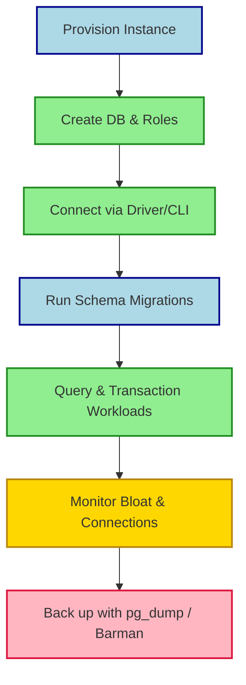

## Summary
PostgreSQL is a free, open-source relational database built for strict data integrity and advanced querying. It excels when you need reliable transactions, complex schemas, or hybrid relational-plus-JSON workloads. Its extensible architecture and strong community make it a default choice for modern backend systems.

## What It Is
- Relational database management system (RDBMS) following SQL standards
- ACID-compliant: guarantees transaction safety even during crashes
- Extensible core: supports custom data types, operators, indexes, and functions
- Multi-platform: runs natively on Linux, macOS, Windows, and BSD
- Licensed under the PostgreSQL License (BSD-style, completely free)
- Uses statement-level MVCC for concurrent read/write isolation

## Why Use It
- **Strict Correctness:** Rejects invalid data instead of silently truncating or coercing types
- **Advanced Data Types:** Built-in JSONB, arrays, range types, network addresses, and UUIDs
- **Extensibility Ecosystem:** Official and community extensions for geospatial (PostGIS), time-series (Timescale), AI/embeddings (pgvector), and more
- **Query Optimizer:** Cost-based planner handles deep joins, subqueries, and analytical workloads efficiently
- **Long-term Stability:** Backward-compatible binary formats and predictable upgrade paths
- **Zero Licensing Cost:** No enterprise lock-in; paid support available on-demand

> [!IMPORTANT] Key Takeaway
- Pick PostgreSQL when data correctness, complex relationships, or feature-rich extensions matter more than raw single-threaded insert speed.

## How to Use It
- **Quick Start:** `docker run -d -e POSTGRES_PASSWORD=secret -p 5432:5432 postgres`
- **Connectivity:** 
  - CLI: `psql -h localhost -U postgres`
  - GUI: pgAdmin, DBeaver, TablePlus
  - Drivers: psycopg2 (Python), JDBC (Java), Prisma/SQLAlchemy (ORMs)
- **Daily Workflow:**

- **Operational Best Practices:**
  - Use `pgBouncer` or `Pgpool-II` for connection pooling
  - Rely on `autovacuum` (tune thresholds if heavy writes occur)
  - Index foreign keys and filter columns; verify with `EXPLAIN (ANALYZE)`
  - Always use parameterized queries to block SQL injection
  - Set `work_mem` and `shared_buffers` based on available RAM

> [!WARNING] Gotcha
- Heavy update/delete cycles without proper indexing cause table bloat. Watch `n_dead_tup` in `pg_stat_user_tables` and trigger manual `VACUUM` if autovacuum lags.

## PostgreSQL vs MySQL
| Feature | PostgreSQL | MySQL |
|---|---|---|
| **License** | PostgreSQL License (BSD-like) | GPL (Oracle MySQL), Apache (MariaDB fork) |
| **SQL Strictness** | Enforces standards & constraints rigorously | Lenient by default; allows silent truncation |
| **Concurrency** | Fine-grained MVCC (reads never block writes) | MVCC with read locks (InnoDB) |
| **JSON Handling** | `JSONB` with GIN indexes & path operators | `JSON` type with functional indexes (newer versions) |
| **Extensibility** | High (custom types, operators, FDWs, extensions) | Low (plugin architecture, limited type creation) |
| **Query Planner** | Cost-based, excels at complex joins/aggregations | Rule/cost hybrid, faster on simple key-lookups |
| **Replication** | Logical & streaming (built-in) | Streaming & group replication (InnoDB) |

> [!TIP] Decision Shortcut
- **PostgreSQL:** Complex schemas, analytical queries, strict integrity, JSON+relational hybrids, geospatial/AI extensions
- **MySQL:** Simple CRUD apps, read-heavy web traffic, legacy hosting, teams already invested in MySQL tooling