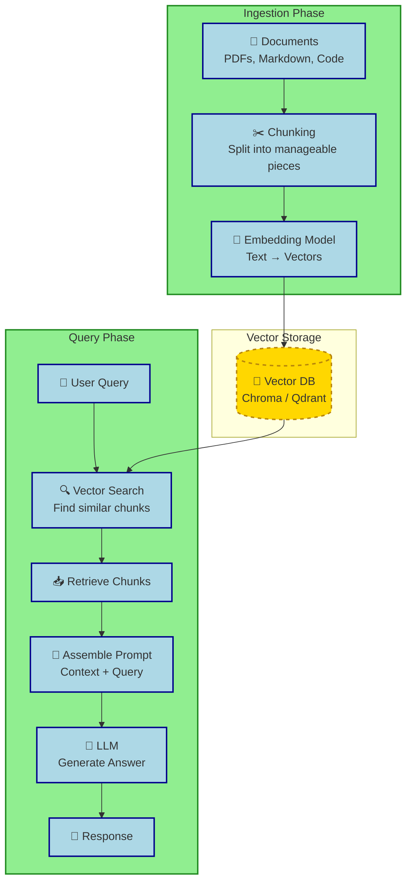

## Summary

RAG (Retrieval Augmented Generation) solves the "closed book" limitation of LLMs by dynamically injecting relevant external context into the prompt, enabling accurate answers based on your private documents, code, or notes. Instead of memorizing data via fine-tuning, the system converts documents into vector embeddings, stores them in a database, and retrieves only the necessary chunks during inference to ground the model's response.

## Mental Model

- **RAG = External Notebook:** The LLM keeps its general knowledge but checks your "notebook" for specific facts before answering.
- **Analogy:**
  - *Without RAG:* Student takes an exam relying only on what they memorized.
  - *With RAG:* Student takes an open-book exam; they look up references to support their answer.
- **Stack Position:** Sits between the **Inference Engine** and the **User**, acting as the memory layer.

## RAG Pipeline

- **Ingestion:** Documents are processed once (or updated incrementally).
- **Query:** Happens at runtime; retrieval adds latency but ensures freshness.
- **Injection:** Retrieved chunks are prepended or injected into the system prompt before the LLM generates text.

## Key Components

### Embeddings (The Librarian)
- **Function:** Convert text into high-dimensional vectors representing semantic meaning.
- **Benefit:** Enables search by *meaning*, not just keywords.
  - *Query:* "How do I deploy Docker?" matches "Container deployment guide" even without shared words.
- **Local Embedding Models:**
  - `nomic-embed-text`: Lightweight, high performance for local use.
  - `BGE-M3 / BGE-Large`: State-of-the-art multilingual and semantic recall.
  - `Mistral-Embed`: Balanced quality for smaller deployments.
- **Expansion:** Embeddings can also represent images or audio when multimodal RAG is needed.

### Vector Databases
- **Purpose:** Store embeddings and support fast approximate nearest neighbor (ANN) search.
- **Comparison:**

| Vector DB | Best For | Local Footprint | Notes |
| :--- | :--- | :--- | :--- |
| **Chroma** | Dev/Prototyping | ⭐ Very Low | Embedded DB, Python-first, easy setup. |
| **Qdrant** | Performance/Scale | ⭐⭐ Low | Rust-based, high concurrency, hybrid search. |
| **Milvus** | Enterprise Scale | ⭐⭐⭐ High | Distributed architecture, complex setup. |
| **LanceDB** | Serverless/Local | ⭐ Low | File-based, no server needed, great for notebooks. |

### Chunking & Retrieval Strategy
- **Chunking:** Splitting documents into pieces the context window can handle.
  - *Size:* Typically 200–500 tokens.
  - *Overlap:* 10–20% overlap prevents cutting meaningful context across boundaries.
  - *Granularity:* Paragraph-based for prose; function-based for code.
- **Retrieval Methods:**
  - *Vector Search:* Semantic similarity.
  - *Hybrid Search:* Combines vector + keyword (BM25) for better precision on specific terms.
  - *Reranking:* Post-retrieval model scores chunks to rank relevance before injection.
    - *Tools:* `BGE-Reranker`, `Cohere Rerank`.

> [!TIP] Reranking drastically improves RAG quality
> Vector search can retrieve "on-topic but irrelevant" chunks. A lightweight reranker filters noise, ensuring only the most relevant context hits the LLM.

## Tools & Local Stack

- **All-in-One Local RAG Tools:**
  - **Open WebUI:** Chat interface with built-in RAG over files/vaults.
  - **AnythingLLM:** Desktop app, manages collections, supports multiple embedding models.
  - **LibreChat:** Chat client with extensive provider and RAG integration.
- **Frameworks:**
  - **LangChain / LlamaIndex:** Python frameworks for building custom RAG pipelines; LlamaIndex is often preferred for data-centric RAG.
  - **Haystack:** DeepMind-originated framework, strong for production pipelines.
- **Typical Developer Stack:**
  - `Qwen/Llama` → `Ollama` → `Open WebUI` → `RAG over Code/Docs`.

## RAG vs. Fine-Tuning vs. LoRA

| Feature | RAG | LoRA | Fine-Tuning |
| :--- | :--- | :--- | :--- |
| **Goal** | Add external knowledge | Add style/skill | Modify behavior/knowledge |
| **Data Update** | Instant (add file) | Requires retraining | Requires retraining |
| **Hallucination** | Reduced (grounded) | Unchanged | Unchanged |
| **Context Limit** | Adds to prompt tokens | No overhead | No overhead |
| **Best Use** | Docs, private data, updates | Roleplay, tone, specific format | Domain reasoning, complex patterns |

> [!WARNING] Context Window Bloat
> RAG consumes context tokens. If retrieval returns too many chunks, you may hit the LLM's limit or degrade performance due to "needle in a haystack" noise. Always optimize chunk count and use reranking.

## Expansion & Best Practices

- **Hybrid Retrieval:** Combine vector search with keyword search to catch exact matches (e.g., error codes, names) that embeddings might miss.
- **Metadata Filtering:** Tag chunks with metadata (date, source, user) to filter results before embedding search, reducing noise.
- **Citations:** Good RAG implementations return source references, allowing the user to verify the answer.
- **Latency Trade-off:** RAG adds steps (Embedding query, DB search, Injection). For low-latency needs, use lightweight embedding models and optimized vector DBs.
- **Self-RAG:** Advanced pattern where the LLM critiques its own retrieval and generates reflections before answering, improving accuracy further.

> [!NOTE] Excalidraw: Sketch a "RAG Error Modes" diagram showing common failure points: Bad Chunking (context cut), Hallucination (model ignores context), Retrieval Failure (wrong chunks), and Latency Spikes.