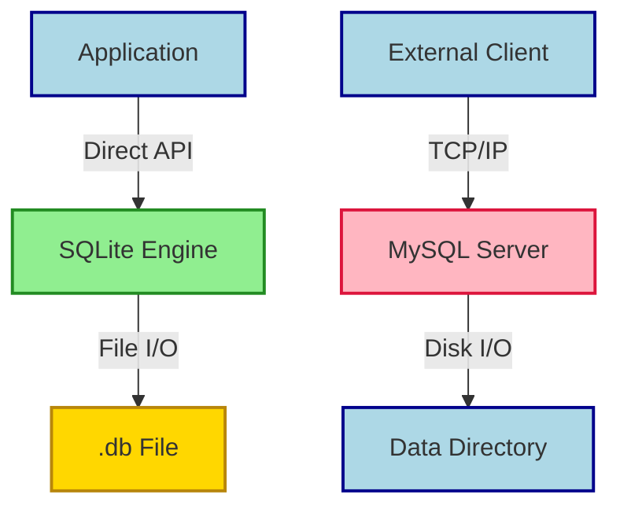

## Summary
SQLite is a lightweight, serverless database engine embedded directly into your application, storing all data in a single portable file. It’s built for zero configuration, fast local reads, and simple deployments where managing a separate database server adds unnecessary overhead.

## What Is SQLite?
- **Serverless & embedded:** Runs inside your app process; no separate daemon or network port
- **Single-file storage:** Entire schema, data, indexes, and journals live in one `.db` file
- **ACID compliant:** Guarantees atomicity, consistency, isolation, durability without external services
- **Zero configuration:** No users, passwords, or server tuning required out of the box
- **Cross-platform:** Native support on desktop, mobile, web (via WASM), and embedded/IoT hardware
- **Public domain:** Completely free, no licensing fees or redistribution restrictions

## When & Why Use It
- Local data caching & offline-first apps
- Rapid prototyping & development sandboxes
- Desktop/mobile apps needing persistent storage
- Edge devices, routers, and firmware with tight memory constraints
- Read-heavy workloads where write concurrency is low
- Environments where deploying a full RDBMS is overkill

## How to Use It
- **CLI quickstart:** `sqlite3 app.db` → interactive shell → `.tables`, `.schema`, `.quit`
- **Language drivers:** Built-in or lightweight packages (`sqlite3` in Python, `better-sqlite3` in Node, `libsqlite3` in C/Rust/Go)
- **File placement:** Store in app sandbox, user home dir, or project root; ensure read/write permissions
- **Backup strategy:** Copy the `.db` file while idle, or use `sqlite3_backup` API for zero-downtime snapshots
- **Performance tuning:** Enable WAL mode, set `cache_size`, add indexes on frequently filtered columns

## SQLite vs MySQL
| Feature | SQLite | MySQL |
|---|---|---|
| Architecture | Embedded, in-process | Client-server, networked |
| Setup | Drop-in, zero config | Requires install, service, auth |
| Concurrency | High reads, serialized writes | High concurrent read/write |
| Storage format | Single `.db` file | Multi-file data directory |
| Network access | Local filesystem only | Native TCP/IP, remote clients |
| Backup method | File copy or backup API | `mysqldump`, snapshots, replication |
| Best fit | Local apps, prototypes, edge | Web platforms, enterprise, high traffic |

## Architecture Comparison

## Key Gotchas & Best Practices
> [!WARNING] Network shares break locking: Never mount SQLite files on NFS, SMB, or cloud sync folders
> [!TIP] Always enable WAL mode: `PRAGMA journal_mode = WAL;` drastically improves concurrent read performance
> [!IMPORTANT] Keep transactions short: Long-running transactions block all other writes; batch or chunk updates
> [!DANGER] No auto-scaling: SQLite hits a hard ceiling on write concurrency; migrate to MySQL/Postgres before traffic spikes
> [!NOTE] Excalidraw: Sketch the "file vs server" mental model — draw a single box (app) touching a disk icon vs two boxes connected by a network line

- Index columns used in `WHERE`, `JOIN`, or `ORDER BY`
- Use parameterized queries to prevent SQL injection
- Avoid `SELECT *` in production; pull only needed columns
- Monitor `free_disk_space()` and handle `SQLITE_FULL` errors gracefully