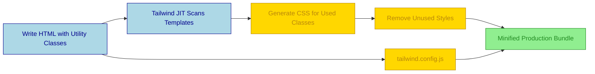

## Summary
TailwindCSS is a utility-first framework that lets you style elements directly in HTML using pre-defined classes instead of writing custom CSS. You build interfaces by composing small, low-level classes like `flex`, `pt-4`, and `text-center` to create unique designs without leaving your markup.

## Core Workflow

*   **Utility-First:** Style by adding classes, not creating custom selectors.
*   **Just-In-Time (JIT):** CSS is generated on-demand during build; no unused code bloat.
*   **Responsive:** Prefix classes with breakpoints (`md:`, `lg:`) for mobile-first design.
*   **State Variants:** Handle interactions with prefixes like `hover:`, `focus:`, `group-hover:`.
*   **Configuration:** Customize colors, spacing, and fonts in `tailwind.config.js` to match design system.

## Tailwind vs. Traditional CSS
| Feature | TailwindCSS | Traditional CSS / BEM |
| :--- | :--- | :--- |
| **Development Speed** | ⚡ Fast for prototyping & UI changes | 🐢 Slower due to context switching |
| **Consistency** | 🎯 High (enforced by design tokens) | ⚠️ Variable (depends on naming discipline) |
| **Bundle Size** | 📉 Tiny (JIT purges unused CSS) | 📈 Can grow with unused styles |
| **HTML Clutter** | 🔥 High class count per element | 🧹 Clean markup, separated styles |
| **Learning Curve** | 📚 Memorizing utility names | 🧠 Understanding selectors/specificity |

> [!NOTE] Excalidraw: Sketch a "Component Deconstruction" showing a button breaking down into individual utility blocks (bg-blue-500, text-white, px-4, py-2, rounded) stacking together.

## Best Practices
*   **Use `@apply` sparingly:** Extract repeated utility groups into semantic classes only when necessary to keep DRY.
*   **Leverage Plugins:** Install official plugins for forms, typography, and aspect ratio to extend functionality.
*   **Content Configuration:** Ensure `content` paths in config file cover all templates so JIT doesn't miss classes.
*   **Component Libraries:** Combine with Headless UI or Radix for accessible, pre-built interactive elements.

> [!TIP] Install the Tailwind CSS IntelliSense extension in VS Code for autocomplete, linting, and visual class ordering.

> [!WARNING] Avoid inline styles or custom CSS files whenever possible; it breaks the utility ecosystem and complicates maintenance.

> [!DANGER] Do not disable JIT mode; full builds are significantly slower and defeat the purpose of on-demand generation.