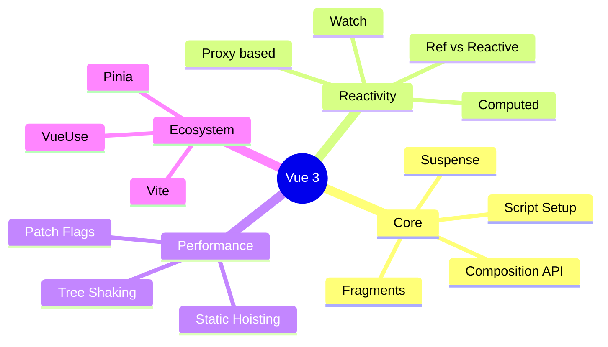
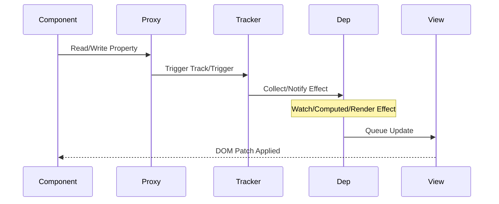

## Summary
Vue 3 is a progressive JavaScript framework for building user interfaces, featuring a Composition API that improves logic reuse and type inference while maintaining the flexibility of the Options API. It delivers significant performance gains through static tree hoisting, patch flags, and better tree-shaking compared to Vue 2.

## Core Features & Upgrades
- **Multiple Root Nodes**: Components can now have multiple root elements (fragments) without wrapper `div`s.
- **Composition API**: Groups logic by feature rather than option, enabling better code organization and reuse across components.
- **Native TypeScript**: Improved type definitions and support for TypeScript throughout the core and ecosystem.
- **Fragments & Teleport**: Render multiple root nodes and move DOM elements to different parts of the tree.
- **Better Tree-Shaking**: Unused APIs can be omitted from the final bundle, reducing size.



### Options API vs Composition API
| Feature | Options API | Composition API |
| :--- | :--- | :--- |
| **Organization** | By option (`data`, `methods`) | By logical concern |
| **Code Reuse** | Mixins (collision risks) | Composables (explicit imports) |
| **TypeScript** | Infer types via return | Native inference, better generics |
| **Learning Curve** | Gentle, predictable | Steeper, more flexibility |
| **Scalability** | Can get messy in large components | Scales well with complex logic |

## Composition API Essentials
- **`setup()`**: Entry point for composition; runs before component initialization.
- **`ref()`**: Creates reactive primitive values; unwrapped automatically in templates.
- **`reactive()`**: Creates reactive proxy objects; best for complex data structures.
- **`computed()`**: Derives state; cached until dependencies change.
- **`watch()` / `watchEffect()`**: Side effects triggered by reactive dependencies.
- **Lifecycle Hooks**: Renamed with `on` prefix (e.g., `onMounted`, `onUnmounted`).

```mermaid
flowchart TD
    classDef success fill:#90EE90,stroke:#228B22;
    classDef danger fill:#FFB6C1,stroke:#DC143C;
    classDef warning fill:#FFD700,stroke:#B8860B;
    classDef neutral fill:#ADD8E6,stroke:#00008B;

    A[User Interaction] -->|Change Value| B(Proxy Trap Triggered)
    B --> C{Reactive State?}
    C -->|Yes| D[Track Dependency]
    C -->|No| E[Direct Mutation / No Update]:::warning
    D --> F[Dependency Collection]:::neutral
    F --> G[Dep.notify()]:::success
    G --> H[Scheduler Queue Update]
    H --> I[Batch DOM Patch]:::success
    E --> J[State Lost / Bug]:::danger
```

> [!WARNING] Reactive Objects Only
> `reactive()` only works with objects and arrays. Assigning a primitive to a reactive variable breaks the proxy link. Use `ref()` for primitives.

> [!TIP] Destructuring Gotcha
> Destructuring a `reactive` object loses reactivity. Use `toRefs()` to preserve reactivity when destructuring, or access properties directly via the object.

> [!IMPORTANT] Key Takeaways
> - Prefer `ref` for primitives and simple values.
> - Prefer `reactive` for complex objects where you access properties frequently.
> - Use `shallowRef` or `shallowReactive` for large, immutable datasets to avoid proxy overhead.

## Reactivity System
- **Proxy-based**: Uses JavaScript `Proxy` to intercept property access and mutations (better than `Object.defineProperty`).
- **Lazy Evaluation**: Effects and computed values run only when needed, not eagerly.
- **Batched Updates**: DOM updates are batched and flushed asynchronously to avoid redundant re-renders.
- **Dependency Tracking**: Automatically tracks dependencies accessed inside computed/watch functions.



## Performance Optimizations
- **Static Tree Hoisting**: Static nodes are hoisted out of the render function and reused, reducing diffing work.
- **Patch Flags**: Compilers inject hints about dynamic parts of the template, allowing the VDOM to skip static checks.
- **Block Patching**: Only patches dynamic bindings within blocks, ignoring static siblings.
- **Event Listening Caching**: Static event listeners are cached to avoid recreation on every render.

## Advanced Patterns
- **Suspense**: Asynchronous dependency management; renders fallback content while async components load.
- **Teleport**: Projects component content to a specific DOM node outside the component hierarchy (e.g., modals).
- **Provide / Inject**: Dependency injection for deep component hierarchies; avoids prop drilling.
- **Custom Renderers**: Vue's renderer is pluggable; can target WebGL, Canvas, or other environments.

> [!NOTE] Excalidraw: Sketch component hierarchy showing prop drilling chain versus Provide/Inject connection lines to visualize dependency injection flow.

## Best Practices
- Use `<script setup>` for cleaner syntax and better dev experience.
- Name composables with `use` prefix (e.g., `useFetch`, `useAuth`).
- Keep components small and focused; extract logic into composables.
- Leverage `v-memo` for expensive list items with static content.
- Use `key` attributes correctly in `v-for` to assist VDOM diffing.