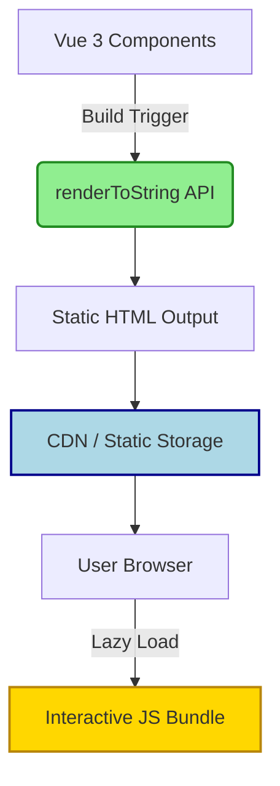

## Summary
Vue 3 SSG pre-renders components into static HTML files during the build process, delivering fast load times and improved SEO without requiring a server-side runtime. This approach is best suited for content-driven websites like blogs, documentation, or marketing pages where data remains static or updates infrequently.

## Core Workflow
- Build-time rendering replaces runtime server requests.
- Components are serialized to HTML strings before deployment.
- Resulting HTML is served directly from a CDN or static host.
- Client-side hydration is optional and often partial for SSG.

## Key APIs & Patterns
- **`@vue/server-renderer`**: Core package for rendering.
- **`createSSRApp`**: Use this factory function instead of `createApp` to ensure SSR-compatible instance handling.
- **`renderToString`**: Converts Vue app instance to an HTML string synchronously.
- **Inline Styles**: Styles are extracted and injected into the `<head>` of the generated HTML.

> [!IMPORTANT] Key Takeaways
> - Always use `createSSRApp` for SSG contexts.
> - Avoid `window` or `document` access in `setup()` or `beforeMount`.
> - SSG eliminates server costs associated with dynamic rendering.

## SSG vs SSR vs CSR

| Feature | SSG (Static Site Gen) | SSR (Server Side Render) | CSR (Client Side Render) |
| :--- | :--- | :--- | :--- |
| **Render Time** | Build Time | Request Time | Browser Time |
| **Server Load** | None (after build) | High per request | None |
| **TTFB** | Near Zero | Dependent on server | High (wait for JS) |
| **SEO** | Excellent | Good | Poor (without SSR) |
| **Data Freshness** | Stale until rebuild | Real-time | Real-time |

## Common Gotchas

> [!WARNING] Client-Only Dependencies
> Components relying on browser APIs (e.g., `localStorage`, `IntersectionObserver`) will crash during build.
> - **Fix:** Wrap with `<ClientOnly>` or use `import.meta.client` checks.
> - **Fix:** Move browser logic to `onMounted`.

> [!TIP] Dynamic Routes
> SSG requires knowing all routes at build time.
> - Generate route lists programmatically from markdown files or CMS data.
> - Pre-render every possible URL to avoid 404s.

> [!DANGER] State Hydration Mismatch
> If the server-rendered HTML differs from the client-rendered output, Vue will discard the HTML and re-render.
> - Ensure data sources match between build context and client context.
> - Check for random values or timestamps generated in `setup`.

## Ecosystem & Tools
- **VitePress**: Lightweight docs engine built on Vue 3 + Vite; SSG by default.
- **Nuxt 3**: Supports `nitro.prerender` for full SSG deployment.
- **Astro**: Integrates Vue 3 components with automatic hydration strategies (`island` architecture).
- **Vitest**: Run component tests during CI to catch SSR incompatibilities early.

> [!NOTE] Excalidraw: Sketch hydration boundaries highlighting static HTML zones versus interactive client-side islands.