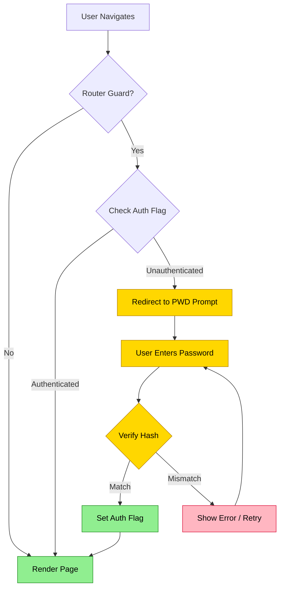

## Summary
Vue3 PWD-only patterns implement lightweight client-side password protection to restrict access to specific routes or components. Best practice uses router navigation guards to intercept requests and validate credentials against a local hash before rendering content.

## Architecture Decisions
- **Router Guard vs Component Guard**:
    - *Router Guard*: Blocks access at navigation level; prevents script loading; better UX for full-page protection.
    - *Component Guard*: Hides content via `v-if`; simpler for modals or sections; scripts may still load.
- **State Management**:
    - Use `provide/inject` or Pinia to store `isAuthenticated` state globally.
    - Avoid `localStorage` for auth status if XSS is a concern; use session-only flags.

> [!DANGER] Security Reality
> Client-side password checks are **easily bypassed** by inspecting code or network traffic.
> - Only use for privacy, not security.
> - Never protect sensitive PII, financial data, or admin functions this way.
> - Hash passwords client-side? Still reversible; attacker sees the hash and compares.

## Implementation Strategy
- **Simple Router Guard**:
    - Define `beforeEach` in Vue Router.
    - Check `localStorage.getItem('pwd-verified') === 'true'`.
    - Redirect to `/login` or show prompt if missing.
- **Hash Verification**:
    - Store hash in `.env` or hardcode (obfuscation).
    - Compare user input against stored hash.
    - Set flag on match.
- **Cleanup**:
    - Provide "Logout" button to clear flag.
    - Clear on `beforeunload` if session-only.

> [!TIP] UX Enhancements
> - Add "Remember me" toggle to persist flag in `localStorage`.
> - Mask input with `type="password"`.
> - Disable enter key submit to prevent accidental reloads.

## Comparison Table
| Method | Protection Level | Complexity | Bypass Risk |
|---|---|---|---|
| Router Guard + Flag | Medium | Low | High |
| Component `v-if` | Low | Very Low | High |
| Server-Side Auth | High | High | Low |

> [!NOTE] Excalidraw: Sketch the difference between Router Guard interception and Component v-if hiding, highlighting where the code executes.

## Gotchas
- **SSR/SSG Compatibility**:
    - Static generation may bake in protected content; guard only works in browser.
    - Use client-only components or middleware if using Nuxt/Vite SSR.
- **Caching**:
    - Browsers may cache protected pages; add cache-control headers or meta tags.
- **Accessibility**:
    - Ensure PWD prompt has focus management and screen reader labels.

## Best Practices
- Use `btoa()` for minimal obfuscation of password string in source code.
- Keep PWD prompt component reusable across projects.
- Test "Back button" behavior after failed attempts.